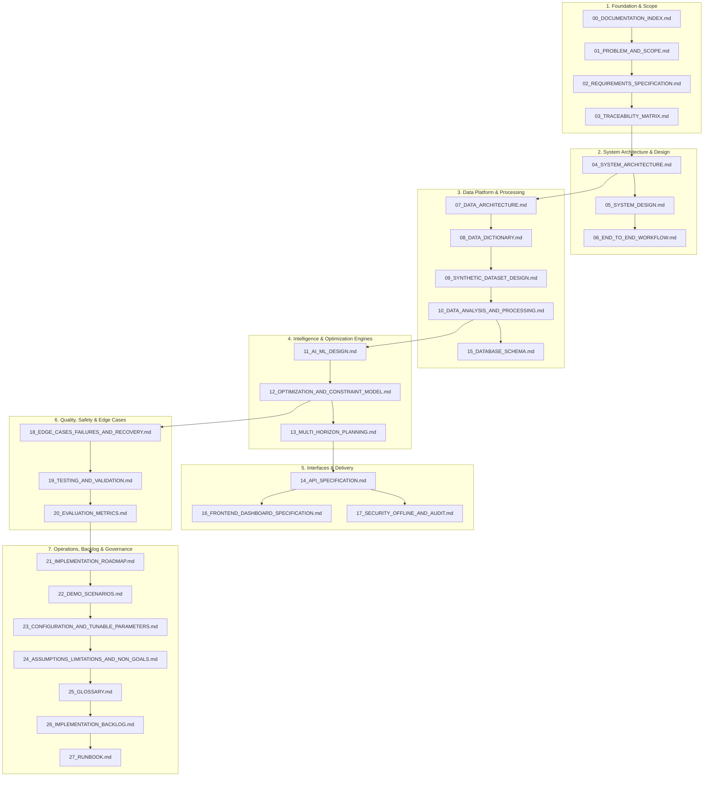

# 00_DOCUMENTATION_INDEX.md — RailSync AI Documentation Index & Architecture Governance

## SIH26027: AI-Powered Automatic Block Planning to Maximize Asset Availability for Train Operations on Indian Railways

---

## 1. Executive Summary & Purpose

This documentation set serves as the authoritative, engineering-grade specification and Single Source of Truth (SSOT) for **RailSync AI** (Smart India Hackathon 2026, Problem Statement `SIH26027`).

RailSync AI is an intelligent, offline-capable, decision-support master scheduling system designed to integrate maintenance defect and demand data from departmental silos—**TMS** (Track Management System), **SMMS** (Signalling Maintenance & Management System), and **TDMS** (Traction Distribution Management System)—with corridor traffic availability derived from **COA** (Control Office Application) train timetables and freight forecasts. It optimizes cross-departmental maintenance possessions ("shadow blocks") using constraint programming (Google OR-Tools CP-SAT) and explainable AI prioritization, maximizing railway asset uptime while strictly preventing disruption to scheduled train operations.

---

## 2. Document Hierarchy & Reading Order



---

## 3. Complete Document Registry

| File Name | Title | Primary Responsibility / Domain | Authoritative Authority |
| :--- | :--- | :--- | :--- |
| `00_DOCUMENTATION_INDEX.md` | Documentation Index & Governance | Master navigation, governance rules, readiness checklist | Lead System Architect |
| `01_PROBLEM_AND_SCOPE.md` | Problem Definition & Scope Boundaries | SIH26027 domain background, manual BDMS failure modes, system scope | Domain Analyst / Architect |
| `02_REQUIREMENTS_SPECIFICATION.md` | Functional & Non-Functional Requirements | Formal requirement specifications (FR-001 to FR-032, NFR-001 to NFR-014) | Lead Systems Engineer |
| `03_TRACEABILITY_MATRIX.md` | End-to-End Traceability Matrix | Forward & backward tracing: SIH $\to$ Req $\to$ Module $\to$ API $\to$ UI $\to$ Test $\to$ Demo | QA / Compliance Lead |
| `04_SYSTEM_ARCHITECTURE.md` | System Architecture Specification | 7-layer modular monolith, C4 architecture diagrams, deployment topology | Lead Architect |
| `05_SYSTEM_DESIGN.md` | Modular System Design & Package Layout | Package structures, class interfaces, service contracts, exception taxonomy | Backend Lead |
| `06_END_TO_END_WORKFLOW.md` | End-to-End Operational Workflows | Workflows A through I (Data Sync $\to$ Prioritization $\to$ Bundling $\to$ Solver $\to$ Review) | Process Analyst |
| `07_DATA_ARCHITECTURE.md` | Data Architecture & Lifecycle Management | Ingestion stages, raw/canonical/feature/schedule layers, provenance tracking | Data Engineer |
| `08_DATA_DICTIONARY.md` | Comprehensive Data Dictionary | Entity definitions, field types, constraints, validation rules, examples | Data Architect |
| `09_SYNTHETIC_DATASET_DESIGN.md` | Synthetic Dataset Design & Generator | Seeded synthetic generator spec, realistic topology, defect & train distributions | Simulation / Data Lead |
| `10_DATA_ANALYSIS_AND_PROCESSING.md` | Data Analysis, Quality & Processing | Data cleansing rules, validation gates, EDA metrics, feature transformations | Data / ML Engineer |
| `11_AI_ML_DESIGN.md` | AI/ML Prioritization & Risk Model | Rule gate + XGBoost/GBDT priority engine, SHAP explainability, fallback | ML Engineer |
| `12_OPTIMIZATION_AND_CONSTRAINT_MODEL.md` | Optimization & Constraint Model | Mathematical formulation, CP-SAT decision variables, 24 hard & 10 soft constraints | Optimization Engineer |
| `13_MULTI_HORIZON_PLANNING.md` | Multi-Horizon Planning Engine | Weekly high-granularity operational vs monthly strategic forecast planning | Optimization / Planning |
| `14_API_SPECIFICATION.md` | OpenAPI / REST API Specification | FastAPI endpoints, Pydantic schemas, request/response bodies, error status codes | Backend / API Lead |
| `15_DATABASE_SCHEMA.md` | Relational Database Schema (SQLAlchemy/Postgres) | ER diagrams, DDL scripts, indexes, check constraints, foreign keys, migrations | Database Architect |
| `16_FRONTEND_DASHBOARD_SPECIFICATION.md` | Frontend Dashboard & UX Specification | React + Vite UI layout, Gantt visualizer, command center, override interactions | Frontend Lead / UX |
| `17_SECURITY_OFFLINE_AND_AUDIT.md` | Security, Offline Operation & Audit Logging | Air-gapped deployment, RBAC permissions, append-only audit trail, tamper-proofing | Security / DevSecOps |
| `18_EDGE_CASES_FAILURES_AND_RECOVERY.md` | Edge Cases, Failure Modes & Recovery Matrix | Comprehensive failure catalog (50+ scenarios), detection, safe behavior, recovery | QA / Reliability Lead |
| `19_TESTING_AND_VALIDATION.md` | Testing Strategy & Validation Framework | Unit, integration, property-based, regression, and E2E verification suites | QA Lead |
| `20_EVALUATION_METRICS.md` | Evaluation Metrics & Benchmark Suite | Availability formulas, downtime metrics, solver runtime, ML metrics, baselines | Optimization / ML Lead |
| `21_IMPLEMENTATION_ROADMAP.md` | Incremental Implementation Roadmap | Phase 0 to Phase 16 milestones, exit criteria, demo checkpoints | Project Lead / Scrum Master |
| `22_DEMO_SCENARIOS.md` | Deterministic Demo Scenarios | Scripted interactive scenarios (Scenarios 1 to 9) for hackathon evaluation | Demo Lead |
| `23_CONFIGURATION_AND_TUNABLE_PARAMETERS.md` | Configuration & Tunable Parameters | Centralized parameter registry (weights, buffers, timeouts, limits) | System Configurator |
| `24_ASSUMPTIONS_LIMITATIONS_AND_NON_GOALS.md` | Assumptions, Limitations & Non-Goals | Engineering assumptions, prototype boundaries, explicit non-goals | Lead Architect / Legal |
| `25_GLOSSARY.md` | Domain & Technical Glossary | Standard definitions for 60+ railway, optimization, and software terms | Technical Writer |
| `26_IMPLEMENTATION_BACKLOG.md` | Detailed Implementation Backlog | Granular work breakdown structure (Epics, Tasks, Subtasks) for team execution | Scrum Master |
| `27_RUNBOOK.md` | Developer & Operations Runbook | Setup guides, CLI execution commands, troubleshooting procedures, healthchecks | DevOps / Dev Lead |

---

## 4. Single Source of Truth & Governance Rules

1. **Hierarchy of Truth:**
   - Operational requirements: `01_PROBLEM_AND_SCOPE.md` and `02_REQUIREMENTS_SPECIFICATION.md`.
   - Data structures: `08_DATA_DICTIONARY.md` and `15_DATABASE_SCHEMA.md`.
   - Optimization behavior & safety limits: `12_OPTIMIZATION_AND_CONSTRAINT_MODEL.md`.
   - System interfaces: `14_API_SPECIFICATION.md`.
2. **Explicit Tagging Standard:**
   Every fact, schema field, formula, and constraint across the documentation and code is classified into one of four categories:
   - `[SOURCE-BACKED]`: Directly derived from the official SIH26027 problem statement or standard public Indian Railways operating principles.
   - `[ENGINEERING ASSUMPTION]`: Practical engineering design decisions made to build a robust, deterministic system.
   - `[SYNTHETIC DEMO ASSUMPTION]`: Parameters, identifiers, and scenarios created explicitly for reproducible hackathon simulation.
   - `[OPTIONAL ENHANCEMENT]`: Advanced features identified for enterprise production scaling.
3. **Change Protocol:**
   If implementation requires changing a schema, constraint, or endpoint, the corresponding document **must be updated first**, followed by code and unit test synchronization.

---

## 5. Architecture Readiness Checklist

| Architectural Domain | Status | Authoritative Document | Validation Criteria |
| :--- | :---: | :--- | :--- |
| **Problem & Scope Boundaries** | `DEFINED` | `01_PROBLEM_AND_SCOPE.md` | Non-autonomous decision-support boundary explicitly established |
| **Formal Requirements** | `DEFINED` | `02_REQUIREMENTS_SPECIFICATION.md` | 32 Functional + 14 Non-Functional Requirements tagged and keyed |
| **Traceability** | `DEFINED` | `03_TRACEABILITY_MATRIX.md` | 100% forward and backward link coverage across all requirements |
| **Modular Architecture** | `DEFINED` | `04_SYSTEM_ARCHITECTURE.md` | 7-layer local-first architecture with clear data and control flows |
| **Module Contracts & Classes** | `DEFINED` | `05_SYSTEM_DESIGN.md` | Exact Python package layout, class definitions, and exception taxonomy |
| **Operational Workflows** | `DEFINED` | `06_END_TO_END_WORKFLOW.md` | Mermaid sequence workflows A–I mapped to user and system actions |
| **Data Lifecycle & Layers** | `DEFINED` | `07_DATA_ARCHITECTURE.md` | Full progression from RAW to HISTORICAL with provenance hashes |
| **Data Dictionary** | `DEFINED` | `08_DATA_DICTIONARY.md` | 30+ relational entities with complete field-level constraints |
| **Synthetic Dataset Engine** | `DEFINED` | `09_SYNTHETIC_DATASET_DESIGN.md` | Deterministic pseudo-random generation with realistic failure modes |
| **Data Quality & ETL** | `DEFINED` | `10_DATA_ANALYSIS_AND_PROCESSING.md` | 12 data validation checks and automated imputation/rejection policies |
| **AI/ML Prioritization** | `DEFINED` | `11_AI_ML_DESIGN.md` | Rule safety gate + GBDT/XGBoost priority ranking + SHAP explainability |
| **Constraint Solver (OR-Tools)** | `DEFINED` | `12_OPTIMIZATION_AND_CONSTRAINT_MODEL.md` | CP-SAT formulation, interval variables, 24 hard constraints, 10 objectives |
| **Multi-Horizon Planning** | `DEFINED` | `13_MULTI_HORIZON_PLANNING.md` | Rolling 7-day tactical schedule + 30-day strategic capacity forecast |
| **REST API Specification** | `DEFINED` | `14_API_SPECIFICATION.md` | Complete OpenAPI 3.0 specs with request/response schemas and HTTP codes |
| **Relational Database DDL** | `DEFINED` | `15_DATABASE_SCHEMA.md` | Normalized PostgreSQL DDL with SQLite compatibility, indexes, foreign keys |
| **Frontend UI/UX** | `DEFINED` | `16_FRONTEND_DASHBOARD_SPECIFICATION.md` | 10 dedicated views, Gantt chart visualizer, override interaction patterns |
| **Security & Auditability** | `DEFINED` | `17_SECURITY_OFFLINE_AND_AUDIT.md` | Local RBAC, immutable audit logging, CSV injection mitigation |
| **Edge Cases & Diagnostics** | `DEFINED` | `18_EDGE_CASES_FAILURES_AND_RECOVERY.md` | 50+ failure catalog items with explicit recovery strategies |
| **Testing Strategy** | `DEFINED` | `19_TESTING_AND_VALIDATION.md` | Unit, integration, property-based, regression, and E2E verification test plans |
| **Evaluation Metrics** | `DEFINED` | `20_EVALUATION_METRICS.md` | Rigorous mathematical formulas for asset availability, downtime, stability |
| **Implementation Roadmap** | `DEFINED` | `21_IMPLEMENTATION_ROADMAP.md` | 17 iterative phases (0 to 16) with explicit checkpoints |
| **Scripted Demo Scenarios** | `DEFINED` | `22_DEMO_SCENARIOS.md` | 9 deterministic scenarios demonstrating core value and edge cases |
| **Tunable Parameters** | `DEFINED` | `23_CONFIGURATION_AND_TUNABLE_PARAMETERS.md` | Centralized YAML/environment variable dictionary with impact descriptions |
| **Non-Goals & Limitations** | `DEFINED` | `24_ASSUMPTIONS_LIMITATIONS_AND_NON_GOALS.md` | Clear statement of prototype scope preventing overclaiming |
| **Domain Glossary** | `DEFINED` | `25_GLOSSARY.md` | 60+ industry and technical terms defined consistently |
| **Work Backlog** | `DEFINED` | `26_IMPLEMENTATION_BACKLOG.md` | Assigned epics, tasks, acceptance criteria, and status tracking |
| **Runbook & Operations** | `DEFINED` | `27_RUNBOOK.md` | Step-by-step developer and judge execution commands and troubleshooting |

---

## 6. Document Change Control Protocol

```
+-------------------------------------------------------------------------+
|                  DOCUMENT CHANGE CONTROL PROTOCOL                      |
+-------------------------------------------------------------------------+
| 1. PROPOSE: Identify divergence between code implementation & spec.     |
| 2. ANALYZE: Check impact on requirements, schemas, APIs, and tests.    |
| 3. UPDATE DOCS: Edit corresponding root markdown files first.           |
| 4. UPDATE CODE: Implement change in codebase conforming to updated doc. |
| 5. VALIDATE: Run automated test suite to verify end-to-end conformance. |
| 6. AUDIT: Record change version and rationale in Git commit history.    |
+-------------------------------------------------------------------------+
```
