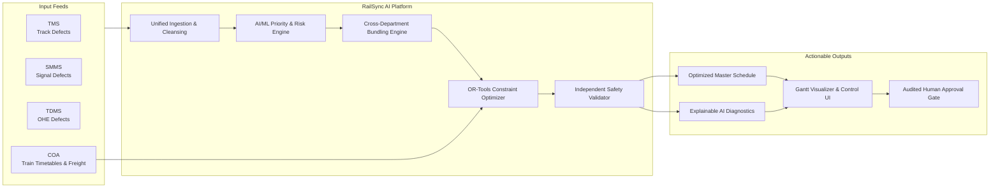

# 01_PROBLEM_AND_SCOPE.md — Problem Statement, Domain Context & System Scope

## SIH26027: AI-Powered Automatic Block Planning to Maximize Asset Availability for Train Operations on Indian Railways

---

## 1. Domain Background & Current Operational Reality

Indian Railways (IR) operates one of the largest and most complex rail networks in the world, managing over 68,000 route kilometers, 13,000+ passenger trains, and 9,000+ freight trains daily. To maintain safety, reliability, and speed efficiency, fixed railway infrastructure—comprising tracks, points, signals, telecommunication, and overhead electrification (OHE)—requires continuous preventive maintenance, periodic overhaul, and rapid defect rectification.

Under current operational practices:
- **Civil Engineering (Permanent Way / Track):** Utilizes the **TMS (Track Management System)** to log track geometry defects, rail fractures, ultrasonic flaw detection (USFD) alerts, weld renewals, and machine tamping requirements.
- **Signal & Telecommunication (S&T):** Utilizes the **SMMS (Signalling Maintenance & Management System)** to track point machine health, signal lamp failures, track circuit glitches, electronic interlocking health, and axle counter status.
- **Electrical (Traction Distribution / TRD):** Utilizes the **TDMS (Traction Distribution Management System)** to monitor OHE wire tension, contact wire wear, insulator wash/replacement, pantograph impact defects, and power substation maintenance.
- **Train Traffic Control:** Utilizes the **COA (Control Office Application)**, where Section Controllers regulate real-time passenger train timetables and dispatch goods trains.
- **Manual Block Requisition:** When departmental engineers require track access, they submit maintenance requests ("block demands") via the legacy **BDMS (Block Demand Management System)** or manual memo systems.

```
+----------------------------------------------------------------------------------------------------+
|                               CURRENT SILOED OPERATIONAL MODEL (MANUAL BDMS)                       |
+----------------------------------------------------------------------------------------------------+
|                                                                                                    |
|  [ TMS Database ]        [ SMMS Database ]        [ TDMS Database ]        [ COA Timetable & Goods]|
|  (Track Defects)         (Signal Defects)         (OHE Elect. Defects)     (Section Controller)    |
|         │                        │                        │                        │               |
|         ▼                        ▼                        ▼                        │               |
|  [ Engineering Memo ]    [ S&T Memo ]             [ TRD Memo ]                     │               |
|  Demand: 3 hrs @ Km 42   Demand: 2.5 hrs @ Km 44  Demand: 2 hrs @ Km 43            │               |
|         │                        │                        │                        │               |
|         └────────────────────────┼────────────────────────┘                        │               |
|                                  ▼                                                 │               |
|                     [ Uncoordinated BDMS Requests ]                                │               |
|                     (Siloed, Competing, Unranked)                                  │               |
|                                  │                                                 │               |
|                                  ▼                                                 │               |
|                     [ Manual Negotiation in Control Office ] ◄─────────────────────┘               |
|                     - Section Controller overwhelmed with manual trade-offs                        |
|                     - Requests granted individually or deferred arbitrarily                        |
|                     - Same corridor closed 3 times on consecutive days                             |
|                     - High passenger train punctuality loss & severe freight delays                |
+----------------------------------------------------------------------------------------------------+
```

---

## 2. Failure Points of the Manual / Decentralized Approach

1. **Fragmentation of Track Occupancy (Block Chatter):** Engineering takes a 2-hour block on Monday at Km 42. S&T takes a 2-hour block on Tuesday at Km 44. TRD takes a 2-hour block on Wednesday at Km 43. The same 5-kilometer corridor is blocked three distinct times, tripling total train disruption.
2. **Subjective & Opaque Prioritization:** Block allocation relies on manual negotiations between departmental Senior Section Engineers (SSEs) and Section Controllers, leading to arbitrary deferral of critical safety repairs in favor of operational convenience.
3. **Critical Defect Escalation:** Overdue minor defects (e.g., weld fatigue or insulator micro-cracks) are deferred repeatedly until they cause an emergency failure, leading to unplanned emergency line closures and safety risks.
4. **Under-Utilization of Timetable "Shadow Blocks":** Natural gaps between scheduled passenger trains (especially during off-peak night hours or wide headways) go unutilized because manual controllers lack automated tools to spot and match complex multi-departmental repair requirements into those windows.
5. **Goods Train Disruption:** Goods trains operate without published fixed timetables, relying on path forecasts. Unplanned maintenance blocks bottleneck freight movement, impacting national logistics supply chains.

---

## 3. What RailSync AI Solves

**RailSync AI** replaces the uncoordinated manual BDMS workflow with an automated, AI-driven, constraint-optimized decision-support engine.



### Core Objective Function
**Maximize fixed-infrastructure asset availability while strictly respecting passenger and freight train operations, safety clearances, and resource limitations.**

$$\text{Maximize } \mathcal{A}_{\text{network}} = \frac{\sum_{s \in \mathcal{S}} \left( T_{\text{total}} - T_{\text{downtime}}(s) \right)}{|\mathcal{S}| \times T_{\text{total}}} \times 100\%$$

---

## 4. Fundamental Concept Definitions

| Term | Engineering Definition in RailSync AI | Tag |
| :--- | :--- | :--- |
| **Asset** | A physical piece of railway infrastructure (track segment, point machine, signal unit, OHE mast, transformer) uniquely identified in the network registry. | `[SOURCE-BACKED]` |
| **Maintenance Task** | A discrete unit of work required to inspect, service, or repair an asset, specifying duration, required crew/machinery, and isolation needs. | `[SOURCE-BACKED]` |
| **Defect** | An anomalous condition detected on an asset with an associated severity rating (Critical, Major, Minor), reported by TMS, SMMS, or TDMS. | `[SOURCE-BACKED]` |
| **Corridor & Segment** | A *Corridor* is a contiguous rail section connecting major junctions (e.g., Delhi-Agra). A *Segment* is an indivisible sub-block (typically 2 to 5 km) bounded by block stations or signals. | `[ENGINEERING ASSUMPTION]` |
| **Block (Possession)** | A formally authorized period during which train traffic is suspended on a specific track segment to allow maintenance work. | `[SOURCE-BACKED]` |
| **Shadow Block** | A candidate time window naturally available between scheduled train runs (or freight forecast paths) where maintenance could theoretically occur without disrupting train paths. *A shadow block is a candidate period of corridor capacity, not an automatic authorization to occupy infrastructure.* | `[SOURCE-BACKED]` |
| **Timetable Gap** | The elapsed time $\Delta t = t_{\text{entry}}(T_{k+1}) - t_{\text{exit}}(T_k)$ between consecutive train runs on a specific track segment. | `[ENGINEERING ASSUMPTION]` |
| **Scheduled Window** | The exact start time $t_{\text{start}}$ and end time $t_{\text{end}}$ assigned to a maintenance block by the optimization engine. | `[ENGINEERING ASSUMPTION]` |
| **Disruption Impact** | The penalty score reflecting potential delay or speed restriction imposed on train traffic by a maintenance possession. | `[ENGINEERING ASSUMPTION]` |
| **Asset Downtime** | Total duration during which an infrastructure segment is closed to normal train operations for maintenance. | `[SOURCE-BACKED]` |
| **Task Bundling** | The simultaneous execution of multiple maintenance tasks (potentially from different departments) within a single physical block window. | `[SOURCE-BACKED]` |
| **Feasibility & Infeasibility** | A schedule is *Feasible* if and only if all hard constraints (train headways, safety buffers, resource concurrency, isolation) are satisfied. Otherwise, it is *Infeasible*. | `[ENGINEERING ASSUMPTION]` |

---

## 5. System Boundary: Inputs, Computations & Outputs

```
+----------------------------------------------------------------------------------------------------+
|                                    SYSTEM BOUNDARY & DATA FLOWS                                    |
+----------------------------------------------------------------------------------------------------+
|                                                                                                    |
|  [ INCOMING DATA FEEDS ]                                                                           |
|  1. TMS Feed: Track geometry defects, rail wear, USFD weld data, tamping machine backlog.           |
|  2. SMMS Feed: Signal lamp outages, point motor health, track circuit faults, cable upkeep.        |
|  3. TDMS Feed: OHE tension anomalies, contact wire thickness, insulator checks, substation logs.   |
|  4. COA Feed: Active passenger timetables (arrival/departure per station), freight path forecasts. |
|  5. Resource Catalog: Available SSE crews, TRD tower wagons, track tamping machines, work gangs.   |
|                                                                                                    |
|  [ WHAT RAILSYNC AI COMPUTES ]                                                                     |
|  1. Data Quality & Normalization: Validates kilometer marks, standardizes timestamps and codes.    |
|  2. Dynamic Risk & Priority Score: Computes severity, asset criticality, overdue age, ML score.    |
|  3. Candidate Window Generation: Identifies timetable gaps and subtracts setup/clearance buffers.  |
|  4. Multi-Department Bundling: Groups spatially adjacent, resource-compatible tasks.               |
|  5. Constraint Optimization (OR-Tools CP-SAT): Allocates bundled tasks into optimal windows.       |
|  6. Independent Schedule Verification: Checks 24 hard safety/operational constraints.              |
|  7. Infeasibility & Explainability Diagnostics: Identifies bottlenecks for unscheduled tasks.      |
|  8. Availability & Downtime Metrics: Computes corridor uptime, block-hours saved, and risk decay.  |
|                                                                                                    |
|  [ WHAT RAILSYNC AI PRODUCES ]                                                                     |
|  1. Weekly Operational Maintenance Plan: Granular, block-by-block schedule for the next 7 days.   |
|  2. Monthly Strategic Maintenance Forecast: Aggregate capacity demand and backlog projection.     |
|  3. Interactive Gantt Timeline: Synchronized train graph + maintenance blocks view.                |
|  4. Actionable Exception Queue: List of unscheduled tasks with exact root-cause explanations.      |
|  5. Immutable Audit Log & Export Records: JSON/CSV exports and cryptographic change logs.          |
+----------------------------------------------------------------------------------------------------+
```

---

## 6. Automation Scope vs. Human Control Boundary

> [!IMPORTANT]
> **Decision-Support Guardrail:** RailSync AI is strictly an intelligent decision-support and optimization system. It **does NOT** autonomously grant track possessions, manipulate physical interlocking, alter railway signaling, or dispatch field crews without human authorization.

| Operational Action | Automated by RailSync AI | Human Controller Responsibility | Tag |
| :--- | :---: | :---: | :--- |
| Defect Ingestion & Normalization | **YES** | Reviews flagged data quality anomalies | `[SOURCE-BACKED]` |
| Risk & Priority Scoring | **YES** | May adjust urgency override with logged justification | `[SOURCE-BACKED]` |
| Timetable Gap Identification | **YES** | Verifies sudden unscheduled traffic variations | `[SOURCE-BACKED]` |
| Cross-Department Task Bundling | **YES** | Confirms inter-departmental tool/crew coordination | `[SOURCE-BACKED]` |
| Mathematical Schedule Optimization | **YES** | Configures objective weights and solver timeouts | `[SOURCE-BACKED]` |
| Block Approval & Publication | **NO** | **Mandatory approval by Chief Controller / Section Controller** | `[SOURCE-BACKED]` |
| Emergency Schedule Override | **NO** | Controller manually moves/cancels/inserts block with audit | `[SOURCE-BACKED]` |
| Physical Possession Authority | **NO** | Handled via official railway block protocols (Operating Manual) | `[SOURCE-BACKED]` |

---

## 7. In-Scope vs. Out-of-Scope Capabilities

### In-Scope (Hackathon Prototype Implementation)
- Ingestion of simulated/mock TMS, SMMS, TDMS, and COA datasets via CSV/REST APIs.
- Automated data validation, geospatial matching, and deduplication.
- Hybrid prioritization engine combining deterministic safety rules and an XGBoost/GBDT tabular model.
- Candidate shadow-block generation derived from train timetable gaps and freight forecasts.
- Multi-department task bundling with spatial, temporal, and isolation compatibility rules.
- OR-Tools CP-SAT mathematical optimization enforcing 24 hard constraints and 10 soft objectives.
- Independent schedule validator ensuring zero safety constraint violations.
- Multi-horizon planning: 7-day granular weekly schedule + 30-day aggregated monthly strategic plan.
- React + Vite web dashboard featuring interactive Gantt charts, geotagged map view, task queue, and metric cards.
- Human-in-the-loop override interface with automatic revalidation and immutable audit logging.
- Targeted disruption re-optimization when trains are delayed or emergency defects occur.
- Full offline operation on local machines without cloud dependencies.

### Out-of-Scope (Future Enterprise Scalability)
- Direct physical integration with live production CRIS (Centre for Railway Information Systems) database backends.
- Real-time GPS tracking of field work crews and locomotives.
- Automatic electronic interlocking / signal route setting.
- Direct inventory supply-chain warehouse ordering for spare parts.
- Automated biometric crew roster dispatch.

---

## 8. Prototype vs. Production Integration Boundary

```
+----------------------------------------------------------------------------------------------------+
|                                    PROTOTYPE VS. PRODUCTION BOUNDARY                               |
+----------------------------------------------------------------------------------------------------+
|                                                                                                    |
|  [ PROTOTYPE IMPLEMENTATION (LOCAL / HACKATHON) ]                                                  |
|  - Data Source: Realistic, reproducible synthetic data generator with fixed seed.                  |
|  - Storage: Local PostgreSQL or SQLite database.                                                   |
|  - Network: Localhost / Air-gapped LAN.                                                            |
|  - Interfaces: Modern REST APIs with OpenAPI documentation.                                        |
|  - Security: Local JWT/Session authentication with role-based access control.                       |
|                                                                                                    |
|  [ PRODUCTION INTEGRATION CONTRACT (ENTERPRISE READY) ]                                            |
|  - Direct Kafka / MQ message bus connectors to CRIS TMS, SMMS, TDMS, and COA servers.              |
|  - Enterprise Active Directory / Single Sign-On (SSO) integration.                                 |
|  - High-availability distributed database cluster with multi-zone replication.                      |
|  - Official Indian Railways General & Subsidiary Rules (G&SR) safety certification compliance.     |
+----------------------------------------------------------------------------------------------------+
```
