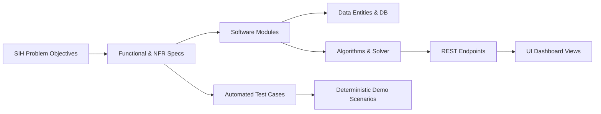

# 03_TRACEABILITY_MATRIX.md — End-to-End Traceability Matrix

## SIH26027: AI-Powered Automatic Block Planning to Maximize Asset Availability for Train Operations on Indian Railways

---

## 1. Traceability Architecture

The Traceability Matrix establishes bidirectional verification from the high-level **SIH26027 Problem Statement Objectives** to **System Requirements (`FR`/`NFR`)**, **Software Modules**, **Database Entities**, **Core Algorithms**, **REST APIs**, **Frontend UI Components**, **Verification Test Cases**, and **Demo Scenarios**.

---

## 2. Master Traceability Matrix

| SIH Objective | Req ID | Software Module | Database Entities | Algorithm / Model | REST API Endpoint | UI Dashboard View | Test ID | Demo Scenario |
| :--- | :--- | :--- | :--- | :--- | :--- | :--- | :--- | :--- |
| **1. Multi-Source Data Ingestion** | `FR-001` `FR-002` `FR-003` `FR-004` `FR-005` | `backend/ingestion/` | `raw_ingest_records` `tms_records` `smms_records` `tdms_records` `coa_records` | Schema Parsing, Format Standardization, Timetable Segment Mapper | `POST /api/v1/ingestion/sync` `GET /api/v1/ingestion/runs` | Data Ingestion Hub, Command Center | `TC-ING-001` `TC-ING-002` `TC-ING-003` `TC-ING-004` `TC-ING-005` | Scenario 1, Scenario 2 |
| **2. Unified Normalization & DQ** | `FR-006` `FR-007` | `backend/processing/` | `maintenance_tasks` `assets` `corridors` `segments` `data_quality_reports` | Deduplication Hashing, Anomaly Detection Gate, Spatial Projection | `GET /api/v1/tasks` `GET /api/v1/data-quality/report` | Task Queue, Data Health Monitor | `TC-NORM-001` `TC-VAL-001` | Scenario 1, Scenario 7 |
| **3. AI/ML Task Prioritization** | `FR-008` | `backend/engine/priority/` | `maintenance_tasks` `priority_scores` `model_metadata` | Rule-based Safety Gate + XGBoost/GBDT Regressor + SHAP Explainer | `POST /api/v1/prioritization/run` `GET /api/v1/prioritization` | Task Queue, Priority Breakdown Panel | `TC-PRI-001` | Scenario 2, Scenario 3 |
| **4. Shadow-Block Window Generation** | `FR-009` | `backend/engine/windows/` | `train_movements` `candidate_windows` `safety_buffers` | Timetable Gap Extractor, Buffer Subtraction, Traffic Conflict Filter | `GET /api/v1/candidate-windows` | Gantt Schedule (Gap Overlay), Optimization Center | `TC-CWG-001` | Scenario 2, Scenario 4 |
| **5. Cross-Department Bundling** | `FR-010` | `backend/engine/bundling/` | `task_bundles` `bundle_items` `compatibility_rules` | Geospatial Sector Clustering, Isolation Compatibility Matrix | `GET /api/v1/bundles` | Task Queue (Bundle View), Optimization Center | `TC-BND-001` | Scenario 1, Scenario 2 |
| **6. Constraint-Based Scheduling** | `FR-011` | `backend/engine/optimizer/` | `optimization_runs` `scheduled_blocks` `schedule_items` | Google OR-Tools CP-SAT (24 Hard Constraints, 10 Objectives) | `POST /api/v1/optimization/run` `GET /api/v1/schedules/{id}` | Gantt Schedule Visualizer, Optimization Center | `TC-OPT-001` | Scenario 2, Scenario 5 |
| **7. Multi-Horizon Planning** | `FR-012` `FR-013` | `backend/engine/horizons/` | `scheduled_blocks` `strategic_forecasts` `monthly_plans` | Rolling-Horizon Scheduler, Strategic Capacity Aggregator | `GET /api/v1/schedules/weekly` `GET /api/v1/schedules/monthly` | Weekly Operational Plan, Monthly Strategic Plan | `TC-MHP-001` `TC-MHP-002` | Scenario 8, Scenario 9 |
| **8. Independent Safety Validation** | `FR-014` | `backend/engine/validator/` | `validation_results` `constraint_violations` | Deterministic Constraint Validator & Safety Interlock Engine | `POST /api/v1/schedules/{id}/validate` | Conflicts & Exceptions View | `TC-VAL-002` | Scenario 4, Scenario 5 |
| **9. Human Override & Approval** | `FR-015` | `backend/api/schedules.py` | `schedule_overrides` `schedule_approvals` | State Machine Controller (Draft $\to$ Approved $\to$ Published) | `POST /api/v1/schedules/{id}/override` `POST /api/v1/schedules/{id}/approve` | Gantt Interactive Override, Audit/Approval View | `TC-OVR-001` | Scenario 6, Scenario 7 |
| **10. Immutable Audit Logging** | `FR-016` | `backend/audit/` | `audit_events` `audit_log_entries` | SHA-256 Chained Event Logger, Session Context Injector | `GET /api/v1/audit` | Audit & Compliance Log | `TC-AUD-001` | Scenario 6 |
| **11. Explainable Infeasibility** | `FR-017` | `backend/engine/diagnostics/` | `infeasibility_diagnostics` `unscheduled_tasks` | Root Cause Diagnostic Tree, SHAP Feature Importance Explainer | `GET /api/v1/conflicts` `GET /api/v1/tasks/{id}/explanation` | Task Detail Modal, Conflicts & Exceptions View | `TC-EXP-001` | Scenario 3, Scenario 7 |
| **12. Data Import / Export** | `FR-018` | `backend/export/` | `export_jobs` `download_tokens` | CSV Sanitizer (Formula Injection Protection), JSON Serializer | `GET /api/v1/export/csv` `GET /api/v1/export/json` | Command Dashboard, Plan Export Toolbar | `TC-EXP-002` | Scenario 8 |
| **13. Disruption Re-Optimization** | `FR-019` | `backend/engine/reoptimizer/` | `disruption_events` `schedule_patches` | Incremental Targeted Replanning (Impacted Subgraph Solver) | `POST /api/v1/reoptimize` | Disruption Recovery Banner, Gantt Plan Diff | `TC-DIS-001` | Scenario 6 |

---

## 3. Non-Functional Traceability Matrix

| NFR ID | Quality Attribute | Technical Implementation | Verification Method | Associated Test ID |
| :--- | :--- | :--- | :--- | :--- |
| `NFR-001` | Offline Capability | 100% local SQLite/PostgreSQL, local model inference, zero external HTTP dependencies | Disconnect network adapter & execute full suite | `TC-NFR-001` |
| `NFR-002` | Determinism | Seeded NumPy/Python random seeds (`seed=42`), deterministic CP-SAT solver threads | Execute solver 10x; assert identical schedule hash | `TC-NFR-002` |
| `NFR-003` | Performance | CP-SAT solver configured with 30s timeout; interval pruning on candidate windows | Benchmark test on 1,000 tasks over 10 corridors | `TC-NFR-003` |
| `NFR-004` | Low Latency | FastAPI asynchronous route handlers, indexed database queries, in-memory caching | Load test endpoint execution with Locust/Pytest | `TC-NFR-004` |
| `NFR-005` | Data Integrity | Database foreign key cascades, unique constraints, check constraints | Property-based testing with Hypothesis | `TC-NFR-005` |
| `NFR-006` | Audit Trail | SQLAlchemy event listener injecting immutable audit records on entity mutations | Audit verification test suite asserting row creation | `TC-NFR-006` |
| `NFR-007` | Explainability | SHAP TreeExplainer persisted outputs, categorical infeasibility decision tree | Automated assertion of explanation field non-nullness | `TC-NFR-007` |
| `NFR-008` | Access Control | JWT bearer tokens, role validation middleware (`ADMIN`, `CONTROLLER`, `ENGINEER`) | Unauthorized API call security assertion test | `TC-NFR-008` |
| `NFR-009` | Input Security | Pydantic strict schemas, regex sanitization on text fields, CSV injection prefixing | Security fuzzing test suite | `TC-NFR-009` |
| `NFR-010` | ML Fallback | Safe try-except fallback to deterministic rule score on model failure | Model corruption injection test | `TC-NFR-010` |
| `NFR-011` | Timezone Safety | Explicit ISO-8601 strings with timezone offset (`+05:30` IST); UTC storage | Timezone boundary regression test | `TC-NFR-011` |
| `NFR-012` | DB Portability | SQLAlchemy ORM abstraction compatible with SQLite and PostgreSQL | Run test suite against both SQLite and Postgres | `TC-NFR-012` |
| `NFR-013` | UI Responsiveness | Virtualized Gantt rendering, memoized React components | Chrome DevTools performance profiling | `TC-NFR-013` |
| `NFR-014` | Code Quality | Flake8/Black formatting, MyPy strict typing, Pytest $\ge 85\%$ coverage | CI/CD automated lint and test run | `TC-NFR-014` |
