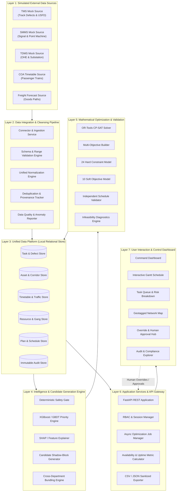

# 04_SYSTEM_ARCHITECTURE.md — System Architecture Specification

## SIH26027: AI-Powered Automatic Block Planning to Maximize Asset Availability for Train Operations on Indian Railways

---

## 1. Architectural Philosophy & Principles

RailSync AI is engineered as an **offline-first, modular monolithic decision-support system**. 

### Core Architectural Principles:
1. **Local-First & Air-Gapped Operation:** No mandatory reliance on public cloud infrastructure, external APIs, or internet connectivity.
2. **Deterministic Safety Core:** AI/ML models suggest priority, risk, and candidate groupings, but the final maintenance schedule is generated and strictly validated by a deterministic mathematical constraint solver (Google OR-Tools CP-SAT) and an independent safety rule checker.
3. **Decoupled 7-Layer Architecture:** Clean separation of concerns from simulated external data sources up to user interaction layers.
4. **Human-in-the-Loop Authority:** The system recommends, explains, and checks feasibility, but human controllers retain exclusive authority to approve and publish operational blocks.
5. **Full Traceability & Provenance:** Every task, candidate window, block allocation, override, and metric is immutably recorded with input versioning and audit trails.

---

## 2. 7-Layer Architecture Specification



---

## 3. Detailed Layer Descriptions

### Layer 1 — Simulated External Sources
- **Purpose:** Mimic live railway IT enterprise databases without requiring production access.
- **Components:**
  - `TMS Connector`: Generates track geometry exceedances, rail wear logs, ultrasonic testing flaw alerts, and tamping requirements.
  - `SMMS Connector`: Generates point machine timing delays, track circuit health drops, signal lamp failures, and telecom trunk cable upkeep items.
  - `TDMS Connector`: Generates OHE contact wire height/stagger anomalies, insulator pollution logs, and transformer substation overhaul jobs.
  - `COA Connector`: Generates active passenger train schedules with minute-by-minute segment entry/exit times.
  - `Freight Forecast Feed`: Generates probabilistic goods train paths with velocity curves and uncertainty buffers.

### Layer 2 — Data Integration & Cleansing Pipeline
- **Purpose:** Ingest raw payloads, enforce strict schemas, resolve spatial references, and detect corrupt/stale data.
- **Components:**
  - `Schema Validator`: Validates field presence, types, and allowed enum values.
  - `Geospatial Projector`: Maps raw chainages (e.g., `Km 142/10`) to discrete `CorridorSegment` identifiers.
  - `Deduplicator`: Computes SHA-256 content hashes to detect duplicate defect reports across sync cycles.
  - `Data Quality Gate`: Computes network-wide data completeness and validity scores; flags unresolvable records.

### Layer 3 — Unified Data Platform (Local Relational Store)
- **Purpose:** Provide an ACID-compliant, normalized relational persistence layer.
- **Engine Support:** PostgreSQL (production/high-throughput) and SQLite (zero-config local development).
- **Core Stores:** Tasks, Assets, Geography (Corridors & Segments), Timetables, Resources (Crews, Tamping Machines, Tower Wagons), Schedules, and Audit Logs.

### Layer 4 — Intelligence & Candidate Generation Engine
- **Purpose:** Transform raw tasks and timetables into actionable, prioritized candidates for mathematical scheduling.
- **Components:**
  - `Safety Rule Gate`: Immediate escalation to `EMERGENCY` ($\ge 90$) for critical track fractures, red signal outages, or OHE snap risks.
  - `GBDT Priority Regressor`: Predicts multi-factor urgency scores for routine and preventive tasks based on defect severity, asset age, and traffic volume.
  - `SHAP Explainer`: Extracts exact feature attribution weights (e.g., $+24$ pts due to overdue days, $+15$ pts due to passenger traffic density).
  - `Candidate Shadow-Block Generator`: Scans train graphs on each segment, extracts idle timetable gaps $\Delta t$, subtracts setup/clearance buffers, and emits verified candidate windows.
  - `Task Bundling Engine`: Evaluates spatial proximity ($\le 5\text{ km}$), isolation rules, and department tool compatibilities to construct unified composite block demands.

### Layer 5 — Mathematical Optimization & Validation
- **Purpose:** Compute optimal block allocations while mathematically guaranteeing zero safety violations.
- **Components:**
  - `OR-Tools CP-SAT Solver`: Models tasks and blocks as integer interval variables.
  - `Constraint Model`: Enforces 24 hard constraints (train headways, crew concurrency, electrical cutoffs, precedence).
  - `Objective Builder`: Combines asset uptime maximization, weighted priority completion, and minimal disruption into a normalized multi-objective function.
  - `Independent Schedule Validator`: Post-solver verification engine that verifies the candidate schedule independently before persistence.
  - `Infeasibility Diagnostics`: Decision-tree root cause analyzer that explains exactly why unscheduled tasks could not be placed.

### Layer 6 — Application Services & API Gateway
- **Purpose:** Expose high-performance REST APIs, manage asynchronous solver jobs, calculate metrics, and enforce security.
- **Components:**
  - `FastAPI Web Application`: Async route handlers with automatic OpenAPI 3.0 documentation.
  - `Security & RBAC`: JWT-based token verification and role permission enforcement.
  - `Metric Calculator`: Calculates network uptime percentages, downtime reduction, and block bundling efficiency in real-time.
  - `Sanitized Exporter`: Produces CSV/JSON exports with strict protection against formula injection.

### Layer 7 — User Interaction & Control Dashboard
- **Purpose:** Provide railway controllers and engineers with an intuitive, high-visibility decision-support dashboard.
- **Components:**
  - `Command Dashboard`: High-level KPI summary, data freshness indicators, and critical alert feeds.
  - `Interactive Gantt Visualizer`: Multi-track timeline showing train movements, candidate gaps, and scheduled maintenance blocks side-by-side.
  - `Task Queue & Detail View`: Searchable, filterable list of tasks with interactive SHAP priority waterfall charts.
  - `Geotagged Network Map`: Visual geographic representation of corridors, active defects, and scheduled blocks.
  - `Override & Approval Hub`: Interface for Section Controllers to review recommended schedules, adjust blocks, provide justification, and publish.

---

## 4. Deployment Topologies

```
+----------------------------------------------------------------------------------------------------+
|                                    DEPLOYMENT TOPOLOGY COMPARISON                                  |
+----------------------------------------------------------------------------------------------------+
|                                                                                                    |
|  [ TOPOLOGY A: LOCAL LAPTOP / HACKATHON DEMO (DEFAULT) ]                                           |
|  ┌────────────────────────────────────────────────────────────────────────┐                       |
|  │ Standalone Development Machine / Laptop                                 │                       |
|  │  ├── Frontend: Node.js / React + Vite (Port 5173 / Localhost)           │                       |
|  │  ├── Backend: Python 3.10+ / FastAPI / Uvicorn (Port 8000 / Localhost)  │                       |
|  │  ├── Database: SQLite file storage (`railsync.db`)                     │                       |
|  │  └── Mock Data: Seeded CSV / JSON files in `data/synthetic/`            │                       |
|  └────────────────────────────────────────────────────────────────────────┘                       |
|                                                                                                    |
|  [ TOPOLOGY B: RAILWAY DIVISIONAL CONTROL OFFICE NODE (AIR-GAPPED LAN) ]                           |
|  ┌────────────────────────────────────────────────────────────────────────┐                       |
|  │ Divisional Control Server (On-Premise Server Room)                      │                       |
|  │  ├── Database: Local PostgreSQL 15+ Cluster (Air-Gapped)                │                       |
|  │  ├── Backend Engine: Containerized FastAPI + OR-Tools Solver Worker     │                       |
|  │  ├── Ingestion Worker: Local Redis Queue + Scheduled Poller Daemon     │                       |
|  │  └── Static Web Host: Nginx Reverse Proxy serving Production React App │                       |
|  └───────────────┬────────────────────────────────────────┬───────────────┘                       |
|                  │ (Internal Secure Ethernet LAN)         │                                       |
|                  ▼                                        ▼                                       |
|  ┌──────────────────────────────┐        ┌──────────────────────────────┐                         |
|  │ Section Controller Workstation│        │ Chief Controller Workstation │                         |
|  │ (Chrome / Edge Browser)      │        │ (Approval & Master Gantt)    │                         |
|  └──────────────────────────────┘        └──────────────────────────────┘                         |
+----------------------------------------------------------------------------------------------------+
```
