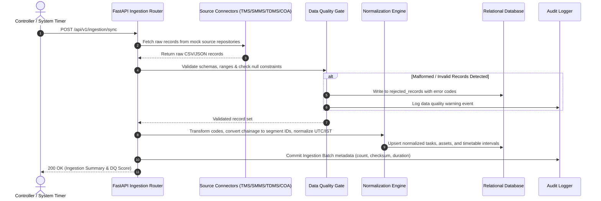
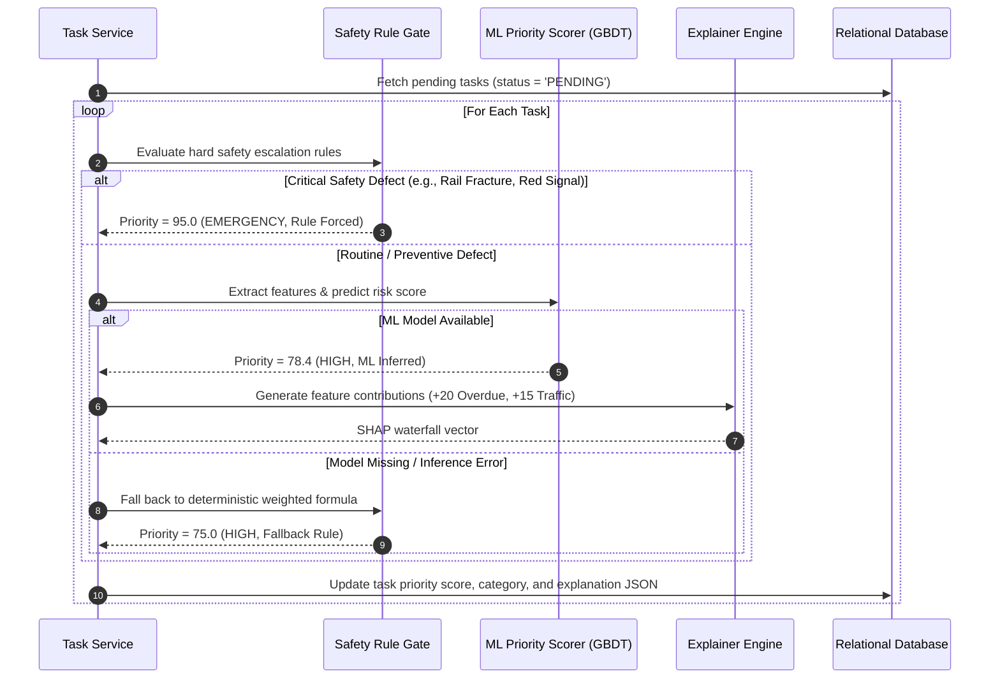
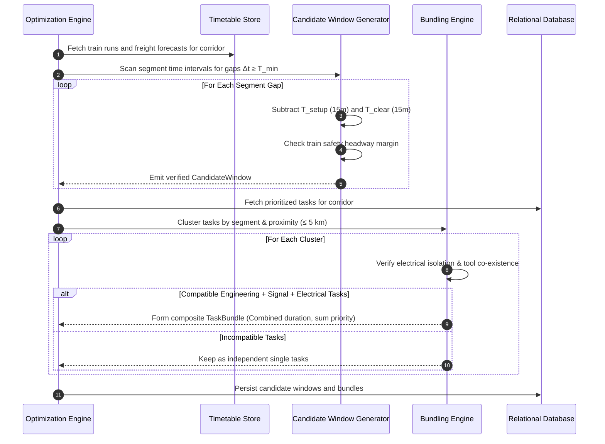
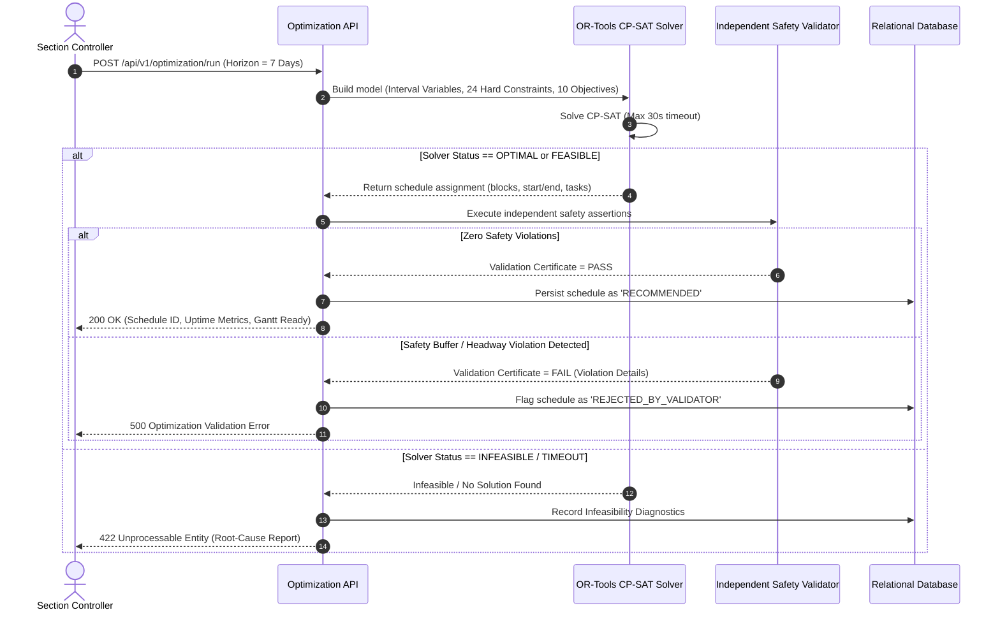
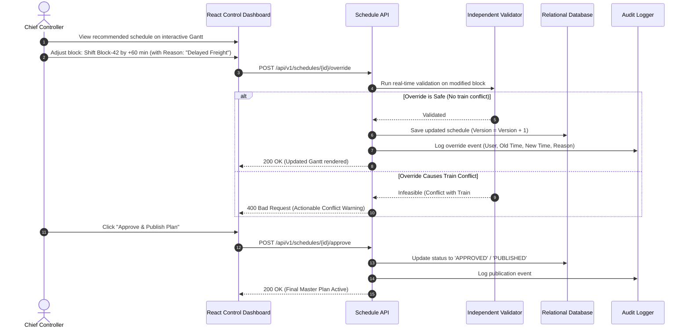
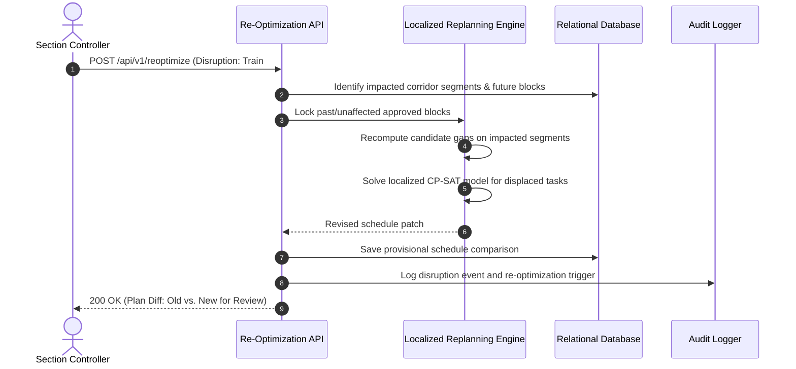

# 06_END_TO_END_WORKFLOW.md — End-to-End Operational Workflows

## SIH26027: AI-Powered Automatic Block Planning to Maximize Asset Availability for Train Operations on Indian Railways

---

## 1. Operational Workflow Catalog

| Workflow ID | Workflow Name | Description | Trigger | Actors / Systems |
| :--- | :--- | :--- | :--- | :--- |
| **Workflow A** | Initial & Periodic Data Sync | Ingestion, validation, normalization, deduplication, and data quality scoring | Scheduled timer / Manual Sync click | Connectors, Normalizer, Relational DB |
| **Workflow B** | Task Prioritization & Risk Scoring | Deterministic safety gating, ML risk inference, and SHAP feature attribution | Ingestion completion / On-demand | Safety Gate, XGBoost Model, Explainer |
| **Workflow C** | Candidate Shadow-Block Generation | Timetable gap scanning, buffer subtraction, and freight path analysis | Timetable update / Prioritization | Timetable Scanner, Buffer Engine |
| **Workflow D** | Cross-Department Task Bundling | Spatial clustering ($\le 5\text{ km}$), isolation and equipment compatibility checks | Candidate window generation | Bundling Engine, Compatibility Matrix |
| **Workflow E** | Mathematical Schedule Optimization | CP-SAT model building, hard constraint solving, multi-objective optimization | Controller trigger / Batch schedule run | OR-Tools Solver, Model Builder |
| **Workflow F** | Independent Safety Validation | Post-solver deterministic verification of all safety buffers and train headways | Solver completion | Independent Safety Validator |
| **Workflow G** | Human Review, Override & Approval | Gantt visualization, conflict review, manual adjustments, audit logging | Controller action | Section Controller, Chief Controller |
| **Workflow H** | Disruption Response & Re-Optimization | Dynamic localized replanning after train delays, cancellations, or emergency defects | Disruption event / Feed alert | Replanning Engine, Auditor |
| **Workflow I** | Multi-Horizon Plan Delivery | Publication of 7-day Weekly Operational Schedule and 30-day Monthly Strategic Plan | Final approval | Export Service, Dashboard UI |

---

## 2. Sequence Diagrams & Workflow Specifications

### Workflow A: Data Ingestion, Validation & Normalization Pipeline

---

### Workflow B: Task Prioritization & Explainable Risk Scoring

---

### Workflow C & D: Candidate Block Generation & Multi-Department Bundling

---

### Workflow E & F: Constraint Optimization & Independent Safety Verification

---

### Workflow G: Human Review, Manual Override & Official Approval

---

### Workflow H: Disruption Response & Targeted Re-Optimization

