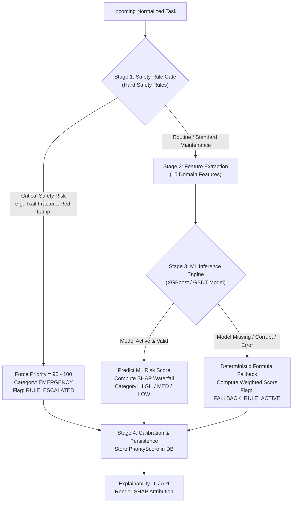

# 11_AI_ML_DESIGN.md — AI/ML Prioritization & Risk Model Specification

## SIH26027: AI-Powered Automatic Block Planning to Maximize Asset Availability for Train Operations on Indian Railways

---

## 1. Hybrid Prioritization Architecture & Philosophy

> [!IMPORTANT]
> **Domain & Safety Guardrail:** In RailSync AI, machine learning is **never** permitted to bypass hard safety constraints or directly write the final train timetable. AI/ML functions as an **intelligent prioritization and risk-estimation engine** that ranks and scores maintenance demands for downstream constraint optimization.



---

## 2. Stage 1: Deterministic Safety Rule Gate

Before executing ML inference, every task passes through deterministic safety escalation rules:

| Defect / Condition | Trigger Criterion | Forced Priority Score | Priority Tier | Tag |
| :--- | :--- | :---: | :---: | :--- |
| **Transverse Rail Fracture (TMS)** | `defect_type == 'RAIL_FRACTURE'` | `98.0` | `EMERGENCY` | `[SOURCE-BACKED]` |
| **Ultrasonic Weld Flaw (USFD IMR)**| `defect_type == 'USFD_IMR'` | `95.0` | `EMERGENCY` | `[SOURCE-BACKED]` |
| **Red Signal Outage (SMMS)** | `defect_type == 'SIGNAL_LAMP_FAIL'` | `96.0` | `EMERGENCY` | `[SOURCE-BACKED]` |
| **Point Motor Stall (SMMS)** | `defect_type == 'POINT_MOTOR_LOCK'` | `94.0` | `EMERGENCY` | `[SOURCE-BACKED]` |
| **OHE Contact Wire Snap Risk (TDMS)** | `defect_type == 'OHE_CRITICAL_SAG'` | `97.0` | `EMERGENCY` | `[SOURCE-BACKED]` |
| **Severe Overdue Age** | `overdue_days >= 30` | Escalated by $+30.0$ | `EMERGENCY` / `HIGH` | `[ENGINEERING ASSUMPTION]` |

---

## 3. Stage 2: Feature Engineering Pipeline

For tasks not immediately forced by the Safety Gate, 15 engineered features are computed:

| Feature Name | Type | Description | Normalization / Encoding |
| :--- | :--- | :--- | :--- |
| `f_defect_severity` | Categorical | Defect severity rating | Ordinal: `CRITICAL`=3, `MAJOR`=2, `MINOR`=1 |
| `f_asset_criticality` | Numeric | Static asset importance rating | Min-Max scaled $[0.0, 1.0]$ ($1.0 \to 5.0$) |
| `f_overdue_days` | Numeric | Days past mandatory compliance deadline | $\max(0, \text{days})$, log-transformed $\ln(1 + x)$ |
| `f_time_to_due_hours` | Numeric | Hours remaining until deadline | Clipped $[-168, 720]$, normalized |
| `f_traffic_density_hourly` | Numeric | Train movements per hour on segment | Min-Max scaled $[0.0, 1.0]$ ($0 \to 12\text{ tph}$) |
| `f_passenger_train_ratio` | Numeric | Fraction of passenger vs freight trains | Ratio $[0.0, 1.0]$ |
| `f_asset_age_years` | Numeric | Years since asset commissioning | Float, normalized against 30-year lifecycle |
| `f_failure_history_180d` | Numeric | Defect count on this asset in past 180 days | Integer count $[0, 20]$ |
| `f_department_code` | Categorical | Department identifier (`ENG`, `SIG`, `TRD`) | One-Hot Encoded |
| `f_required_duration_min` | Numeric | Required block possession duration | Min-Max scaled $[15, 480]$ |
| `f_requires_power_cutoff` | Binary | Whether OHE 25kV power must be isolated | Boolean `0` or `1` |
| `f_speed_limit_kmh` | Numeric | Maximum permissible speed on segment | Normalized $[30, 160]$ |
| `f_segment_utilization` | Numeric | Historical block demand pressure | Ratio $[0.0, 1.0]$ |
| `f_candidate_gap_count` | Numeric | Available gaps $\ge 90\text{ min}$ in next 7 days | Integer count $[0, 50]$ |
| `f_corridor_tier` | Categorical | High-density vs branch corridor tier | Ordinal: `A_GOLD`=3, `B_TRUNK`=2, `C_BRANCH`=1 |

---

## 4. Stage 3: ML Model Architecture & Training

### Model Specification:
- **Algorithm:** Gradient Boosted Decision Trees (XGBoost Regressor / LightGBM).
- **Target Variable ($y$):** Synthetic Urgency Risk Score $y \in [0.0, 100.0]$, reflecting the probability and operational severity of asset failure if unaddressed within the 7-day planning window.
- **Loss Function:** Squared Error with L1 regularization (Lasso) for sparsity and interpretability.
- **Evaluation on Synthetic Benchmark:**
  - $R^2 \ge 0.92$ on synthetic held-out test split.
  - Mean Absolute Error (MAE) $\le 3.5$ priority points.
  - Reproducible seed: `seed=42`.

```python
# Model hyperparameters: ml_models/train_priority.py
XGB_PARAMS = {
    "n_estimators": 150,
    "max_depth": 5,
    "learning_rate": 0.05,
    "subsample": 0.85,
    "colsample_bytree": 0.85,
    "reg_alpha": 0.1,
    "reg_lambda": 1.0,
    "random_state": 42
}
```

---

## 5. Deterministic Baseline Formula & Model Fallback

If the trained model binary is missing, corrupted, or encounters an invalid inference payload, the system automatically falls back to a transparent deterministic formula:

$$\mathcal{P}_{\text{baseline}} = w_1 \cdot S_{\text{defect}} + w_2 \cdot C_{\text{asset}} + w_3 \cdot O_{\text{overdue}} + w_4 \cdot T_{\text{traffic}} + w_5 \cdot H_{\text{history}}$$

Where default weights are configured as:
- $w_1 = 0.35$ (Defect Severity: Critical=100, Major=65, Minor=30)
- $w_2 = 0.20$ (Asset Criticality: Scaled 0 to 100)
- $w_3 = 0.25$ (Overdue Factor: $\min(100, \text{overdue\_days} \times 5)$)
- $w_4 = 0.10$ (Traffic Density Factor: Scaled 0 to 100)
- $w_5 = 0.10$ (Failure History Factor: Scaled 0 to 100)

---

## 6. Explainability via SHAP Waterfall Attribution

Every predicted priority score is decomposed into additive feature contributions using TreeSHAP:

$$\mathcal{P}_{\text{task}} = \text{Base Value} + \sum_{i=1}^{M} \phi_i$$

### Example Explanation Payload:
```json
{
  "task_id": "TSK-TMS-2026-0042",
  "priority_score": 88.5,
  "priority_category": "HIGH",
  "base_value": 45.0,
  "shap_contributions": [
    {"feature": "Overdue Days (14 days)", "impact": +22.4, "direction": "INCREASE"},
    {"feature": "Defect Severity (Major)", "impact": +14.2, "direction": "INCREASE"},
    {"feature": "Asset Criticality (Weight 4.5)", "impact": +9.8, "direction": "INCREASE"},
    {"feature": "Passenger Traffic Density", "impact": +4.1, "direction": "INCREASE"},
    {"feature": "Candidate Gap Abundance", "impact": -7.0, "direction": "DECREASE"}
  ],
  "human_summary": "Task priority is 88.5/100 (HIGH). Driven primarily by 14 days overdue status (+22.4 pts) and high asset criticality (+9.8 pts)."
}
```
