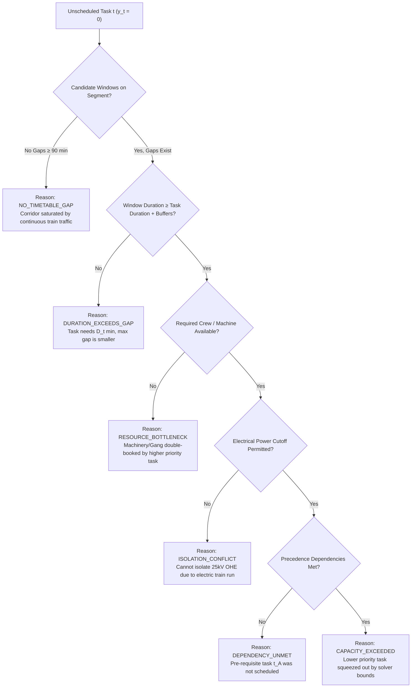

# 12_OPTIMIZATION_AND_CONSTRAINT_MODEL.md — Optimization & Constraint Model Specification

## SIH26027: AI-Powered Automatic Block Planning to Maximize Asset Availability for Train Operations on Indian Railways

---

## 1. Problem Formulation & Why Constraint Programming

The block scheduling challenge on Indian Railways is a **Multi-Resource, Multi-Horizon, Spatially-Constrained Non-Preemptive Job Shop Scheduling Problem with Disjunctive Precedence and Dynamic Headway Windows**.

### Why ML Alone is Insufficient:
- Machine learning models are probabilistic and cannot guarantee $100\%$ mathematical compliance with hard physical constraints (e.g., zero train-maintenance collisions, strict electrical isolation, crew concurrency).
- Any constraint violation in railway operations carries catastrophic safety risks.
- Google OR-Tools **CP-SAT (Constraint Programming - Satisfiability)** is selected because it delivers exact, deterministic mathematical proof of feasibility and optimality across discrete integer time intervals.

---

## 2. Decision Variables & Notation

Let:
- $\mathcal{T} = \{t_1, t_2, \dots, t_N\}$ be the set of pending maintenance tasks.
- $\mathcal{W} = \{w_1, w_2, \dots, w_M\}$ be the set of pre-calculated candidate shadow-block windows.
- $\mathcal{S}$ be the set of discrete corridor track segments.
- $\mathcal{R}$ be the set of available crew and machinery resources.
- $\mathcal{B} = \{b_1, b_2, \dots, b_K\}$ be the set of candidate cross-departmental task bundles.

### Primary Decision Variables:

| Variable | Type | Domain | Description |
| :--- | :--- | :--- | :--- |
| $x_{t,w} \in \{0, 1\}$ | Boolean | $\{0, 1\}$ | $1$ if task $t$ is scheduled in candidate window $w$; $0$ otherwise. |
| $y_t \in \{0, 1\}$ | Boolean | $\{0, 1\}$ | $1$ if task $t$ is scheduled in the current planning horizon; $0$ if deferred. |
| $z_b \in \{0, 1\}$ | Boolean | $\{0, 1\}$ | $1$ if task bundle $b$ is selected and executed; $0$ otherwise. |
| $\text{start}_t \in \mathbb{Z}^+$ | Integer | $[0, T_{\text{horizon}}]$ | Scheduled start time of task $t$ (in minutes from horizon start). |
| $\text{end}_t \in \mathbb{Z}^+$ | Integer | $[0, T_{\text{horizon}}]$ | Scheduled end time of task $t$ ($\text{end}_t = \text{start}_t + D_t$). |
| $\text{interval}_t$ | CP-SAT Interval | $[\text{start}_t, \text{end}_t, D_t]$ | Optional/mandatory CP-SAT interval variable for task $t$. |
| $u_{b,w} \in \{0, 1\}$ | Boolean | $\{0, 1\}$ | $1$ if bundle $b$ is assigned to candidate window $w$. |
| $r_{k,t} \in \{0, 1\}$ | Boolean | $\{0, 1\}$ | $1$ if resource $k \in \mathcal{R}$ is allocated to task $t$. |

---

## 3. The 24 Hard Constraints (Strict Safety & Operational Feasibility)

Every valid schedule $\mathcal{X}$ generated by RailSync AI must satisfy all 24 hard constraints without exception:

### 1. Train Traffic Non-Interference
Maintenance interval must not overlap with scheduled passenger or freight train occupancies on the same segment:
$$\forall t \in \mathcal{T}, \forall \text{Train } tr \text{ on } \text{segment}(t): \quad [\text{start}_t - T_{\text{setup}}, \text{end}_t + T_{\text{clear}}] \cap [t_{\text{entry}}(tr), t_{\text{exit}}(tr)] = \emptyset$$

### 2. Window Confinement
A scheduled task must lie completely within its assigned candidate window $w$:
$$x_{t,w} = 1 \implies \text{start}_w \le \text{start}_t \quad \land \quad \text{end}_t \le \text{end}_w$$

### 3. Non-Preemptive Execution
Once maintenance commences, it must proceed uninterrupted for its full required duration $D_t$:
$$\text{end}_t - \text{start}_t = D_t \cdot y_t$$

### 4. Setup and Clearance Buffer Invariance
Mandatory safety preparation ($T_{\text{setup}} = 15\text{ min}$) and track clearing ($T_{\text{clear}} = 15\text{ min}$) buffers must be preserved:
$$\text{start}_t \ge \text{window\_start}_w + T_{\text{setup}}, \quad \text{end}_t \le \text{window\_end}_w - T_{\text{clear}}$$

### 5. Task Single-Assignment
A task can be scheduled at most once in the planning horizon:
$$\sum_{w \in \mathcal{W}} x_{t,w} = y_t \le 1, \quad \forall t \in \mathcal{T}$$

### 6. Crew Non-Concurrency (Disjunctive Resource)
The same maintenance crew/gang cannot perform two tasks simultaneously:
$$\text{NoOverlap}(\{\text{interval}_t \mid r_{\text{crew}, t} = 1\}), \quad \forall \text{crew} \in \mathcal{R}_{\text{crew}}$$

### 7. Heavy Machinery Non-Concurrency
Specialized equipment (e.g. Tamping Machine #01, Tower Wagon #03) cannot be assigned to overlapping intervals:
$$\text{NoOverlap}(\{\text{interval}_t \mid r_{\text{machinery}, t} = 1\}), \quad \forall \text{machine} \in \mathcal{R}_{\text{machinery}}$$

### 8. Resource Availability Horizon
A task requiring crew $k$ can only be scheduled when crew $k$ is on active roster:
$$x_{t,w} = 1 \implies \text{IsRostered}(k, \text{start}_t, \text{end}_t) = 1$$

### 9. Electrical Power Isolation (25kV OHE)
If task $t$ requires power cutoff, no electric train movement or power-dependent task may run on that electrical section:
$$\text{requires\_power\_cutoff}(t) = 1 \land y_t = 1 \implies \text{PowerIsolated}(\text{segment}(t), \text{start}_t, \text{end}_t) = 1$$

### 10. Precedence Dependencies
If task $t_B$ strictly depends on prior completion of task $t_A$:
$$y_{t_A} \ge y_{t_B} \quad \land \quad \text{start}_{t_B} \ge \text{end}_{t_A} + T_{\text{switch}}$$

### 11. Spatial Segment Coherence
Task $t$ can only be assigned to a candidate window $w$ located on its physical segment:
$$x_{t,w} = 1 \implies \text{segment}(t) == \text{segment}(w)$$

### 12. Mandatory Blackout Periods
No maintenance may be scheduled during declared VIP movements, major festival traffic, or prohibited hours:
$$[\text{start}_t, \text{end}_t] \cap \text{BlackoutInterval} = \emptyset$$

### 13. Published Block Invariance (Rolling Horizon)
Previously published and committed blocks are fixed unless an explicit human override unlocks them:
$$b \in \mathcal{B}_{\text{published}} \implies \text{start}_b = \text{start}_b^{\text{fixed}}, \quad \text{end}_b = \text{end}_b^{\text{fixed}}$$

### 14. Emergency Task Priority Placement
Emergency safety tasks ($\mathcal{P} \ge 95$) must be scheduled in the earliest feasible window:
$$y_{t_{\text{emergency}}} = 1 \quad \text{if } \exists w \text{ feasible}$$

### 15. Bundle Spatial Proximity
Tasks bundled together into bundle $b$ must be within the maximum allowed spatial threshold ($\le 5.0\text{ km}$):
$$\forall t_i, t_j \in b: \quad |\text{location\_km}(t_i) - \text{location\_km}(t_j)| \le \Delta_{\text{max\_bundle\_km}}$$

### 16. Bundle Temporal Co-existence
All tasks within a composite bundle must share the exact same physical block possession window:
$$\forall t_i \in b: \quad \text{start}_b \le \text{start}_{t_i} \quad \land \quad \text{end}_{t_i} \le \text{end}_b$$

### 17. Inter-Departmental Incompatibility Matrix
Mutually exclusive task types (e.g., track lifting vs. fragile signaling relay calibration) cannot be placed in the same bundle:
$$\text{IsIncompatible}(t_i, t_j) = 1 \implies t_i \text{ and } t_j \text{ cannot co-exist in bundle } b$$

### 18. Maximum Bundle Capacity
A single block possession cannot bundle more tasks than the segment safety supervisor limit ($N_{\text{max\_bundle}} \le 5$):
$$\sum_{t \in b} 1 \le N_{\text{max\_bundle}}$$

### 19. Data Quality Quarantine Exclusion
Tasks marked `REJECTED` or `QUARANTINED` by the Data Quality Gate are excluded from model domains:
$$\text{quality\_status}(t) == \text{'REJECTED'} \implies y_t = 0$$

### 20. Non-Rescheduling of Completed/Closed Tasks
Tasks already marked `COMPLETED` or `CANCELLED` are omitted from solver variables:
$$\text{lifecycle\_status}(t) \in \{\text{'COMPLETED'}, \text{'CANCELLED'}\} \implies y_t = 0$$

### 21. Strictly Monotonic Time Ordering
Start times must strictly precede end times:
$$\text{start}_t < \text{end}_t, \quad \forall t \text{ with } y_t = 1$$

### 22. Segment Capacity Limitation
Total concurrent track occupations on a single track segment cannot exceed permitted track capacity ($C_{\text{segment}} = 1$ for single line):
$$\sum_{t \in \mathcal{T}_{\text{active}}(s, \tau)} 1 \le C_s, \quad \forall s \in \mathcal{S}, \forall \tau \in [0, T_{\text{horizon}}]$$

### 23. Machinery Transit & Relocation Buffer
If machine $m$ transitions from segment $s_A$ to segment $s_B$, transit time must be enforced:
$$\text{start}_{t_B} \ge \text{end}_{t_A} + \text{TransitTime}(s_A, s_B)$$

### 24. Daylight Restriction for Visual Inspection Tasks
Visual OHE and track alignment tasks with daylight requirements must be scheduled between $06:00$ and $18:00$:
$$\text{requires\_daylight}(t) = 1 \implies 06:00 \le \text{TimeOfDay}(\text{start}_t) \land \text{TimeOfDay}(\text{end}_t) \le 18:00$$

---

## 4. Multi-Objective Function (10 Soft Objectives)

RailSync AI minimizes a composite weighted penalty objective function:

$$\text{Minimize } \mathcal{Z} = \sum_{k=1}^{10} \lambda_k \cdot \Phi_k$$

| Term | Objective Component | Mathematical Formulation | Weight $\lambda_k$ | Goal |
| :--- | :--- | :--- | :---: | :--- |
| $\Phi_1$ | **Unscheduled Task Penalty** | $\sum_{t \in \mathcal{T}} (1 - y_t) \cdot (\mathcal{P}_t)^2$ | $100.0$ | Maximize completion of high-priority work |
| $\Phi_2$ | **Weighted Asset Downtime** | $\sum_{b \in \mathcal{B}} D_b \cdot \text{TrafficDensity}(\text{segment}(b))$ | $25.0$ | Minimize track closure impact on traffic |
| $\Phi_3$ | **Bundling Reward (Negative)** | $-\sum_{b \in \mathcal{B}} (|b| - 1) \cdot \text{Bonus}$ | $40.0$ | Maximize cross-departmental coordination |
| $\Phi_4$ | **Number of Separate Possessions**| $\sum_{b \in \mathcal{B}} z_b$ | $30.0$ | Reduce total count of line blockages |
| $\Phi_5$ | **Freight Disruption Penalty** | $\sum_{b \in \mathcal{B}} \text{Overlap}(\text{FreightForecast}, b)$ | $20.0$ | Protect freight path reliability |
| $\Phi_6$ | **Overdue Delay Penalty** | $\sum_{t \in \mathcal{T}} y_t \cdot \max(0, \text{start}_t - t_{\text{due\_date}})$ | $35.0$ | Penalize delays past compliance deadline |
| $\Phi_7$ | **Machine Idle & Relocation** | $\sum_{m \in \mathcal{M}} \text{TransitDistance}(m)$ | $10.0$ | Minimize machinery relocation transit |
| $\Phi_8$ | **Schedule Fragmentation** | $\sum_{s \in \mathcal{S}} \text{BlockCount}(s)$ | $15.0$ | Consolidate maintenance on each sector |
| $\Phi_9$ | **Preferred Shift Alignment** | $\sum_{t \in \mathcal{T}} y_t \cdot |\text{start}_t - \text{PreferredTime}(t)|$ | $5.0$ | Align with preferred gang work shifts |
| $\Phi_{10}$| **Schedule Stability vs Baseline**| $\sum_{t \in \mathcal{T}_{\text{prev}}} |\text{start}_t - \text{start}_t^{\text{prev}}|$ | $15.0$ | Prevent unnecessary churn during re-optimization |

---

## 5. Candidate Shadow-Block Generation Algorithm

```python
def generate_candidate_windows(
    train_movements: List[TrainMovement],
    freight_forecasts: List[FreightForecast],
    corridor_segments: List[Segment],
    horizon_start: datetime,
    horizon_end: datetime,
    t_setup_min: int = 15,
    t_clear_min: int = 15,
    min_viable_gap_min: int = 90
) -> List[CandidateWindow]:
    """
    Scans timetable occupancies per segment, computes natural gaps,
    applies setup/clearance buffers, and emits verified CandidateWindows.
    """
    candidate_windows = []
    
    for segment in corridor_segments:
        # 1. Collect all train occupancy intervals on segment
        occupancies = get_segment_occupancies(segment.id, horizon_start, horizon_end)
        sorted_occupancies = sorted(occupancies, key=lambda x: x.entry_time)
        
        # 2. Scan gaps between consecutive train runs
        prev_time = horizon_start
        for occ in sorted_occupancies:
            gap_duration = (occ.entry_time - prev_time).total_seconds() / 60.0
            
            # Net available work window after safety buffers
            net_work_window = gap_duration - (t_setup_min + t_clear_min)
            
            if net_work_window >= min_viable_gap_min:
                window_start = prev_time + timedelta(minutes=t_setup_min)
                window_end = occ.entry_time - timedelta(minutes=t_clear_min)
                
                # Assess confidence score (lower if freight forecast intersects)
                conf = calculate_window_confidence(window_start, window_end, freight_forecasts)
                
                candidate_windows.append(CandidateWindow(
                    id=f"CW-{segment.id}-{window_start.strftime('%m%d%H%M')}",
                    segment_id=segment.id,
                    window_start=window_start,
                    window_end=window_end,
                    net_duration_min=int(net_work_window),
                    confidence_score=conf
                ))
            prev_time = max(prev_time, occ.exit_time)
            
    return candidate_windows
```

---

## 6. Infeasibility Diagnostics & Root Cause Taxonomy

When a task $t$ cannot be scheduled in the planning horizon ($y_t = 0$), the diagnostic engine classifies the exact bottleneck:


