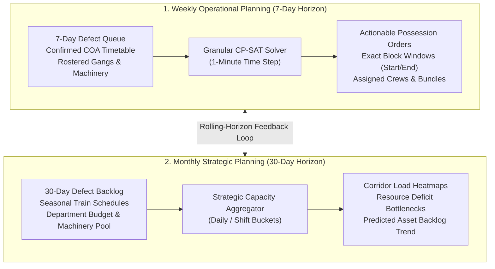

# 13_MULTI_HORIZON_PLANNING.md — Multi-Horizon Planning Engine

## SIH26027: AI-Powered Automatic Block Planning to Maximize Asset Availability for Train Operations on Indian Railways

---

## 1. Dual-Horizon Architecture & Concept

Railway infrastructure planning requires balancing **high-precision immediate tactical execution** with **macro-level capacity and resource forecasting**. RailSync AI implements a synchronized two-tier multi-horizon planning model:



---

## 2. Granularity & Horizon Comparison

| Dimension | Weekly Operational Plan | Monthly Strategic Plan | Tag |
| :--- | :--- | :--- | :--- |
| **Planning Horizon** | 7 Rolling Days ($T = 168\text{ hours}$) | 30 Rolling Days ($T = 720\text{ hours}$) | `[SOURCE-BACKED]` |
| **Temporal Granularity** | Minute-level precision ($\Delta t = 1\text{ min}$) | Shift / Daily aggregate buckets ($\Delta t = 8\text{ hrs}$) | `[ENGINEERING ASSUMPTION]` |
| **Train Schedule Input** | Confirmed COA Timetable + Active Freight Forecasts | Master Timetable + Historical Freight Volume | `[SOURCE-BACKED]` |
| **Resource Allocation** | Specific Named Gangs & Machine Unit IDs (e.g. Gang #03, Tamper-01) | Department Crew Count & Machinery Pool Hours | `[ENGINEERING ASSUMPTION]` |
| **Primary Output** | Legal Block Possession Orders, Gantt Dispatch Timeline | Corridor Capacity Load, Backlog Trajectory, Bottleneck Alerts | `[SOURCE-BACKED]` |
| **Solver Model** | Exact CP-SAT with 24 Hard Constraints | Linear Programming (LP) / Mixed-Integer Capacity Flow | `[ENGINEERING ASSUMPTION]` |
| **Commitment State** | `RECOMMENDED` $\to$ `APPROVED` $\to$ `PUBLISHED` | `STRATEGIC_FORECAST` | `[SOURCE-BACKED]` |

---

## 3. Rolling-Horizon Feedback & Re-planning Protocol

```
+----------------------------------------------------------------------------------------------------+
|                                 ROLLING-HORIZON RE-PLANNING DYNAMICS                               |
+----------------------------------------------------------------------------------------------------+
|                                                                                                    |
|  [ DAY 1: CURRENT OPERATIONAL DAY ]                                                                |
|  - Blocks for Day 1 to Day 3 are 'PUBLISHED' and locked.                                           |
|  - Blocks for Day 4 to Day 7 are 'RECOMMENDED' and open to optimization adjustments.               |
|  - Monthly strategic forecast covers Day 1 to Day 30.                                              |
|                                                                                                    |
|  [ ROLLING STEP (EVERY 24 HOURS / UPON MAJOR SYNC) ]                                               |
|  1. Advance Horizon Window by +1 Day.                                                              |
|  2. Archive executed Day 1 actuals to Historical Store.                                            |
|  3. Lock newly approved Day 2 blocks.                                                              |
|  4. Ingest new defects from TMS/SMMS/TDMS sync; update backlog.                                    |
|  5. Re-run CP-SAT solver for Days 4-8, holding published Days 2-3 fixed (Hard Constraint #13).     |
|  6. Update 30-day aggregate capacity forecast curve.                                               |
+----------------------------------------------------------------------------------------------------+
```

---

## 4. Strategic Capacity Metrics & Backlog Projections

The Monthly Strategic Engine computes key macro indicators:
1. **Corridor Congestion Index ($CCI_s$):** $\frac{\text{Required Block Hours}}{\text{Available Shadow-Block Hours}}$ per segment $s$.
2. **Resource Deficit Index ($RDI_k$):** Projected shortfall in specialized equipment (e.g., Tamping machine deficit in Week 3).
3. **Asset Availability Trajectory ($\mathcal{A}_{30\text{d}}$):** Simulated 30-day forecast of network uptime based on scheduled defect clearance rates.
