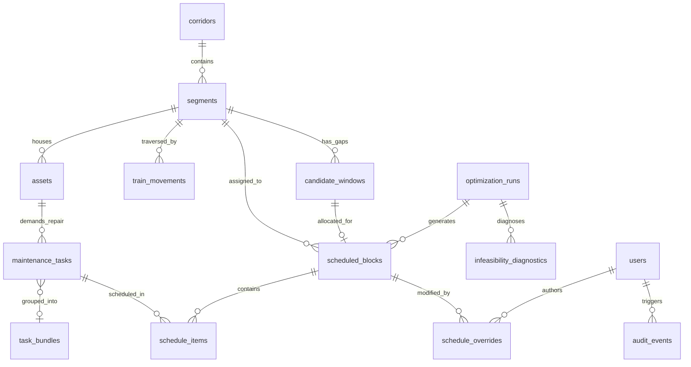

# 15_DATABASE_SCHEMA.md — Relational Database Schema Specification

## SIH26027: AI-Powered Automatic Block Planning to Maximize Asset Availability for Train Operations on Indian Railways

---

## 1. Entity-Relationship (ER) Architecture



---

## 2. Table DDL Definitions (PostgreSQL & SQLite Compatible)

```sql
-- 1. CORRIDORS TABLE
CREATE TABLE corridors (
    id VARCHAR(32) PRIMARY KEY,
    name VARCHAR(128) NOT NULL UNIQUE,
    code VARCHAR(16) NOT NULL UNIQUE,
    total_length_km DOUBLE PRECISION NOT NULL CHECK (total_length_km > 0.0),
    track_count INTEGER NOT NULL DEFAULT 2 CHECK (track_count >= 1),
    electrification_type VARCHAR(32) NOT NULL DEFAULT '25KV_AC',
    created_at TIMESTAMP WITH TIME ZONE NOT NULL DEFAULT CURRENT_TIMESTAMP
);

-- 2. SEGMENTS TABLE
CREATE TABLE segments (
    id VARCHAR(32) PRIMARY KEY,
    corridor_id VARCHAR(32) NOT NULL REFERENCES corridors(id) ON DELETE CASCADE,
    name VARCHAR(128) NOT NULL,
    start_km DOUBLE PRECISION NOT NULL CHECK (start_km >= 0.0),
    end_km DOUBLE PRECISION NOT NULL,
    track_identifier VARCHAR(16) NOT NULL DEFAULT 'UP',
    speed_limit_kmh INTEGER NOT NULL DEFAULT 130 CHECK (speed_limit_kmh >= 10),
    is_active BOOLEAN NOT NULL DEFAULT TRUE,
    created_at TIMESTAMP WITH TIME ZONE NOT NULL DEFAULT CURRENT_TIMESTAMP,
    CONSTRAINT chk_segment_km_order CHECK (end_km > start_km)
);
CREATE INDEX idx_segments_corridor ON segments(corridor_id);

-- 3. ASSETS TABLE
CREATE TABLE assets (
    id VARCHAR(32) PRIMARY KEY,
    segment_id VARCHAR(32) NOT NULL REFERENCES segments(id) ON DELETE CASCADE,
    department VARCHAR(16) NOT NULL CHECK (department IN ('ENG', 'SIG', 'TRD')),
    asset_type VARCHAR(64) NOT NULL,
    location_km DOUBLE PRECISION NOT NULL,
    criticality_weight DOUBLE PRECISION NOT NULL DEFAULT 3.0 CHECK (criticality_weight BETWEEN 1.0 AND 5.0),
    installation_date DATE,
    health_status VARCHAR(16) NOT NULL DEFAULT 'GOOD' CHECK (health_status IN ('GOOD', 'DEGRADED', 'CRITICAL')),
    created_at TIMESTAMP WITH TIME ZONE NOT NULL DEFAULT CURRENT_TIMESTAMP
);
CREATE INDEX idx_assets_segment ON assets(segment_id);
CREATE INDEX idx_assets_dept ON assets(department);

-- 4. MAINTENANCE TASKS TABLE
CREATE TABLE maintenance_tasks (
    id VARCHAR(32) PRIMARY KEY,
    source_system VARCHAR(16) NOT NULL CHECK (source_system IN ('TMS', 'SMMS', 'TDMS', 'MANUAL')),
    source_record_id VARCHAR(64) NOT NULL,
    asset_id VARCHAR(32) NOT NULL REFERENCES assets(id) ON DELETE RESTRICT,
    segment_id VARCHAR(32) NOT NULL REFERENCES segments(id) ON DELETE RESTRICT,
    department VARCHAR(16) NOT NULL CHECK (department IN ('ENG', 'SIG', 'TRD')),
    defect_type VARCHAR(64) NOT NULL,
    severity VARCHAR(16) NOT NULL CHECK (severity IN ('CRITICAL', 'MAJOR', 'MINOR')),
    duration_minutes INTEGER NOT NULL CHECK (duration_minutes BETWEEN 15 AND 720),
    reported_at TIMESTAMP WITH TIME ZONE NOT NULL,
    due_date TIMESTAMP WITH TIME ZONE NOT NULL,
    requires_power_cutoff BOOLEAN NOT NULL DEFAULT FALSE,
    requires_traffic_block BOOLEAN NOT NULL DEFAULT TRUE,
    required_crew_type VARCHAR(64) NOT NULL DEFAULT 'GENERAL_MAINT_CREW',
    required_machinery VARCHAR(64),
    priority_score DOUBLE PRECISION NOT NULL DEFAULT 50.0 CHECK (priority_score BETWEEN 0.0 AND 100.0),
    priority_category VARCHAR(16) NOT NULL DEFAULT 'MEDIUM' CHECK (priority_category IN ('EMERGENCY', 'HIGH', 'MEDIUM', 'LOW')),
    explanation_json TEXT,
    quality_status VARCHAR(16) NOT NULL DEFAULT 'VALID' CHECK (quality_status IN ('VALID', 'FLAGGED', 'REJECTED')),
    status VARCHAR(16) NOT NULL DEFAULT 'PENDING' CHECK (status IN ('PENDING', 'SCHEDULED', 'COMPLETED', 'DEFERRED', 'REJECTED')),
    created_at TIMESTAMP WITH TIME ZONE NOT NULL DEFAULT CURRENT_TIMESTAMP,
    updated_at TIMESTAMP WITH TIME ZONE NOT NULL DEFAULT CURRENT_TIMESTAMP,
    CONSTRAINT chk_task_due_after_report CHECK (due_date >= reported_at)
);
CREATE INDEX idx_tasks_status ON maintenance_tasks(status);
CREATE INDEX idx_tasks_priority ON maintenance_tasks(priority_score DESC);
CREATE INDEX idx_tasks_segment ON maintenance_tasks(segment_id);
CREATE INDEX idx_tasks_dept ON maintenance_tasks(department);

-- 5. TRAIN MOVEMENTS TABLE (COA TIMETABLE)
CREATE TABLE train_movements (
    id VARCHAR(32) PRIMARY KEY,
    train_number VARCHAR(16) NOT NULL,
    train_name VARCHAR(128) NOT NULL,
    train_type VARCHAR(32) NOT NULL DEFAULT 'MAIL_EXPRESS',
    corridor_id VARCHAR(32) NOT NULL REFERENCES corridors(id) ON DELETE CASCADE,
    segment_id VARCHAR(32) NOT NULL REFERENCES segments(id) ON DELETE CASCADE,
    entry_time TIMESTAMP WITH TIME ZONE NOT NULL,
    exit_time TIMESTAMP WITH TIME ZONE NOT NULL,
    priority_rank INTEGER NOT NULL DEFAULT 3 CHECK (priority_rank BETWEEN 1 AND 5),
    is_forecast BOOLEAN NOT NULL DEFAULT FALSE,
    created_at TIMESTAMP WITH TIME ZONE NOT NULL DEFAULT CURRENT_TIMESTAMP,
    CONSTRAINT chk_train_time_order CHECK (exit_time > entry_time)
);
CREATE INDEX idx_trains_segment_time ON train_movements(segment_id, entry_time);

-- 6. CANDIDATE WINDOWS (SHADOW BLOCKS)
CREATE TABLE candidate_windows (
    id VARCHAR(32) PRIMARY KEY,
    segment_id VARCHAR(32) NOT NULL REFERENCES segments(id) ON DELETE CASCADE,
    window_start TIMESTAMP WITH TIME ZONE NOT NULL,
    window_end TIMESTAMP WITH TIME ZONE NOT NULL,
    net_duration_min INTEGER NOT NULL CHECK (net_duration_min > 0),
    confidence_score DOUBLE PRECISION NOT NULL DEFAULT 1.0 CHECK (confidence_score BETWEEN 0.0 AND 1.0),
    created_at TIMESTAMP WITH TIME ZONE NOT NULL DEFAULT CURRENT_TIMESTAMP,
    CONSTRAINT chk_window_time_order CHECK (window_end > window_start)
);
CREATE INDEX idx_candidate_segment ON candidate_windows(segment_id, window_start);

-- 7. OPTIMIZATION RUNS
CREATE TABLE optimization_runs (
    id VARCHAR(32) PRIMARY KEY,
    solver_status VARCHAR(32) NOT NULL,
    runtime_sec DOUBLE PRECISION NOT NULL,
    horizon_days INTEGER NOT NULL DEFAULT 7,
    total_tasks_evaluated INTEGER NOT NULL,
    tasks_scheduled INTEGER NOT NULL,
    tasks_unscheduled INTEGER NOT NULL,
    objective_value DOUBLE PRECISION,
    parameters_json TEXT,
    created_at TIMESTAMP WITH TIME ZONE NOT NULL DEFAULT CURRENT_TIMESTAMP
);

-- 8. SCHEDULED BLOCKS
CREATE TABLE scheduled_blocks (
    id VARCHAR(32) PRIMARY KEY,
    optimization_run_id VARCHAR(32) NOT NULL REFERENCES optimization_runs(id) ON DELETE CASCADE,
    segment_id VARCHAR(32) NOT NULL REFERENCES segments(id) ON DELETE RESTRICT,
    candidate_window_id VARCHAR(32) REFERENCES candidate_windows(id) ON DELETE SET NULL,
    start_time TIMESTAMP WITH TIME ZONE NOT NULL,
    end_time TIMESTAMP WITH TIME ZONE NOT NULL,
    is_bundled BOOLEAN NOT NULL DEFAULT FALSE,
    departments_involved VARCHAR(64) NOT NULL,
    status VARCHAR(16) NOT NULL DEFAULT 'RECOMMENDED' CHECK (status IN ('RECOMMENDED', 'APPROVED', 'PUBLISHED', 'OVERRIDDEN', 'CANCELLED')),
    version INTEGER NOT NULL DEFAULT 1,
    created_at TIMESTAMP WITH TIME ZONE NOT NULL DEFAULT CURRENT_TIMESTAMP,
    updated_at TIMESTAMP WITH TIME ZONE NOT NULL DEFAULT CURRENT_TIMESTAMP,
    CONSTRAINT chk_block_time_order CHECK (end_time > start_time)
);
CREATE INDEX idx_blocks_segment_time ON scheduled_blocks(segment_id, start_time);

-- 9. SCHEDULE ITEMS (TASK TO BLOCK MAPPING)
CREATE TABLE schedule_items (
    id VARCHAR(32) PRIMARY KEY,
    scheduled_block_id VARCHAR(32) NOT NULL REFERENCES scheduled_blocks(id) ON DELETE CASCADE,
    task_id VARCHAR(32) NOT NULL REFERENCES maintenance_tasks(id) ON DELETE RESTRICT,
    assigned_start_time TIMESTAMP WITH TIME ZONE NOT NULL,
    assigned_end_time TIMESTAMP WITH TIME ZONE NOT NULL,
    allocated_crew_id VARCHAR(32),
    allocated_machine_id VARCHAR(32),
    created_at TIMESTAMP WITH TIME ZONE NOT NULL DEFAULT CURRENT_TIMESTAMP
);
CREATE UNIQUE INDEX uq_schedule_item_task ON schedule_items(task_id);

-- 10. INFEASIBILITY DIAGNOSTICS
CREATE TABLE infeasibility_diagnostics (
    id VARCHAR(32) PRIMARY KEY,
    optimization_run_id VARCHAR(32) NOT NULL REFERENCES optimization_runs(id) ON DELETE CASCADE,
    task_id VARCHAR(32) NOT NULL REFERENCES maintenance_tasks(id) ON DELETE CASCADE,
    reason_code VARCHAR(64) NOT NULL,
    explanation TEXT NOT NULL,
    suggested_remediation TEXT,
    created_at TIMESTAMP WITH TIME ZONE NOT NULL DEFAULT CURRENT_TIMESTAMP
);
CREATE INDEX idx_infeasibility_run ON infeasibility_diagnostics(optimization_run_id);

-- 11. AUDIT EVENTS
CREATE TABLE audit_events (
    id VARCHAR(32) PRIMARY KEY,
    event_type VARCHAR(32) NOT NULL,
    entity_type VARCHAR(32) NOT NULL,
    entity_id VARCHAR(32) NOT NULL,
    user_id VARCHAR(32) NOT NULL,
    timestamp TIMESTAMP WITH TIME ZONE NOT NULL DEFAULT CURRENT_TIMESTAMP,
    old_value_json TEXT,
    new_value_json TEXT,
    justification TEXT,
    event_sha256 VARCHAR(64) NOT NULL
);
CREATE INDEX idx_audit_entity ON audit_events(entity_type, entity_id);
CREATE INDEX idx_audit_time ON audit_events(timestamp DESC);
```
