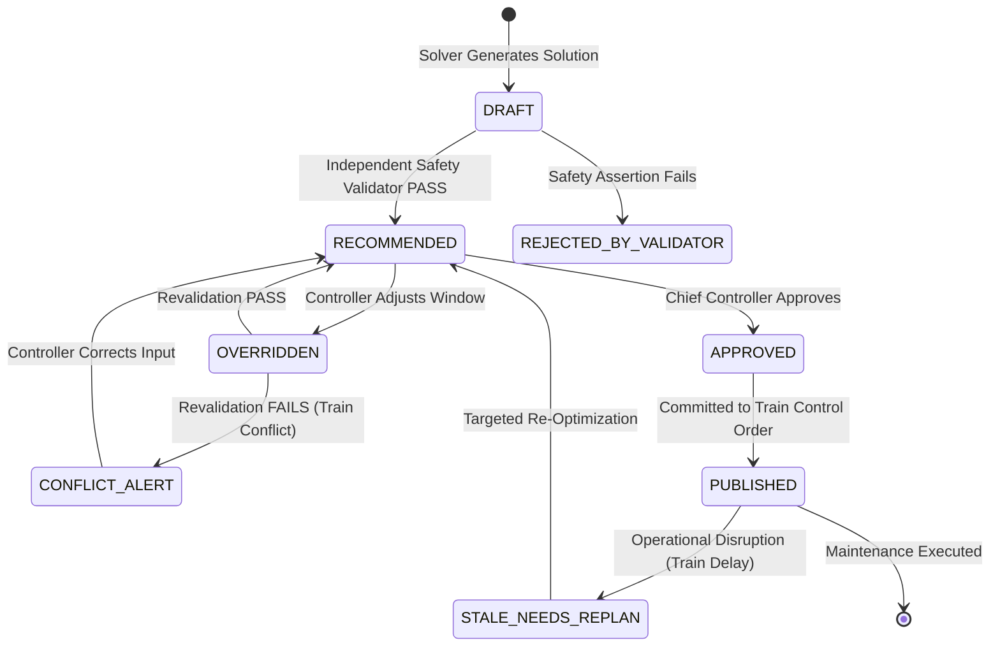

# 16_FRONTEND_DASHBOARD_SPECIFICATION.md — Frontend Dashboard & UX Specification

## SIH26027: AI-Powered Automatic Block Planning to Maximize Asset Availability for Train Operations on Indian Railways

---

## 1. UI/UX Philosophy & Design System

The RailSync AI Frontend is an **interactive, high-density decision-support console** designed for railway Section Controllers, Chief Controllers, and Departmental Maintenance Engineers.

### Visual Design Principles:
1. **Curated Color Tokens:**
   - **Civil Engineering / Track (`ENG`):** Amber / Warm Gold (`#F59E0B`)
   - **Signal & Telecom (`SIG`):** Emerald / Leaf Green (`#10B981`)
   - **Electrical / Traction (`TRD`):** Royal / Electric Blue (`#3B82F6`)
   - **Passenger Train Movements:** Charcoal / Indigo (`#4F46E5`)
   - **Freight Forecast Paths:** Slate Grey with Dashed Outline (`#64748B`)
   - **Candidate Shadow Blocks:** Translucent Cyan Hatch (`rgba(6, 182, 212, 0.15)`)
   - **Critical / Emergency Alerts:** Vivid Crimson (`#EF4444`)
2. **Typography:** Inter / Outfit for high-contrast scannability under low-light control room conditions.
3. **No Placeholders:** Every visual component binds to live reactive backend states.

---

## 2. The 10 Primary Dashboard Views

```mermaid
flowchart TD
    ROOT["React Single Page Application (Vite + Tailwind)"] --> V1["1. Command Dashboard<br/>(KPI Cards, System Status, Alerts)"]
    ROOT --> V2["2. Task Queue & Prioritization<br/>(Search, Filter, SHAP Waterfall)"]
    ROOT --> V3["3. Optimization Center<br/>(Parameters, Run Solver, Diagnostics)"]
    ROOT --> V4["4. Interactive Gantt Schedule<br/>(Train Graphs, Blocks, Overrides)"]
    ROOT --> V5["5. Geotagged Corridor Map<br/>(Corridor Health, Active Possessions)"]
    ROOT --> V6["6. Task Detail Modal<br/>(Asset Specs, Defect History, Why Ranked)"]
    ROOT --> V7["7. Conflicts & Exceptions<br/>(Unscheduled Root Causes, Warnings)"]
    ROOT --> V8["8. Weekly Operational Plan<br/>(7-Day Minute-Level Possession Orders)"]
    ROOT --> V9["9. Monthly Strategic Plan<br/>(30-Day Capacity & Backlog Heatmap)"]
    ROOT --> V10["10. Audit & Governance Log<br/>(Immutable Event Trail, State History)"]
```

---

## 3. Screen Specifications & Key Features

### 1. Command Dashboard (`/`)
- **Metric Tiles:** Overall Network Asset Availability ($95.2\%$), Total Downtime Saved ($54\text{ hrs}$), Pending Defect Backlog ($342$), Critical Safety Alerts ($4$).
- **Data Freshness Widget:** TMS / SMMS / TDMS / COA sync indicators with "Sync External Data" instant action button.
- **Corridor Health Table:** Mini uptime sparklines for Delhi-Agra, Mumbai-Vadodara, etc.

### 2. Task Queue (`/tasks`)
- **Filter Bar:** Department (`ENG`, `SIG`, `TRD`), Severity (`CRITICAL`, `MAJOR`, `MINOR`), Corridor, Overdue Status.
- **Priority Badge:** Color-coded chip displaying dynamic score ($\mathcal{P} \in [0, 100]$).
- **Interactive SHAP Popover:** Hovering over the priority score displays an instant mini-waterfall breakdown.

### 3. Optimization Center (`/optimizer`)
- **Solver Configuration Panel:** Sliders for objective weights (Downtime Penalty vs. Bundling Reward) and timeout.
- **Solver Run Trigger:** "Run Optimization Engine" button with animated progress indicator.
- **Real-Time Convergence Chart:** Displays CP-SAT objective minimization curve and runtime telemetry.

### 4. Interactive Gantt Schedule (`/gantt`)
- **Multi-Track Timeline Canvas:**
  - Y-Axis: Corridor segments (e.g. `Km 0` to `Km 200`).
  - X-Axis: Time (24-hour / 7-day zoomable timeline).
  - Train Layer: Solid diagonal curves representing passenger trains; dashed curves for freight paths.
  - Shadow-Block Layer: Shaded cyan rectangles representing candidate gaps.
  - Scheduled Possession Layer: Colored rounded blocks (`ENG`=Amber, `SIG`=Green, `TRD`=Blue, Bundled=Multi-stripe).
- **Interactive Drag-to-Override:** Users can drag blocks horizontally to adjust timing, triggering real-time safety verification modals.

### 5. Geotagged Corridor Map (`/map`)
- **Topology Visualizer:** Schematic linear map of corridor lines, signaling block sections, and traction substations.
- **Defect Pins:** Pulsing markers for critical defects requiring urgent track access.

### 6. Conflicts & Exceptions Hub (`/conflicts`)
- **Unscheduled Task Triage:** Filterable list of tasks that could not fit in the current horizon.
- **Root-Cause Chips:** `NO_TIMETABLE_GAP`, `DURATION_EXCEEDS_GAP`, `RESOURCE_BOTTLENECK`, `ISOLATION_CONFLICT`.
- **Remediation Advisor:** Actionable suggestions (e.g., "Increase gap by rerouting Freight #BOXN-22 or split 240m task into 2x120m").

### 7. Weekly Operational Plan (`/weekly`)
- **Formal Possession Order View:** Table of scheduled blocks sorted by day and time, ready for printing or direct CSV/JSON export.

### 8. Monthly Strategic Plan (`/monthly`)
- **Corridor Load Heatmap:** Grid showing projected maintenance demand vs. available capacity over 4 consecutive weeks.

### 9. Audit & Governance Explorer (`/audit`)
- **Tamper-Evident History Table:** Filterable table of all system events, manual overrides, solver runs, and Chief Controller approvals with cryptographic SHA-256 signatures.

---

## 4. UI State Machine for Scheduled Blocks

