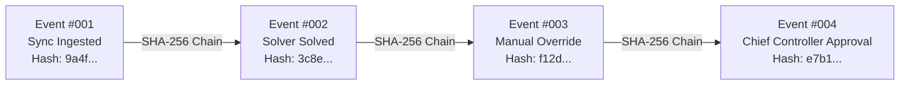

# 17_SECURITY_OFFLINE_AND_AUDIT.md — Security, Offline Architecture & Audit Logging

## SIH26027: AI-Powered Automatic Block Planning to Maximize Asset Availability for Train Operations on Indian Railways

---

## 1. Local-First & Air-Gapped Security Architecture

RailSync AI is architected from the ground up to operate in **mission-critical, air-gapped railway operational networks (Control Office LAN)** without requiring continuous or external internet access.

### Air-Gapped Security Guardrails:
1. **Zero External API Calls:** No external cloud endpoints (e.g. OpenAI, AWS, Google Cloud) are queried at runtime.
2. **Local Machine Learning Inference:** All XGBoost/GBDT models and SHAP explainers execute on the local CPU runtime via pre-serialized model files.
3. **Local Database Persistence:** Uses on-premise PostgreSQL or SQLite instances bounded strictly to localhost (`127.0.0.1`) or secure divisional subnets.
4. **Environment-Based Secret Management:** API secret keys, database credentials, and token salts are loaded strictly from environment variables (`.env`), never hardcoded in source files.

---

## 2. Role-Based Access Control (RBAC) Matrix

| Operational Role | Ingest & Sync | View Tasks & Gantt | Run Optimizer | Manual Override | Approve Schedule | Publish Schedule | View Audit Log |
| :--- | :---: | :---: | :---: | :---: | :---: | :---: | :---: |
| `ADMIN` | Yes | Yes | Yes | Yes | Yes | Yes | Yes |
| `CHIEF_CONTROLLER` | Yes | Yes | Yes | Yes | **Yes** | **Yes** | Yes |
| `SECTION_CONTROLLER`| Yes | Yes | Yes | **Yes** (with audit) | No | No | Read-Only |
| `DEPARTMENT_ENGINEER`| No (Read) | Yes | Simulation Only | Request Only | No | No | Read-Only |
| `AUDITOR_OFFICER` | Read-Only | Yes | No | No | No | No | **Yes** (Full) |

---

## 3. Cryptographic Audit Trail & Tamper Evident Logging

Every modification to scheduled blocks, tasks, or system parameters generates an immutable audit event stored in the `audit_events` table.



### Event Hash Chaining Formula:
$$\text{Hash}_k = \text{SHA-256}\Big(\text{Hash}_{k-1} \,\|\, \text{Timestamp} \,\|\, \text{UserID} \,\|\, \text{EventType} \,\|\, \text{EntityID} \,\|\, \text{PayloadJSON}\Big)$$

---

## 4. Input Sanitization & CSV Formula Injection Protection

When exporting data to CSV format for consumption by legacy railway desktop applications (e.g., MS Excel), text fields may contain malicious spreadsheet formulas (`=`, `+`, `-`, `@`, `\t`, `\r`).

### Sanitization Policy:
Every string field in the export pipeline passes through the `sanitize_csv_field` utility:
```python
def sanitize_csv_field(val: str) -> str:
    """
    Prevents CSV Injection (CWE-1236) by prefixing dangerous characters with a single quote.
    """
    if not val:
        return ""
    cleaned = str(val).strip()
    if cleaned and cleaned[0] in ('=', '+', '-', '@', '\t', '\r'):
        return "'" + cleaned
    return cleaned
```
