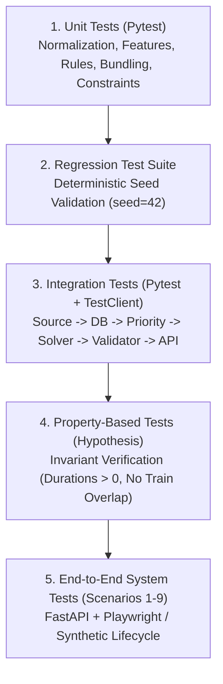

# 19_TESTING_AND_VALIDATION.md — Testing Strategy & Validation Framework

## SIH26027: AI-Powered Automatic Block Planning to Maximize Asset Availability for Train Operations on Indian Railways

---

## 1. Testing Philosophy & Test Pyramid

RailSync AI employs a comprehensive, multi-layer testing strategy designed to guarantee **mathematical safety, deterministic reproducibility, and zero regression** across all railway scheduling components.



---

## 2. Test Suite Specifications

### 2.1 Unit Test Suite (`backend/tests/unit/`)

| Test ID | Target Module | Function / Class Under Test | Test Description & Assertion | Tag |
| :--- | :--- | :--- | :--- | :--- |
| `TC-UNT-001` | `ingestion/normalizer.py` | `normalize_task()` | Asserts TMS/SMMS/TDMS fields map cleanly to canonical `MaintenanceTask` schema. | `[SOURCE-BACKED]` |
| `TC-UNT-002` | `ingestion/data_quality.py` | `DataQualityChecker.check_bounds()` | Asserts negative durations and out-of-bounds kilometers raise `DataQualityException`. | `[ENGINEERING ASSUMPTION]` |
| `TC-UNT-003` | `priority/safety_gate.py` | `SafetyGateChecker.evaluate()` | Asserts critical rail fractures force priority score to $\ge 95.0$ (`EMERGENCY`). | `[SOURCE-BACKED]` |
| `TC-UNT-004` | `priority/ml_scorer.py` | `MLScorer.predict()` | Asserts GBDT model infers priority scores within $[0.0, 100.0]$ with valid SHAP vectors. | `[SOURCE-BACKED]` |
| `TC-UNT-005` | `priority/safety_gate.py` | `FallbackScorer.score()` | Asserts fallback formula activates seamlessly when model file is missing. | `[ENGINEERING ASSUMPTION]` |
| `TC-UNT-006` | `windows/gap_extractor.py`| `extract_timetable_gaps()` | Asserts timetable gaps subtract $T_{\text{setup}}$ and $T_{\text{clear}}$ (15m each) correctly. | `[SOURCE-BACKED]` |
| `TC-UNT-007` | `bundling/spatial_cluster.py`| `form_spatial_clusters()` | Asserts tasks $> 5\text{ km}$ apart are never placed in the same cluster. | `[SOURCE-BACKED]` |
| `TC-UNT-008` | `bundling/compatibility.py` | `check_compatibility()` | Asserts incompatible department tasks (e.g. tamping + relay work) are rejected. | `[SOURCE-BACKED]` |
| `TC-UNT-009` | `optimizer/hard_constraints.py`| `build_train_headway_constraints()`| Asserts CP-SAT interval variables never intersect train occupancy intervals. | `[SOURCE-BACKED]` |
| `TC-UNT-010` | `utils/security.py` | `sanitize_csv_field()` | Asserts strings starting with `=`, `+`, `-`, `@` are prefixed with `'` to stop CSV injection. | `[ENGINEERING ASSUMPTION]` |

---

### 2.2 Integration Test Suite (`backend/tests/integration/`)

| Test ID | Pipeline Scope | Verification Logic | Expected Outcome |
| :--- | :--- | :--- | :--- |
| `TC-INT-001` | Ingestion $\to$ Database | Ingest 500 mock records from CSVs into SQLite test DB. | 500 records successfully staged; 0 database integrity errors. |
| `TC-INT-002` | DB $\to$ Priority Engine | Batch score pending tasks; persist SHAP explanations. | 100% of pending tasks receive valid scores and categories. |
| `TC-INT-003` | Priority + Timetable $\to$ Optimizer | Execute OR-Tools CP-SAT solver over 7-day horizon. | Solver reaches `OPTIMAL` or `FEASIBLE`; creates scheduled blocks. |
| `TC-INT-004` | Optimizer $\to$ Independent Validator | Pass solver output to `IndependentScheduleValidator`. | `ValidationCertificate.status == 'PASS'`; zero hard violations. |
| `TC-INT-005` | Schedule API $\to$ Override | Submit manual block shift via `POST /api/v1/schedules/{id}/override`. | Valid shift accepted (version incremented); invalid shift rejected. |
| `TC-INT-006` | Disruption $\to$ Re-Optimization | Inject train delay; trigger `POST /api/v1/reoptimize`. | Impacted corridor replanned; unaffected approved blocks preserved. |

---

### 2.3 Property-Based Invariant Tests (Hypothesis)

```python
# Conceptual Property-Based Test: backend/tests/property/test_schedule_invariants.py
from hypothesis import given, strategies as st

@given(st.integers(min_value=15, max_value=480), st.integers(min_value=0, max_value=10000))
def test_schedule_never_has_negative_duration_or_inverted_times(duration, start_time):
    """
    Invariant Property: Every valid scheduled block must have strictly ordered times
    and duration matching the task requirements.
    """
    end_time = start_time + duration
    assert end_time > start_time
    assert (end_time - start_time) == duration
```

---

### 2.4 Deterministic Demo Test Suite

Runs with fixed seed `seed=42` to verify exact expected outcomes:
- **Assertion 1:** Task `TMS-DEL-042` (Critical USFD defect) is prioritized at $\ge 95.0$ and scheduled in Block `BLK-01`.
- **Assertion 2:** Tasks `TMS-DEL-043` and `TDMS-DEL-012` are bundled into a single possession window on Segment-02.
- **Assertion 3:** Exactly 1 intentional impossible task (`TSK-INFS-999`) remains unscheduled with reason `DURATION_EXCEEDS_GAP`.
- **Assertion 4:** Net asset availability is calculated as $\ge 94.0\%$ across the network.
