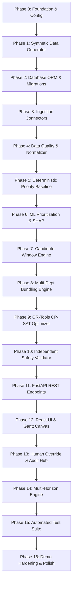

# 21_IMPLEMENTATION_ROADMAP.md — Incremental Implementation Roadmap

## SIH26027: AI-Powered Automatic Block Planning to Maximize Asset Availability for Train Operations on Indian Railways

---

## 1. Roadmap Architecture & Engineering Phases

The implementation of RailSync AI is structured into 17 sequential, verifiable engineering phases designed for rapid, stable execution by a student hackathon engineering team.

---

## 2. Phase-by-Phase Milestone Matrix

| Phase | Milestone Name | Key Deliverables & Files | Dependencies | Acceptance Criteria | Checkpoint |
| :--- | :--- | :--- | :--- | :--- | :--- |
| **Phase 0** | Repository Foundation | `requirements.txt`, `backend/app/config.py`, `.env.example`, logging utilities | None | Virtualenv installs without conflicts; config loads properly. | `CP-0` |
| **Phase 1** | Synthetic Data Generator | `ml_models/mock_data_gen.py`, CSV outputs in `data/synthetic/` | Phase 0 | Generates 5 corridors, 40 segments, 1,500 tasks, 250 trains with fixed seed (`seed=42`). | `CP-1` |
| **Phase 2** | Database Layer & ORM | `backend/app/db/session.py`, `backend/app/db/models/*.py`, Alembic migrations | Phase 0 | Tables created cleanly in SQLite/PostgreSQL with constraints and foreign keys. | `CP-2` |
| **Phase 3** | Ingestion Connectors | `ingestion/connectors/*.py` (TMS, SMMS, TDMS, COA) | Phase 1, Phase 2 | Successfully parses synthetic CSV/JSON files into staged memory models. | `CP-3` |
| **Phase 4** | Normalization & Data Quality | `ingestion/normalizer.py`, `ingestion/data_quality.py` | Phase 3 | 12 data quality rules enforce schema validity; rejects malformed records safely. | `CP-4` |
| **Phase 5** | Priority Baseline Rule Engine | `engine/priority/safety_gate.py`, weighted baseline formula | Phase 4 | Critical safety defects forced to $\ge 95.0$; routine tasks scored accurately. | `CP-5` |
| **Phase 6** | ML Prioritization & SHAP | `ml_models/train_priority.py`, `engine/priority/ml_scorer.py`, `explainer.py` | Phase 5 | XGBoost model trains with $R^2 \ge 0.90$; outputs SHAP waterfall feature vectors. | `CP-6` |
| **Phase 7** | Candidate Window Engine | `engine/windows/gap_extractor.py`, `buffer_calc.py` | Phase 4 | Scans timetable gaps $\Delta t$, subtracts 15m setup/clearance buffers, emits windows. | `CP-7` |
| **Phase 8** | Cross-Dept Bundling Engine | `engine/bundling/spatial_cluster.py`, `compatibility.py` | Phase 6, Phase 7 | Clusters tasks $\le 5\text{ km}$; enforces electrical and tool compatibility. | `CP-8` |
| **Phase 9** | OR-Tools CP-SAT Optimizer | `engine/optimizer/model_builder.py`, `hard_constraints.py`, `objectives.py` | Phase 8 | Solves 7-day schedule with 24 hard constraints in $\le 30\text{s}$; zero violations. | `CP-9` |
| **Phase 10** | Validation & Diagnostics | `engine/validator/schedule_checker.py`, `engine/diagnostics/conflict_tree.py` | Phase 9 | Post-solver checker asserts zero train conflicts; explains unscheduled tasks. | `CP-10` |
| **Phase 11** | FastAPI REST Endpoints | `backend/app/api/v1/*.py`, Pydantic schemas, dependency injection | Phase 10 | All 15+ REST endpoints respond with valid JSON schemas and HTTP codes. | `CP-11` |
| **Phase 12** | React Frontend & Gantt UI | `frontend/src/pages/*.jsx`, `components/gantt/*.jsx`, Tailwind design tokens | Phase 11 | Dashboard renders interactive Gantt, task queue, and metric tiles smoothly. | `CP-12` |
| **Phase 13** | Human Override & Audit Hub | `api/v1/schedules.py` (override/approve), `backend/app/db/models/audit.py` | Phase 12 | Controller can drag-to-shift blocks; invalid moves blocked; valid moves audited. | `CP-13` |
| **Phase 14** | Multi-Horizon Engine | `engine/horizons/weekly_planner.py`, `monthly_planner.py` | Phase 11 | Emits 7-day granular possession orders and 30-day capacity heatmaps. | `CP-14` |
| **Phase 15** | Automated Testing Suite | `backend/tests/unit/`, `tests/integration/`, `tests/property/` | Phase 14 | $\ge 85\%$ test coverage; all unit, integration, and invariant tests pass. | `CP-15` |
| **Phase 16** | Demo Hardening & Polish | Seed package verification, runbook validation, final presentation scripts | Phase 15 | Complete end-to-end demo executed flawlessly in $\le 5\text{ minutes}$ offline. | `CP-16` |
