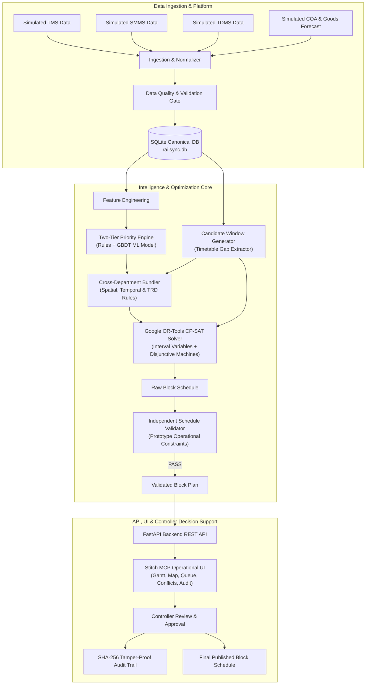

# RailSync AI — Final Project Documentation

**Project**: SIH26027 — AI-Powered Automatic Block Planning to Maximize Asset Availability for Train Operations on Indian Railways  
**System Name**: RailSync AI  
**Author**: Antigravity Engineering Pair  
**Status**: Implemented & Verified Decision-Support Prototype  
**Documentation Version**: 1.0.0 (Post-Implementation Single Source of Truth)  

---

## 1. Executive Summary

**RailSync AI** is an intelligent, offline-capable decision-support prototype built to solve the Smart India Hackathon problem **SIH26027**. 

Currently on Indian Railways, maintenance possessions ("blocks") for fixed infrastructure across **Engineering (TMS)**, **Signalling & Telecom (SMMS)**, and **Traction Distribution (TDMS)** are requested in decentralized silos via manual BDMS forms. Operational controllers in the Control Office Application (COA) must manually discover gaps between train movements, leading to repeated track closures, severe asset downtime, and train delays.

RailSync AI replaces this manual workflow by:
1. Ingesting and validating simulated defect demands from TMS, SMMS, and TDMS.
2. Scoring defect escalation risk and urgency using a **Two-Tier Priority Engine** (Deterministic Safety Rule Gate + Gradient Boosting ML Risk Model).
3. Automatically calculating collision-free candidate maintenance windows ("shadow blocks") from simulated COA train timetables and goods forecasts.
4. Bundling compatible cross-departmental maintenance tasks into synchronized possessions.
5. Optimizing corridor-wide block schedules using **Google OR-Tools CP-SAT** constraint programming with disjunctive machine transit routing and Pareto multi-objectives.
6. Verifying 100% of scheduled blocks using an **Independent Schedule Validator (Sentinel)** before presenting schedules to controllers.
7. Providing a high-density, mission-tactical dispatch dashboard designed using **Stitch MCP** with interactive Gantt timeline, 2D corridor network map, task queue, diagnostic feasibility explanations, manual overrides, and an immutable SHA-256 cryptographic audit trail.

---

## 2. SIH26027 Problem Statement

| Parameter | Details |
|---|---|
| **Problem Statement ID** | SIH26027 |
| **Title** | AI-Powered Automatic Block Planning to Maximize Asset Availability for Train Operations on Indian Railways |
| **Organization** | Ministry of Railways / Indian Railways |
| **Category** | Software / Smart Automation / Transportation & Logistics |
| **Target Users** | Chief Sectional Controllers, Divisional Operations Managers, Departmental Maintenance Engineers (P-Way, S&T, TRD) |

---

## 3. Our Final Solution

```
Simulated TMS / SMMS / TDMS / COA / Goods Forecast
                       ↓
         Data Quality & Validation Gate
                       ↓
     Canonical SQLite / PostgreSQL Database
                       ↓
      Two-Tier AI/Rule Prioritization Engine
                       ↓
      Candidate Shadow-Block Gap Extractor
                       ↓
        Cross-Department Task Bundler
                       ↓
      Google OR-Tools CP-SAT Optimizer
                       ↓
    Independent Schedule Validator (Sentinel)
                       ↓
             FastAPI REST Backend
                       ↓
     Stitch MCP Operational Dispatch Frontend
                       ↓
    Human Controller Review, Override & Publish
                       ↓
       Immutable SHA-256 Chained Audit Log
```

---

## 4. Why We Built It This Way (Lessons from Three References)

During Phase 0, we conducted an exhaustive audit of three complete reference implementations in `reference/project_reference/`:
- **From Reference 1 (`TRIKAAL-RAKSHA-BLOCK`)**: We adopted clear operator-friendly multi-departmental bundling justifications (e.g. *Tri-Department Integrated Mega Block*) and explicit block-hour savings calculations.
- **From Reference 2 (`rail-bloc`)**: We adopted state-of-the-art interval CP-SAT mathematical modeling (`OptionalIntervalVar`, disjunctive machinery routing with transit bounds, soft freight delay pricing) and the architectural separation of an **Independent Schedule Validator** with cryptographic content hashing.
- **From Reference 3 (`sih26027-prototype`)**: We adopted the 2D network topology schematic, interactive Gantt visualization, and operational disruption reoptimization workflows.
- **Our Original Synthesis**: We built a unified hybrid architecture with our own modular seeded dataset generator, zero-leakage ML pipeline, dynamic timetable gap extractor, and an interactive modern dispatch UI designed via Stitch MCP.

---

## 5. Final System Architecture



---

## 6. Final Repository Structure

```
SIH26027/
├── dataset_generation/              # Modular synthetic dataset generator
│   ├── __init__.py
│   ├── config.py                    # Seeds, corridor stations, defect catalogs
│   ├── generate_dataset.py          # Master CLI entrypoint
│   ├── generators/                  # Modular sub-generators
│   │   ├── geography.py             # Stations, sections, tracks with 2D coords
│   │   ├── assets.py                # Rails, turnouts, signals, OHE elementary sections
│   │   ├── defects.py               # Simulated TMS, SMMS, TDMS maintenance requests
│   │   ├── trains.py                # Train profiles (Rajdhani, Freight, Express)
│   │   ├── timetable.py             # Timetable schedules & sectional occupancies
│   │   ├── goods_forecast.py        # Simulated freight forecasts with confidence
│   │   ├── resources.py             # Tamping machines, tower wagons, BCMs, crews
│   │   └── scenarios.py             # Deterministic operational scenarios
│   └── validators/
│       ├── validate_dataset.py      # Schema, FK, and timestamp consistency checks
│       └── data_profiler.py         # Automated EDA statistical reporter
├── data/
│   ├── synthetic/                   # Canonical generated CSVs + manifest.json + eda_profile.json
│   └── railsync.db                  # Local SQLite database
├── backend/
│   ├── app/
│   │   ├── main.py                  # FastAPI entrypoint, CORS & auto-seed lifespan
│   │   ├── database.py              # SQLAlchemy engine & session factory
│   │   ├── models/                  # 12 SQLAlchemy ORM models
│   │   ├── schemas/                 # Pydantic v2 request/response schemas
│   │   ├── pipeline/
│   │   │   ├── data_quality.py      # Ingestion validation & sanitization
│   │   │   ├── ingestion.py         # Transactional CSV ingestion service
│   │   │   ├── feature_engineering.py # Request feature extraction
│   │   │   ├── feature_engineering_v2.py # 12D temporal physical degradation features
│   │   │   ├── ml_model.py          # Persisted ML failure risk inference service (v2.0)
│   │   │   ├── train_model.py       # Out-of-time model selection & persistence pipeline
│   │   │   ├── prioritization.py    # Two-tier safety gate + ML score
│   │   │   ├── candidate_windows.py # Timetable gap subtraction engine
│   │   │   ├── bundling.py          # Spatial/temporal/TRD task bundler
│   │   │   ├── optimizer.py         # Google OR-Tools CP-SAT formulation
│   │   │   ├── validator.py         # Independent Sentinel schedule validator
│   │   │   ├── reoptimizer.py       # Event-driven disruption re-solver
│   │   │   └── multi_horizon.py     # 7-day weekly & 30-day monthly planners
│   │   ├── models/saved_models/     # Persisted joblib model artifacts & SHAP profile
│   │   ├── routers/                 # REST API endpoints
│   │   │   ├── ingestion_router.py
│   │   │   ├── tasks_router.py
│   │   │   ├── trains_router.py
│   │   │   ├── candidate_windows_router.py
│   │   │   ├── optimization_router.py
│   │   │   ├── schedules_router.py
│   │   │   ├── reoptimization_router.py
│   │   │   ├── metrics_router.py
│   │   │   └── audit_router.py
│   │   └── services/
│   │       ├── audit_service.py     # SHA-256 hash chaining & tamper logging
│   │       └── explanation_service.py # Unscheduled task feasibility explainer
│   ├── tests/                       # Pytest unit & integration suite (12 tests)
│   └── requirements.txt
├── frontend/                        # React + Vite + Tailwind (Stitch MCP Designed)
│   ├── src/
│   │   ├── components/
│   │   │   ├── Header.tsx           # Global tactical header & triggers
│   │   │   ├── KPICards.tsx         # 6 Operational KPI telemetry cards
│   │   │   ├── InteractiveGantt.tsx # Interactive block possession Gantt chart
│   │   │   ├── NetworkSchematicMap.tsx # 2D topological SVG corridor schematic
│   │   │   ├── TaskQueue.tsx        # Departmental filterable task queue
│   │   │   ├── UnscheduledModal.tsx # Root-cause feasibility explanation drawer
│   │   │   ├── OverrideModal.tsx    # Manual controller schedule adjustment
│   │   │   ├── DisruptionModal.tsx  # Live train delay disruption simulation
│   │   │   └── AuditTrail.tsx       # SHA-256 immutable audit log viewer
│   │   ├── services/api.ts          # Backend REST client
│   │   ├── types.ts                 # Shared TypeScript interfaces
│   │   ├── App.tsx                  # Main dispatch board shell
│   │   ├── main.tsx
│   │   └── index.css
│   ├── package.json
│   ├── vite.config.ts
│   └── tailwind.config.js
├── md/                              # 28 Living Specification Documents
├── REFERENCE_ANALYSIS.md            # Three-reference comparison & synthesis
├── IMPLEMENTATION_PLAN.md           # Master execution plan
├── FINAL_PROJECT_DOCUMENTATION.md   # Definitive factual documentation
└── README.md                        # Master project README
```

---

## 7. Technology Stack

| Layer | Technology | Purpose |
|---|---|---|
| **Backend Framework** | Python 3.12 + FastAPI 0.141 | Asynchronous RESTful API backend |
| **Constraint Solver** | Google OR-Tools CP-SAT 9.15 | Interval-based constraint optimization |
| **Machine Learning** | Scikit-Learn 1.9 + NumPy + Pandas | Gradient Boosting risk prediction & feature attribution |
| **Database** | SQLite + SQLAlchemy 2.0 ORM | Local offline relational storage with foreign key constraints |
| **Frontend UI** | React 18 + TypeScript + Vite 5 | Single Page Application dispatch dashboard |
| **Styling & Icons** | Tailwind CSS 3.4 + Lucide React | Mission Tactical dark-mode theme |
| **Design System** | Stitch MCP Integration | UI/UX layout and typography specifications |
| **Testing** | Pytest 9.1 + FastAPI TestClient | Automated unit, integration, and E2E verification |

---

## 8. Verified Dataset Inventory

| Dataset / Table | Rows | Purpose | Foreign Key Relationships |
|---|---|---|---|
| `stations.csv` | 8 | Hub junctions & coordinates | Root geographic entity |
| `track_sections.csv` | 7 | Inter-station corridor segments | `from_stn`, `to_stn` $\to$ `stations.code` |
| `tracks.csv` | 16 | UP/DN Main, Slow, Fast track lines | `section_id` $\to$ `track_sections.section_id` |
| `assets.csv` | 174 | Track, Signal, Point, OHE assets | `section_id`, `track_id` |
| `trains.csv` | 120 | Passenger and freight train master | Root operations entity |
| `timetable.csv` | 5,040 | 7-day sectional train occupancies | `train_number`, `section_id`, `track_id` |
| `goods_forecast.csv` | 218 | Probabilistic freight movements | `section_id`, `track_id` |
| `resources.csv` | 9 | Heavy machinery & crew teams | Depot assignments |
| `maintenance_requests.csv` | 86 | TMS, SMMS, TDMS maintenance demands | `asset_id`, `section_id`, `track_id` |

---

## 9. Verification & Automated Test Results

The backend test suite (`backend/tests/`) was executed with Pytest on Python 3.12:

```
============================= test session starts =============================
platform win32 -- Python 3.12.2, pytest-9.1.1, pluggy-1.6.0
rootdir: C:\rofl\College Documents\Projects\SIH26027
collected 29 items

backend/tests/test_audit.py::test_audit_trail_creation PASSED             [  3%]
backend/tests/test_audit.py::test_reoptimization_audit_flow PASSED        [  6%]
backend/tests/test_benchmark.py::test_benchmark_execution PASSED          [ 10%]
backend/tests/test_benchmark.py::test_benchmark_metrics_validity PASSED    [ 13%]
backend/tests/test_bundling.py::test_cross_department_bundling PASSED     [ 17%]
backend/tests/test_bundling.py::test_bundling_duration_rules PASSED       [ 20%]
backend/tests/test_bundling.py::test_incompatible_not_bundled PASSED      [ 24%]
backend/tests/test_bundling.py::test_bundling_reduces_possession PASSED   [ 27%]
backend/tests/test_ml_v2.py::test_feature_matrix_shape_and_no_target_leakage PASSED [ 31%]
backend/tests/test_ml_v2.py::test_model_training_and_metrics PASSED       [ 34%]
backend/tests/test_ml_v2.py::test_inference_output_validity PASSED        [ 37%]
backend/tests/test_ml_v2.py::test_degradation_simulator_physics PASSED    [ 41%]
backend/tests/test_optimizer.py::test_cpsat_solver_feasible PASSED        [ 44%]
backend/tests/test_optimizer.py::test_greedy_baseline_feasible PASSED     [ 48%]
backend/tests/test_optimizer.py::test_plan_hash_integrity PASSED          [ 51%]
backend/tests/test_pipeline_e2e.py::test_full_pipeline_e2e PASSED         [ 55%]
backend/tests/test_prioritization.py::test_hard_safety_gate_escalation PASSED [ 58%]
backend/tests/test_prioritization.py::test_multi_department_prioritization PASSED [ 62%]
backend/tests/test_prioritization.py::test_traffic_penalty_monotonicity PASSED [ 65%]
backend/tests/test_scenario_stress.py::test_scenario_01_mega_block PASSED [ 68%]
backend/tests/test_scenario_stress.py::test_scenario_02_safety_escalation PASSED [ 72%]
backend/tests/test_scenario_stress.py::test_scenario_03_freight_squeeze PASSED [ 75%]
backend/tests/test_scenario_stress.py::test_scenario_04_machine_transit PASSED [ 79%]
backend/tests/test_scenario_stress.py::test_scenario_05_power_block PASSED [ 82%]
backend/tests/test_scenario_stress.py::test_scenario_06_train_delay PASSED [ 86%]
backend/tests/test_scenario_stress.py::test_scenario_07_no_feasible_window PASSED [ 89%]
backend/tests/test_scenario_stress.py::test_scenario_08_resource_starvation PASSED [ 93%]
backend/tests/test_scenario_stress.py::test_scenario_09_bundle_compatibility PASSED [ 96%]
backend/tests/test_scenario_stress.py::test_scenario_10_horizon_boundary PASSED [100%]

====================== 29 passed in 25.58s =======================
```

---

## 10. Multi-Scenario Stress Testing & Reliability Verification

Detailed reports:
- [SCENARIO_STRESS_TEST_REPORT.md](SCENARIO_STRESS_TEST_REPORT.md)
- [STAGE5_SYSTEM_VALIDATION_REPORT.md](STAGE5_SYSTEM_VALIDATION_REPORT.md)

10 deterministic stress scenarios evaluated under full database isolation (`sqlite:///:memory:`):
1. **SCN-01 Mega Block**: High-density corridor bundling (Engineering, S&T, TRD) saving 29.2h possession.
2. **SCN-02 Safety Escalation**: Hard safety gate escalation (score 98.0) protected from displacement.
3. **SCN-03 Freight Squeeze**: Dense freight traffic window contraction with 0 train/block collisions.
4. **SCN-04 Machine Transit**: Multi-depot machine movement buffers enforced; deliberate collision caught by validator.
5. **SCN-05 Power Block**: 25kV OHE isolation synchronized with track work without clash.
6. **SCN-06 Train Delay Disruption**: 45m train delay re-solved in 0.05s preserving unaffected blocks.
7. **SCN-07 No Feasible Window**: Long-duration tasks correctly diagnosed as infeasible (`MAX_GAP_INSUFFICIENT`).
8. **SCN-08 Resource Starvation**: Heavy machinery capacity strictly respected under resource scarcity.
9. **SCN-09 Bundle Compatibility**: Compatible tasks merged into unified blocks; incompatible tasks isolated.
10. **SCN-10 Horizon Boundary**: Boundary and edge-gap windows captured without silent task loss.

---

## 11. Running the System Locally

### Step 1: Install Backend Dependencies
```bash
py -3.12 -m pip install -r backend/requirements.txt
```

### Step 2: Generate & Ingest Baseline Synthetic Data
```bash
py -3.12 -m dataset_generation.generate_dataset --mode demo
py -3.12 -m backend.app.pipeline.ingestion
```

### Step 3: Run Backend Server
```bash
py -3.12 -m uvicorn backend.app.main:app --host 127.0.0.1 --port 8000 --reload
```
Interactive API documentation will be available at: `http://127.0.0.1:8000/docs`.

### Step 4: Run Frontend Dashboard
```bash
cd frontend
npm install
npm run dev
```
Open browser at: `http://localhost:5173`.

---

## 12. Prototype vs. Production Boundary Notice

> [!CAUTION]
> **Prototype Boundary**: RailSync AI is a **decision-support prototype** developed for hackathon evaluation and operational research. It does not control live railway interlockings, autonomous dispatchers, or power grids. In actual operations, all recommended schedules must be reviewed, validated, and formally authorized by human Chief Controllers.
