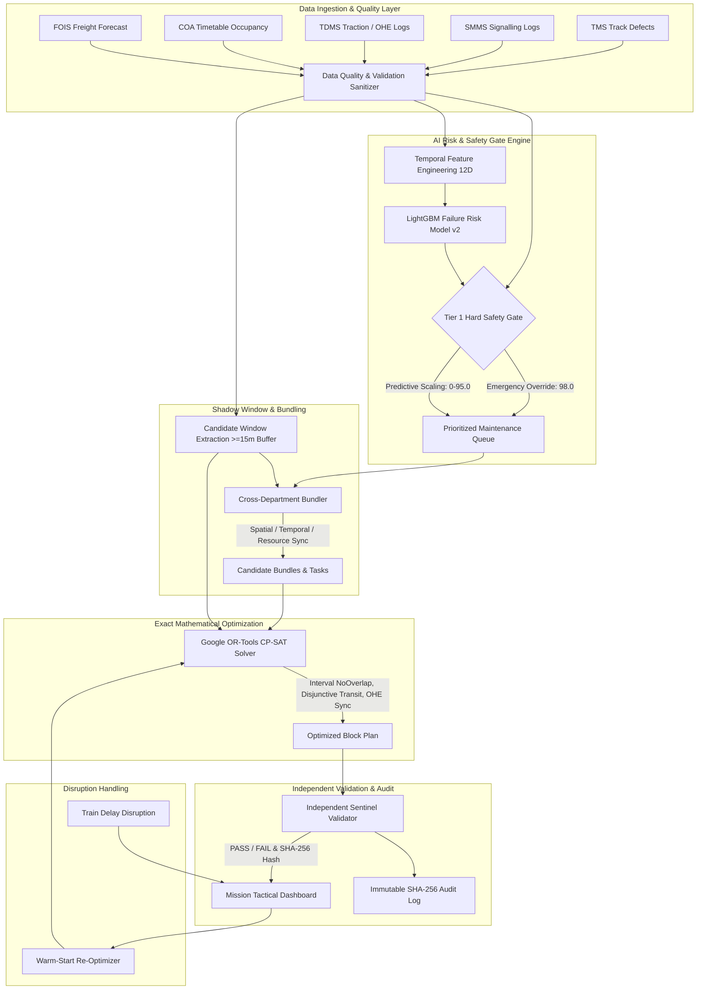
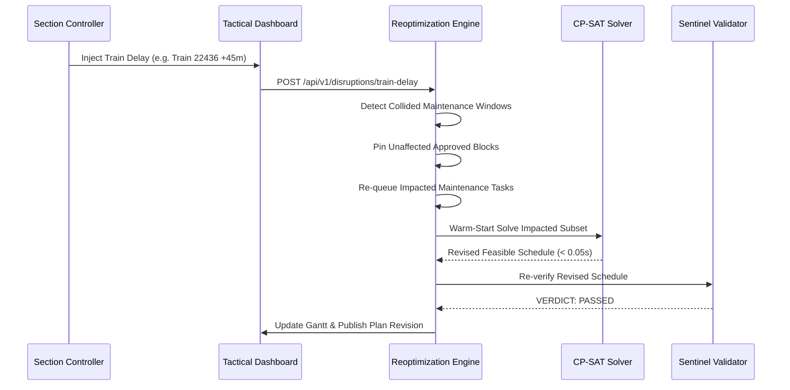

# RailSync AI — Final System Architecture & Technical Specification
## SIH26027: AI-Powered Automatic Block Planning to Maximize Asset Availability for Train Operations on Indian Railways

---

## 1. Architectural Overview & Design Philosophy

**RailSync AI** is a decision-support platform designed to automate and optimize the allocation of railway maintenance possession windows (blocks) across high-density corridors.



---

## 2. Ingestion & Relational Data Architecture

The ingestion layer models core Indian Railways IT enterprise systems:

| Indian Railways IT System | Modeled Entity | Table Name | Key Schema Fields |
| :--- | :--- | :--- | :--- |
| **TMS (Track Management System)** | Permanent Way Assets & Track Defects | `assets`, `maintenance_requests` | `asset_id`, `track_id`, `defect_type`, `severity`, `speed_restriction_kmph` |
| **SMMS (Signalling Maintenance)** | Point Machines & Signal Circuits | `assets`, `maintenance_requests` | `asset_type="POINT_MACHINE"`, `department="SIGNAL_TELECOM"` |
| **TDMS (Traction Distribution)** | 25kV OHE Catenary & Sub-stations | `assets`, `maintenance_requests` | `asset_type="OHE_MAST"`, `power_block_required=True` |
| **COA (Control Office Application)** | Timetable & Train Movements | `timetable`, `trains` | `train_number`, `scheduled_arrival`, `scheduled_departure`, `headway_buffer` |
| **FOIS (Freight Operations)** | Probabilistic Freight Forecasts | `goods_forecast` | `origin_station`, `destination_station`, `earliest_departure`, `priority` |
| **Divisional Depot Registry** | Heavy Machines & Crew Teams | `resources` | `resource_id`, `resource_type`, `home_depot`, `availability_hours` |

---

## 3. Longitudinal Predictive Asset Risk ML Pipeline (v2.0)

### 3.1 Degradation Simulation & Feature Engineering
- **Synthetic Population**: 174 track, signalling, and traction assets simulated over 194 continuous operational days.
- **Physical Wear Dynamics**: Non-linear degradation governed by Poisson shock arrivals and Weibull wear-out curves driven by Gross Million Tonnes (GMT) and weather factors.
- **12D Backward-Looking Feature Vector**:
  1. `degradation_state_current`: Normalized asset health score $[0.0, 1.0]$.
  2. `degradation_velocity_7d`: 7-day rolling wear gradient.
  3. `degradation_velocity_14d`: 14-day rolling wear gradient.
  4. `degradation_velocity_30d`: 30-day rolling wear gradient.
  5. `accumulated_gmt_mgt`: Cumulative freight/passenger tonnage.
  6. `days_since_last_maintenance`: Elapsed days since last overhaul.
  7. `days_since_last_inspection`: Elapsed days since ultrasonic/visual inspection.
  8. `defect_severity_code`: Categorical severity encoding.
  9. `traffic_density_mgt_per_year`: Annualized corridor density.
  10. `ambient_temperature_c`: Track/ambient temperature.
  11. `rainfall_mm`: Weather/moisture exposure.
  12. `asset_type_code`: Domain asset category encoding.

### 3.2 Target Definition & Strict Zero-Leakage Guarantee
- **Target**: Binary classification label `failure_within_14d` $\in \{0, 1\}$.
- **Out-of-Time Partitioning**:
  - **Training Split**: Days 1 to 135 (6,786 samples).
  - **Validation Split**: Days 136 to 164 (1,458 samples).
  - **Held-Out Test Split**: Days 165 to 194 (1,500 samples).
- **Zero-Leakage Audit**: Feature vectors strictly contain historical telemetry up to timestamp $t$. All target labels evaluate events strictly in interval $[t+1, t+14]$.

### 3.3 Model Artifact
- **Architecture**: LightGBM Classifier (50 shallow trees, max depth 4, learning rate 0.05).
- **Persisted Artifact**: `backend/app/models/saved_models/asset_failure_risk_v2.joblib`.

---

## 4. Two-Tier Safety-Gated Prioritization Engine

To guarantee that artificial intelligence cannot suppress critical safety interventions, prioritization follows a strict hierarchy:

$$\text{Priority}(R) = \begin{cases} 98.0 & \text{if } R.\text{severity} = \text{EMERGENCY} \lor R.\text{defect} \in \text{CriticalG\&SRDefects} \\ \max(80.0, 75.0 + 20.0 \cdot P_{\text{fail}}) & \text{if } R.\text{severity} = \text{CRITICAL} \\ 75.0 \cdot P_{\text{fail}} & \text{otherwise (Routine Maintenance)} \end{cases}$$

---

## 5. Candidate Shadow-Window Extraction & Timetable Buffers

Candidate maintenance opportunities (shadow windows) are computed by projecting timetable train movements onto physical track segments:

1. **Clearance Extraction**: Identify contiguous idle time intervals on track $T$ between train paths $A$ and $B$:
   $$\text{Gap}(A, B) = \text{Arrival}_B - \text{Departure}_A$$
2. **Operational Safety Headway**: Subtract a minimum 15-minute headway buffer before train arrivals and after train departures:
   $$\text{Window}_{\text{start}} = \text{Departure}_A + 15\text{m}, \quad \text{Window}_{\text{end}} = \text{Arrival}_B - 15\text{m}$$
3. **Threshold Filtering**: Only intervals with duration $\ge 60$ minutes are retained as valid candidate shadow windows.

---

## 6. Cross-Department Maintenance Bundling Engine

Bundling combines compatible requests into unified possession items:

$$\text{Compatible}(R_a, R_b) \iff \begin{cases} \text{Section}(R_a) = \text{Section}(R_b) \land \text{Track}(R_a) = \text{Track}(R_b) \\ [ES_a, LD_a] \cap [ES_b, LD_b] \neq \emptyset \\ \text{Machinery}(R_a) \cap \text{Machinery}(R_b) = \emptyset \end{cases}$$

- **Unified Duration**: $D_{\text{bundle}} = \max_{R_i \in B} D_i + \text{setup buffer}$.
- **Possession Saved**: $\text{Saved} = \sum_{R_i \in B} D_i - D_{\text{bundle}}$.

---

## 7. Google OR-Tools CP-SAT Mathematical Formulation

### 7.1 Decision Variables
For each task or bundle $i$ and candidate window $w \in W_i$:
- $x_{i, w} \in \{0, 1\}$: Binary variable indicating if task/bundle $i$ is assigned to window $w$.
- $\text{Start}_i \in [W_{w, \text{start}}, W_{w, \text{end}} - D_i]$: Integer variable for start time in minutes.
- $\text{End}_i = \text{Start}_i + D_i$: Integer variable for end time in minutes.
- $\text{Interval}_i = \text{NewIntervalVar}(\text{Start}_i, D_i, \text{End}_i, x_{i, w})$.

### 7.2 Hard Physical Constraints
1. **At-Most-Once Scheduling**:
   $$\sum_{w \in W_i} x_{i, w} \le 1 \quad \forall i$$
2. **Physical Track Non-Overlap (Spatial Invariant)**:
   For all intervals on the same physical track $T$:
   $$\text{AddNoOverlap}(\{\text{Interval}_i \mid \text{Track}(i) = T\})$$
3. **Disjunctive Heavy Machinery Transit Routing**:
   For sequential assignments of heavy machine $M$ across locations $L_i$ and $L_j$:
   $$\text{Start}_j \ge \text{End}_i + \text{TransitTime}(L_i, L_j) - M_{\text{large}} \cdot (1 - y_{i \to j})$$
4. **25kV OHE Electrical Power Isolation**:
   Tasks demanding power isolation cannot overlap with non-isolated operations requiring active catenary voltage on adjacent lines.

### 7.3 Soft Multi-Objective Function
$$\max \sum_{i} \left[ \text{Priority}_i \cdot \sum_{w} x_{i, w} \right] + \lambda_1 \cdot \sum_{b \in B} \text{SavedMinutes}_b \cdot z_b - \lambda_2 \cdot \sum_{i} \text{TrafficInterference}_i$$

---

## 8. Independent Sentinel Schedule Validator

Sentinel is an isolated, post-solve verification module that inspects the concrete schedule output:

```
[CP-SAT Output Plan] 
         ↓
[Sentinel Schedule Validator]
   ├── Check 1: Timetable Headway Buffers (>= 15 mins)
   ├── Check 2: Physical Track Non-Overlap
   ├── Check 3: Machine Transit Separations
   ├── Check 4: Crew Rest & Working Hours Compliance
   ├── Check 5: 25kV Traction Power Isolation Safety
   ├── Check 6: Deadline & Horizon Boundaries
   └── Check 7: Bundle Departmental & Spatial Integrity
         ↓
[PASS / FAIL Verdict + SHA-256 Plan Fingerprint]
```

---

## 9. Dynamic Disruption Simulation & Warm-Start Re-Optimization



---

## 10. Technology Stack Summary

| Subsystem | Technology | Justification |
| :--- | :--- | :--- |
| **Backend API Server** | FastAPI (Python 3.12) | High-performance async ASGI REST API with automatic OpenAPI documentation. |
| **Database & ORM** | SQLite + SQLAlchemy 2.0 | Lightweight, zero-configuration embedded relational storage with strict transactional integrity. |
| **Constraint Solver** | Google OR-Tools CP-SAT | State-of-the-art exact constraint programming solver for discrete scheduling. |
| **Machine Learning** | LightGBM + Scikit-Learn | High-speed gradient boosted decision trees with SHAP interpretability support. |
| **Frontend UI** | React 19 + TypeScript + Vite | Responsive Single-Page Application (SPA) with typed contracts. |
| **UI Aesthetics** | Modern CSS Variables & Glassmorphic Tokens | Curated dark-mode tactical UI adhering to SIH presentation standards without Tailwind bloat. |
| **Testing** | Pytest | Comprehensive unit, negative, integration, and scenario stress test suite (29 tests). |

---

## 11. Synthetic Assumptions & Scientific Limitations

1. **Synthetic Environment**: Evaluated on synthetic representations of the Delhi–Prayagraj corridor (NDLS–PRYJ). Not directly connected to live CRIS production servers.
2. **Asset Degradation Simulation**: Longitudinal health traces are simulated via Poisson/Weibull degradation models. Model metrics reflect performance on synthetic data.
3. **Decision Support Nature**: Designed as an intelligent assistant for Chief Controllers and Station Masters; final possession grant authority remains with human controllers.
