# RailSync AI — Stage 4 Operational Dispatch UI & Frontend Integration Report

**Project**: SIH26027 — AI-Powered Automatic Block Planning to Maximize Asset Availability for Train Operations on Indian Railways  
**System**: RailSync AI  
**Stage**: Stage 4 — Operational Dispatch UI & Real API Integration  
**Evaluation Date**: 2026-09-18  
**Environment**: React 18, Vite 5, TypeScript 5, Tailwind CSS, Lucide React, FastAPI REST Backend  

---

## Executive Summary

Stage 4 delivered a **mission-tactical Railway Operations Control Center (OCC) dashboard** that connects the full backend intelligence, optimization, and validation stack to an interactive, desktop-first controller interface. The dashboard operates **100% on real backend APIs**, providing live telemetry across 86 maintenance demands, CP-SAT schedule generation, first-class bundled block visualization, side-by-side optimization benchmarking, AI risk attribution explanation drawers, Sentinel integrity audits, and pre-validated manual overrides.

No mock data or fabricated numbers are used in the frontend.

---

## 1. Frontend Architecture

The frontend follows a modular, typed component hierarchy:

```mermaid
graph TD
    App[App Shell & State Manager] --> Header[Operational Control Bar & Status Telemetry]
    App --> KPICards[Live KPI Telemetry Pods - 9 Operational Cards]
    App --> NetworkMap[2D Topological Corridor Network Schematic]
    App --> Gantt[Central Block Possession Gantt & Section Timetable]
    App --> TaskQueue[Maintenance Request Queue with Tier & ML Risk Filters]
    App --> AuditTrail[Cryptographic SHA-256 Audit Trail]

    App --> AIModal[AI Explanation & Local Feature Attribution Drawer]
    App --> BlockModal[Block Detail & Possession Economy Modal]
    App --> BenchModal[Optimization Quality Benchmark Modal - Greedy vs CP-SAT]
    App --> ValModal[Independent Sentinel Validator Modal]
    App --> OverrideModal[Manual Schedule Override with Pre-Validation Gate]
    App --> DisruptModal[Live Disruption & Reoptimization Simulator]

    App --> APIService[Centralized Typed API Client - services/api.ts]
    APIService --> FastAPIServer[FastAPI REST Backend - /api/v1]
```



---

## 2. Core Components & Operational Screens

| Component | Purpose & Operational Functionality | Backend Source Endpoint |
|---|---|---|
| [`Header.tsx`](file:///frontend/src/components/Header.tsx) | Displays corridor ID, horizon selector, plan state, Sentinel badge, and triggers for Ingestion, AI Priority, CP-SAT Solver, Benchmark, Sentinel, Disruption, and Publish. | `/api/v1/metrics/dashboard`, `/api/v1/schedules/latest` |
| [`KPICards.tsx`](file:///frontend/src/components/KPICards.tsx) | 9 real-time telemetry pods: Demand, Unscheduled, Tier 1 Emergency (100%), Critical Predictive, Active Possessions, Bundles Formed, Hours Saved, Sentinel Status, Solver Runtime. | `GET /api/v1/metrics/dashboard` |
| [`NetworkSchematicMap.tsx`](file:///frontend/src/components/NetworkSchematicMap.tsx) | 2D SVG topological network schematic of 8 stations (NDLS, ANVT, GZB, ALJN, TDL, ETW, CNB, PRYJ) showing live possession counts and simulation badges. | `GET /api/v1/network/stations`, `/api/v1/network/sections` |
| [`InteractiveGantt.tsx`](file:///frontend/src/components/InteractiveGantt.tsx) | Central visual timeline organizing unified block possessions by section and physical track. Bundled blocks appear as **ONE synchronized possession** with multi-department badges. | `GET /api/v1/schedules/latest` |
| [`BlockDetailModal.tsx`](file:///frontend/src/components/BlockDetailModal.tsx) | Detailed block inspector displaying shared track, start/end time, possession duration, member tasks, assigned machinery, and **hours saved via bundling**. | Local BlockPlanItem selection |
| [`TaskQueue.tsx`](file:///frontend/src/components/TaskQueue.tsx) | Maintenance request table filterable by Department, Tier (Tier 1 / 1.5 / 2), and Status, displaying calibrated ML failure risk ($P(\text{failure}_{14\text{d}})$). | `GET /api/v1/tasks` |
| [`AIExplanationPanel.tsx`](file:///frontend/src/components/AIExplanationPanel.tsx) | Comprehensive task explanation drawer with predicted failure risk, model spec, asset health telemetry, and **Local Feature Attribution (SHAP proxy)** bar breakdown. | `GET /api/v1/tasks/{id}/explain` |
| [`BenchmarkModal.tsx`](file:///frontend/src/components/BenchmarkModal.tsx) | Live comparative benchmark modal displaying side-by-side performance: **Deterministic Greedy Baseline vs RailSync CP-SAT Optimizer**. | `POST /api/v1/optimization/benchmark` |
| [`ValidatorModal.tsx`](file:///frontend/src/components/ValidatorModal.tsx) | Sentinel validation audit report with PASS/FAIL status, conflict counts, 7 independent integrity check cards, and SHA-256 content hash. | `POST /api/v1/schedules/{id}/validate` |
| [`OverrideModal.tsx`](file:///frontend/src/components/OverrideModal.tsx) | Interactive manual slot adjustment modal that sends proposed changes to backend Sentinel validator and **blocks invalid confirmations** if conflicts arise. | `POST /api/v1/schedules/override` |
| [`DisruptionModal.tsx`](file:///frontend/src/components/DisruptionModal.tsx) | Live disruption simulation modal injecting passenger train delays (e.g., Train 22436, 45m delay) and triggering targeted warm-start reoptimization. | `POST /api/v1/disruptions/train-delay` |
| [`AuditTrail.tsx`](file:///frontend/src/components/AuditTrail.tsx) | Immutable tabular viewer of cryptographic SHA-256 chained audit logs. | `GET /api/v1/audit` |

---

## 3. Real API Integration Layer

All network communication is centralized in [`frontend/src/services/api.ts`](file:///frontend/src/services/api.ts) with typed TypeScript interfaces defined in [`frontend/src/types.ts`](file:///frontend/src/types.ts).

### API Integration Coverage:
- `fetchMetrics()`: Retrieves live operational KPIs from `/api/v1/metrics/dashboard`.
- `fetchTasks(dept, severity, status)`: Retrieves filtered maintenance demands from `/api/v1/tasks`.
- `fetchLatestSchedule()`: Retrieves active block plan with items from `/api/v1/schedules/latest`.
- `fetchStations()` & `fetchSections()`: Retrieves corridor infrastructure from `/api/v1/network/`.
- `triggerPrioritization()`: Executes two-tier AI priority engine via `POST /api/v1/tasks/prioritize`.
- `triggerOptimization(horizon)`: Executes CP-SAT solver via `POST /api/v1/optimization/solve`.
- `fetchBenchmark(horizon)`: Executes comparative Greedy vs CP-SAT benchmark via `POST /api/v1/optimization/benchmark`.
- `validatePlan(planId)`: Triggers independent Sentinel validator via `POST /api/v1/schedules/{id}/validate`.
- `explainTask(requestId)`: Retrieves ML attribution & feasibility diagnosis from `/api/v1/tasks/{id}/explain`.
- `applyManualOverride(...)`: Submits controller override with Sentinel pre-validation via `POST /api/v1/schedules/override`.
- `triggerTrainDelayDisruption(...)`: Injects train delays and re-solves via `POST /api/v1/disruptions/train-delay`.
- `publishSchedule(planId)`: Publishes validated schedule to sectional controllers via `POST /api/v1/schedules/{id}/publish`.

---

## 4. AI Explanation & Feature Attribution Integration

When a controller selects any maintenance task in the queue, the `AIExplanationPanel` presents a complete mathematical diagnostic breakdown:

1. **Predicted Failure Risk**: Shows $P(\text{failure within 14d})$ (e.g. $84.0\%$) with calibrated cutoff notice.
2. **Model Metadata**: Engine: `LightGBM Classifier v2.0.0`, Prediction Target: `P(failure_within_14d)`.
3. **Local Feature Attribution**: Bar chart displaying relative feature contributions (e.g., `health_index`, `days_since_last_inspection`, `health_degradation_velocity_14d`, `deferred_maintenance_count`, `criticality_weight`).
4. **Asset Health Telemetry**: Live health index, days since inspection, and physical track location.
5. **Tier Classification**:
   - `TIER 1 (Emergency Safety Gate)`: Deterministic unconditional override.
   - `TIER 1.5 (Critical Predictive Escalation)`: High structural severity scaled by ML risk.
   - `TIER 2 (AI-Prioritized Work)`: Routine work prioritized by predicted risk.
6. **Operational Feasibility Diagnosis**:
   - If scheduled: Assigned unified block ID, start/end time, bundle membership.
   - If unscheduled: Exact root cause (`NO_TRAFFIC_GAP_ON_CORRIDOR`, `MAX_GAP_INSUFFICIENT`, `RESOURCE_BOTTLENECK`, `DEADLINE_WINDOW_TOO_SHORT`, or `OBJECTIVE_TRADE_OFF`) and actionable dispatch recommendation.

---

## 5. First-Class Unified Bundle Visualization

In the Interactive Gantt:
- Multi-task bundles on the same physical line appear as **ONE synchronized block possession item** (`{plan_id}-BUNDLE-{bundle_id}`).
- Multi-department badges (ENG Blue, S&T Amber, TRD Purple) clearly indicate collaborative possessions.
- Clicking any bundle opens the `BlockDetailModal`, listing:
  - All member tasks
  - Total standalone duration (e.g., $4.0\text{h}$) vs synchronized block duration ($2.0\text{h}$)
  - **Net line possession hours saved** (e.g., $2.0\text{h}$ track closure reduction)
  - Assigned heavy machinery and candidate shadow window justification.

---

## 6. Optimization Benchmark View (Greedy vs CP-SAT)

The `BenchmarkModal` executes both the Deterministic Greedy Baseline and CP-SAT Optimizer on identical synthetic data and presents the measured results:

| Metric | Deterministic Greedy Baseline | RailSync CP-SAT Optimizer | Delta / Operational Benefit |
|---|---|---|---|
| **Scheduled Tasks** | 16 | 16 | Equal task capture capacity |
| **Emergency Tasks** | 2 / 2 (100%) | 2 / 2 (100%) | Maintained safety gate |
| **High-Priority Tasks** | 16 / 16 (100%) | 16 / 16 (100%) | Equal top-priority coverage |
| **Total Task Maintenance Time** | 35.5 hrs | 35.5 hrs | Same physical maintenance work |
| **Total Track Possession Time** | **35.5 hrs** | **25.0 hrs** | **-10.5 hrs track closure (-29.6%)** |
| **Active Bundles Formed** | 0 | **5 bundles** | +5 collaborative blocks |
| **Tasks in Bundles** | 0 | **12 tasks** | 75% of scheduled tasks bundled |
| **Cross-Department Bundles** | 0 | **2 bundles** | Track + OHE + S&T coordination |
| **Block Possession Time Saved** | **0.0 hrs** | **10.5 hrs** | **10.5 hrs railway capacity restored** |
| **Track / Machine Conflicts** | 0 | 0 | 0 conflicts detected |
| **Solver Runtime** | < 0.001s | **0.056s** | Fast interactive solution |

---

## 7. Sentinel Schedule Validator View

The `ValidatorModal` displays:
- **Verdict Badge**: `PASSED` (or `FAILED` if conflicts exist).
- **Audit Cards**:
  1. Train Path Occupancy & Headway Safety
  2. Physical Track Exclusivity (`NoOverlap` interval check)
  3. Machinery Disjunctive Routing & Transit Buffers
  4. Departmental Crew Capacity & Shift Limits
  5. Candidate Window Boundary Containment
  6. Task Deadline Feasibility
  7. Bundle Synchronization & Track Uniformity
- **Tamper-Evident Digest**: SHA-256 hash computed deterministically from canonical schedule content with one-click copy.

---

## 8. Manual Override & Re-optimization Workflows

### Manual Override Gate:
1. Controller opens `OverrideModal` for any block item.
2. Selects new start/end timestamps and enters mandatory justification.
3. Clicks **"Validate & Apply Override"**.
4. The backend applies the temporary shift, runs Sentinel validation, and logs the action to the SHA-256 audit trail.
5. If the shift introduces a train collision or track conflict, Sentinel returns `FAILED`, and the modal displays the exact conflict warning, **preventing invalid plan publish**.

### Disruption & Re-optimization:
1. Controller opens `DisruptionModal`, selects delayed train (e.g., Train 22436), section (`NDLS-GZB`), and delay duration (45 mins).
2. Submits to `/api/v1/disruptions/train-delay`.
3. The solver isolates collided shadow windows, resets affected tasks to queue, preserves unaffected blocks, and computes a collision-free re-optimized plan with warm start.

---

## 9. Error, Loading & Empty States Handling

- **Loading State**: Displays animated pulse spinner with `"Initializing RailSync AI Control Center..."`.
- **Backend Error Banner**: Displays sticky alert banner with `"Backend Warning: RailSync backend service unavailable"` and a **Retry** button.
- **Empty Schedule State**: Displays informative card with `"No Optimized Block Schedule Available"` and guidance to click "CP-SAT Solve".
- **Empty Filter Results**: Shows `"No maintenance tasks matching current filters"` within table view.

---

## 10. Build and Verification Results

### Backend Automated Test Suite:
```bash
py -3.12 -m pytest backend/tests/ -v
# Result: 19 passed, 0 failed in 6.32s
```

### Frontend Production Build:
```bash
npm run build
# Result: Built cleanly in 1.75s with 0 TypeScript/Vite errors (dist/ size: 235 kB JS, 32 kB CSS).
```

### Live API Connectivity:
- `http://127.0.0.1:8000/api/v1/metrics/dashboard` $\rightarrow$ $200\text{ OK}$, returning real operational metrics.
- `http://127.0.0.1:8000/api/v1/tasks` $\rightarrow$ $200\text{ OK}$, returning 86 canonical maintenance demands.
- `http://127.0.0.1:8000/api/v1/schedules/latest` $\rightarrow$ $200\text{ OK}$, returning verified CP-SAT plan with 9 unified block items.

---

## 11. Known Limitations & Research Boundaries

1. **Synthetic Data Context**: All train schedules, defect demands, and machine positions are synthetic/simulated; the UI explicitly notes "Synthetic Simulation".
2. **Deterministic Transit Speeds**: Machine transit buffers use simulated fixed velocities rather than real-time dynamic track topography.
3. **No Direct Interlocking Control**: The system acts strictly as an operational decision-support prototype for chief controllers; all recommendations require formal human controller authorization.
