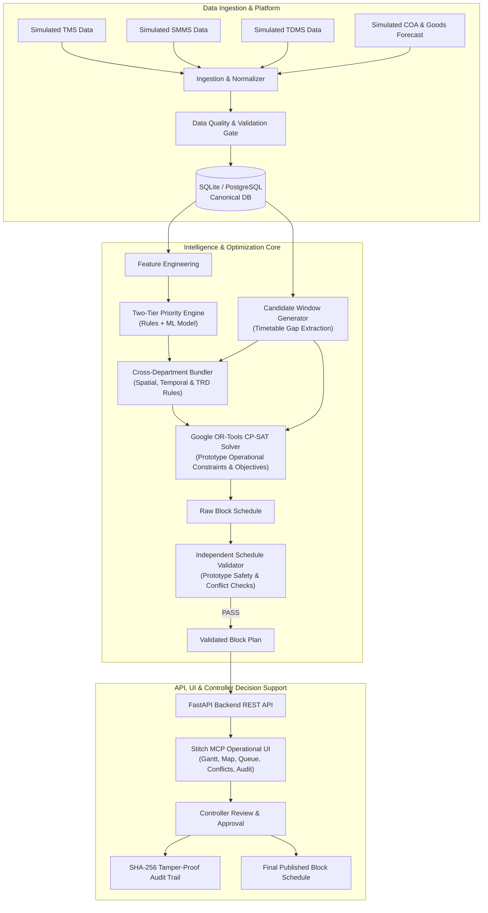

# RailSync AI — Master Implementation Plan (SIH26027)

**Project**: SIH26027 — AI-Powered Automatic Block Planning to Maximize Asset Availability for Train Operations on Indian Railways  
**System Name**: RailSync AI  
**Author**: Antigravity Engineering Pair  
**Status**: Decision-Support Prototype Implementation Plan  

---

## 1. Problem Statement & Scope Boundary

> [!NOTE]
> **Prototype & Domain Stance**: RailSync AI is a **decision-support prototype** operating on **synthetic datasets** and **simulated data sources** (simulated TMS, SMMS, TDMS, COA timetables, and simulated goods forecasts). It does not claim official Indian Railways certification, direct FOIS production integration, or safety-critical interlocking control. All rule validations and constraints are **prototype operational constraints** designed to demonstrate automated block planning feasibility. Entity counts, constraint counts, objective terms, and scenario counts are **provisional targets** to be verified during implementation.

Indian Railways fixed infrastructure maintenance across three critical departments—**Engineering (TMS)**, **Signalling & Telecommunications (SMMS)**, and **Traction Distribution (TDMS)**—is currently managed through decentralized, manual Block Demand Management System (BDMS) requests.

Control Office Application (COA) controllers must manually find gaps in live passenger and freight traffic to grant maintenance possessions ("blocks"). This manual process often results in repeated track possessions on the same corridor by different departments, missed opportunities to bundle compatible maintenance tasks into natural timetable gaps ("shadow blocks"), and operational delays.

**RailSync AI** provides an intelligent, offline-capable decision-support prototype that ingests simulated departmental defect data, calculates explainable priority scores via a two-tier AI/rule engine, extracts candidate timetable gaps from simulated COA timetables, bundles compatible cross-departmental tasks, and solves optimal block schedules using **Google OR-Tools CP-SAT** constraint programming verified by an **Independent Schedule Validator**.

---

## 2. Synthesis of Three References & Our Original Innovations

### A. Reference Audit Summary
- **Reference 1 (`TRIKAAL-RAKSHA-BLOCK-main`)**: Demonstrated clear operator-friendly multi-departmental bundling justifications and block savings metrics, but lacked dynamic timetable gap search and relied on pre-assigned request timestamps.
- **Reference 2 (`rail-bloc-main`)**: Demonstrated interval-based CP-SAT modeling (`OptionalIntervalVar`, disjunctive machine transit routing, soft freight confidence handling) and an independent validator with prototype operational checks and SHA-256 content hashing, but lacked an intuitive visual dispatch dashboard for live controllers.
- **Reference 3 (`sih26027-prototype-main`)**: Demonstrated a structured sequential pipeline, 2D network topology visualization, interactive Gantt board, and manual override workflows, but had heuristic optimization shortcuts and monolithic seed scripts.

### B. What All Three References Missed (Our Key Innovations)
1. **Two-Tier AI Prioritization with Zero Data Leakage**: Combining deterministic hard safety gates (Emergency / severe track defects) with calibrated ML risk models explaining defect escalation probabilities using feature attributions.
2. **Dynamic Timetable Gap Extraction (Candidate Shadow Block Engine)**: Automatically computing available track gaps from simulated COA timetables and simulated goods forecasts with headway buffers and station clearance allowances.
3. **Disruption-Triggered Reoptimization with Warm-Start & Schedule Stability**: When a train is delayed or emergency maintenance arises, dynamically re-scheduling affected windows while preserving unaffected approved blocks.
4. **Independent Post-Solve Schedule Validator**: An internal, deterministic validator that verifies prototype operational constraints (train headways, machine conflicts, power isolation, crew shifts) independently of the solver before presenting schedules for human review.
5. **Stitch MCP Operational UI**: High-density, professional operational dispatch interface with interactive Gantt timeline, corridor network map, task queue, conflict visualizer, and tamper-proof audit trail.

---

## 3. System Architecture & Folder Layout



### Target Repository Layout:
```
SIH26027/
├── dataset_generation/              # Our modular synthetic dataset generator
│   ├── generate_dataset.py          # Master CLI entrypoint (demo / stress modes)
│   ├── config.py                    # Seed, corridors, stations, and parameter configs
│   ├── generators/
│   │   ├── geography.py             # Stations, corridors, track segments, 2D coords
│   │   ├── assets.py                # Rails, turnouts, signals, OHE elementary sections
│   │   ├── defects.py               # TMS, SMMS, TDMS synthetic defects & severities
│   │   ├── trains.py                # Train profiles (Rajdhani, Freight, Express)
│   │   ├── timetable.py             # Timetable schedules & sectional occupancies
│   │   ├── goods_forecast.py        # Simulated freight forecasts with confidence scores
│   │   ├── resources.py             # Tamping machines, tower wagons, BCMs, crews
│   │   └── scenarios.py             # Deterministic edge scenarios
│   └── validators/
│       ├── validate_dataset.py      # Schema, FK, and timestamp consistency checks
│       └── data_profiler.py         # Automated EDA and dataset summary reports
├── data/
│   └── synthetic/                   # Canonical generated CSV files + manifest.json
├── backend/
│   ├── app/
│   │   ├── main.py                  # FastAPI application entrypoint & middleware
│   │   ├── config.py                # Environment & tuning parameters
│   │   ├── database.py              # SQLAlchemy engine & session management
│   │   ├── models/                  # SQLAlchemy ORM models (core relational entities)
│   │   ├── schemas/                 # Pydantic request/response schemas
│   │   ├── pipeline/
│   │   │   ├── ingestion.py         # Ingestion, normalization & DQ gates
│   │   │   ├── feature_engineering.py # Feature vectorization & risk attributes
│   │   │   ├── prioritization.py    # Two-tier rule gate + ML model
│   │   │   ├── candidate_windows.py # Timetable gap subtraction engine
│   │   │   ├── bundling.py          # Spatial/temporal/TRD task bundler
│   │   │   ├── optimizer.py         # Google OR-Tools CP-SAT formulation
│   │   │   ├── validator.py         # Independent prototype schedule validator
│   │   │   ├── reoptimizer.py       # Event-driven disruption re-solver
│   │   │   └── multi_horizon.py     # Multi-horizon operational & strategic planning
│   │   ├── routers/                 # REST API endpoints
│   │   │   ├── tasks.py
│   │   │   ├── trains.py
│   │   │   ├── candidate_windows.py
│   │   │   ├── optimization.py
│   │   │   ├── schedules.py
│   │   │   ├── reoptimization.py
│   │   │   ├── metrics.py
│   │   │   └── audit.py
│   │   └── services/
│   │       ├── audit_service.py     # SHA-256 hash chaining & tamper logging
│   │       └── explanation_service.py # Unscheduled task feasibility explainer
│   ├── tests/                       # Pytest unit, integration & scenario tests
│   └── requirements.txt
├── frontend/                        # React + Vite + Tailwind CSS (Stitch MCP Designed)
│   ├── src/
│   │   ├── components/
│   │   │   ├── DashboardOverview.tsx
│   │   │   ├── TaskQueueTable.tsx
│   │   │   ├── InteractiveGantt.tsx
│   │   │   ├── CorridorNetworkMap.tsx
│   │   │   ├── ConflictResolutionModal.tsx
│   │   │   ├── UnscheduledReasonDrawer.tsx
│   │   │   ├── DisruptionSimulationModal.tsx
│   │   │   ├── OverrideApprovalModal.tsx
│   │   │   └── AuditTrailViewer.tsx
│   │   ├── hooks/
│   │   ├── services/api.ts
│   │   ├── types/
│   │   ├── App.tsx
│   │   └── main.tsx
│   ├── package.json
│   └── vite.config.ts
├── md/                              # Living Specification Documents
├── REFERENCE_ANALYSIS.md            # Comprehensive reference evaluation
├── IMPLEMENTATION_PLAN.md           # Master implementation plan
├── FINAL_PROJECT_DOCUMENTATION.md   # Final verified documentation
└── README.md                        # Master project README
```

---

## 4. Core Relational Data Model & Provisional Entities

The unified prototype operates on relational entities derived from problem requirements:
1. **`Station`**: Station code, name, division, zone, 2D map coordinates $(x, y)$, platform count.
2. **`TrackSection`**: Section ID (`NDLS-GZB`), start/end station, distance (km), line type (`DOUBLE`, `TRIPLE`, `QUAD`), max speed, headway buffer.
3. **`Track`**: Individual track ID (`NDLS-GZB-UP-1`), direction (`UP`, `DOWN`, `BI`), electrification type (25kV AC), elementary section ID.
4. **`Asset`**: Asset ID, category (`TRACK`, `SIGNAL`, `OHE`, `TURNOUT`, `POINT_MACHINE`), section ID, km post, installation date, criticality weight.
5. **`MaintenanceRequest`**: Request ID, department (`ENGINEERING`, `SIGNAL_TELECOM`, `TRD`), asset ID, defect type, severity (`EMERGENCY`, `CRITICAL`, `URGENT`, `ROUTINE`), requested duration (mins), earliest start, latest deadline, speed restriction, machinery required.
6. **`Train`**: Train number, train name, type (`RAJDHANI`, `SHATABDI`, `SUPERFAST`, `EXPRESS`, `FREIGHT`), priority rank (1 to 4).
7. **`Timetable`**: Timetable entry ID, train number, section ID, scheduled entry time, scheduled exit time, run days.
8. **`GoodsForecast`**: Forecast ID, train ID, section ID, estimated entry/exit, arrival confidence score (0.0 to 1.0).
9. **`Resource`**: Resource ID, type (`TAMPING_MACHINE`, `TOWER_WAGON`, `BCM`, `UNIMAT`, `CREW_TEAM`), department, home depot, transit speed (km/h), max continuous shift (hours).
10. **`CandidateWindow`**: Window ID, section ID, track ID, window start, window end, usable duration (mins), train conflict count, forecast uncertainty.
11. **`BlockPlan`**: Plan ID, horizon (`WEEKLY`, `MONTHLY`), run timestamp, status (`DRAFT`, `RECOMMENDED`, `APPROVED`, `PUBLISHED`, `OVERRIDDEN`), solver runtime (s), total saved minutes, content hash (SHA-256).
12. **`BlockPlanItem`**: Item ID, plan ID, window ID, scheduled start, scheduled end, bundled task IDs, assigned resource IDs, justification summary, validation status (`PASSED`, `CONFLICT`).

---

## 5. Implementation Roadmap & Phases

### Phase 0: Repository & Living Documentation Alignment
- Clean root directory and establish consistent architecture.
- Update `md/` living specifications to match the synthesized architecture.

### Phase 1: Modular Synthetic Dataset Generator (`dataset_generation/`)
- Build generators for geography, assets, defects, trains, timetables, freight, and resources.
- Create deterministic scenarios:
  1. Multi-Department Mega Block (Engineering + S&T + TRD bundle).
  2. Safety-Critical Escalation (Emergency track flaw).
  3. Freight Gap Squeeze (tight window with uncertain goods train).
  4. Heavy Machine Routing Conflict (tamping machine transit collision).
  5. TRD Power Isolation Block (traction power cut across adjacent tracks).
  6. Overdue Backlog Squeeze (deadline violation risk).
  7. Infeasible Request Handling (unfittable task with clear explanation).
  8. Mid-Horizon Disruption & Reoptimization (train delay + new emergency defect).
- Implement dataset validator and automated EDA summary generator.

### Phase 2: Database Schema & Ingestion Pipeline
- Build SQLAlchemy models and SQLite/PostgreSQL schema.
- Implement data ingestion service with data quality validation gates.

### Phase 3: AI/ML Prioritization Engine
- Implement feature extraction pipeline.
- Train Scikit-Learn/XGBoost defect escalation risk model with zero data leakage.
- Combine with deterministic safety rule gate into a Two-Tier Priority Engine.

### Phase 4: Candidate Shadow Block & Bundling Engine
- Build timetable gap extraction algorithm with configurable headway and safety buffers.
- Implement spatial, temporal, machinery, and electrical (TRD) bundling compatibility rules.

### Phase 5: Google OR-Tools CP-SAT Optimizer & Independent Validator
- Build CP-SAT mathematical model with `OptionalIntervalVar`, disjunctive machine constraints, and multi-objective Pareto optimization.
- Implement independent `ScheduleValidator` (prototype operational rules, machine transit, train headways, TRD isolation) with SHA-256 hash generation.
- Implement unscheduled task feasibility explanation service.

### Phase 6: Disruption Reoptimization & Multi-Horizon Planning
- Implement event-triggered re-solver for live disruptions.
- Build multi-horizon operational and strategic planning modes.

### Phase 7: FastAPI Backend & Endpoints
- Implement REST API endpoints for tasks, trains, windows, optimization runs, validation, overrides, reoptimization, and audit logs.

### Phase 8: Stitch MCP Frontend Design & Implementation
- Use Stitch MCP to generate design systems and screens.
- Implement React + Vite frontend connecting UI components to real backend endpoints.

### Phase 9: End-to-End Testing, Metrics & Verification
- Execute Pytest suite covering all pipeline stages and demo scenarios.
- Verify that prototype operational constraints are enforced and audit logs are tamper-proof.

### Phase 10: Final Project Documentation Synchronization
- Update root `FINAL_PROJECT_DOCUMENTATION.md` and `md/` living specifications to reflect the actual running implementation.

---

## 6. Verification & Definition of Done (DoD)

The prototype is complete when:
1. `generate_dataset.py` generates deterministic, relational CSVs that pass all validation gates.
2. Ingestion loads and verifies all data into SQLite/PostgreSQL.
3. Priority Engine outputs scores and feature importance for all maintenance tasks.
4. Candidate Window Generator identifies valid timetable gaps from simulated train timetables.
5. Bundling Engine bundles multi-department tasks with verifiable justification.
6. CP-SAT Solver computes optimized block schedules within practical prototype runtimes.
7. Independent Validator verifies prototype operational constraints with SHA-256 content hashing.
8. Unscheduled tasks have accurate mathematical/operational failure explanations.
9. Disruption Reoptimization resolves train delays and emergency defects cleanly.
10. Stitch MCP designed frontend visualizes the live schedule, Gantt chart, network map, and override controls with real backend data.
11. All unit, integration, and scenario tests pass.
12. `FINAL_PROJECT_DOCUMENTATION.md` and `md/` documents match the real implementation.

---

## 7. Evolution Milestones & Current System Status

### Stage 1: Core Architecture & Prototype Pipeline (Completed)
- Clean ingestion, synthetic dataset generators, and database relational models.
- Independent Sentinel validation and interactive frontend prototype.

### Stage 2: Longitudinal Synthetic ML v2 Pipeline (Completed)
- 194-day longitudinal synthetic asset history (174 assets, 33,756 state observations).
- Non-linear physical wear dynamics (Poisson/Weibull degradation models).
- Backward-looking temporal lag features (rolling 7d/14d/30d aggregations) predicting future outcome target (`failure_within_14d`).
- Out-of-time temporal split (Train: Day 1-135, Val: Day 136-164, Test: Day 165-194).
- Zero target leakage, LightGBM classifier with 50-tree shallow architecture, persisted in `asset_failure_risk_v2.joblib`.
- Fully documented in `AI_V2_IMPLEMENTATION_REPORT.md`.

### Stage 3: Optimization Integrity, Bundling Correctness & Benchmarking (Completed)
- Physical track-level interval `NoOverlap` constraint enforcement.
- First-class unified `BlockPlanItem` bundle representation (`{plan_id}-BUNDLE-{bundle_id}`) with detailed possession savings metrics.
- Hardened candidate window boundary gap and exact-fit gap extraction.
- Strict mathematical separation between hard constraints (feasibility) and soft objectives (optimization).
- Deterministic Greedy Baseline Scheduler built for objective comparative analysis.
- Empirical benchmarking engine (`POST /api/v1/optimization/benchmark`) measuring CP-SAT against Greedy Baseline (**10.5 hours of track closure saved via bundling**, 29.6% reduction in possession time, $0.056\text{s}$ solver runtime).
- Strengthened independent Sentinel validator with negative test suite (caught track collisions, train clashes, machinery transit violations, and deadline breaches).
- Fully documented in `OPTIMIZATION_V1_IMPLEMENTATION_REPORT.md`.

### Stage 4: Operational Dispatch UI & Frontend Integration (Completed)
- Mission Tactical Control Center (OCC) dashboard connected 100% to real FastAPI REST endpoints.
- Real API-driven KPI cards (Demand, Unscheduled, Tier 1 Emergency, Critical Predictive, Active Possessions, Bundles, Hours Saved, Sentinel, Solver Runtime).
- Central Gantt possession timeline with unified bundle representation and block possession detail inspector.
- AI Explanation Panel displaying predicted synthetic failure risk ($P(\text{failure}_{14\text{d}})$), local feature attribution (SHAP proxy), asset telemetry, and root-cause feasibility diagnosis.
- Dedicated Optimization Quality Benchmark Modal (Greedy Baseline vs CP-SAT side-by-side comparison).
- Sentinel Validator Modal with PASS/FAIL badge, 7 independent integrity check cards, and SHA-256 content hash.
- Manual Override workflow with Sentinel pre-validation gate and audit logging.
- Disruption simulation & warm-start re-optimization interface.
- 2D topological SVG corridor schematic with live possession overlays.
- Production build verified with `npm run build` (0 errors) and all 19 backend tests passing.
- Fully documented in `FRONTEND_V1_IMPLEMENTATION_REPORT.md`.

### Stage 5: Multi-Scenario Stress Testing & End-to-End Reliability Hardening (Completed)
- Designed and built modular, reproducible scenario testing framework (`backend/app/pipeline/scenario_runner.py`).
- Complete database isolation (`sqlite:///:memory:`) guarantees zero state corruption of canonical data.
- 10 deterministic operational stress scenarios evaluated and passing all invariant checks:
  1. `SCN-01` Mega Block (High-density multi-department corridor bundling, 29.2h possession saved).
  2. `SCN-02` Safety Escalation (Tier 1 emergency hard safety gate score 98.0 protected from displacement).
  3. `SCN-03` Freight Squeeze (Dense freight timetable window contraction, 0 train/block collisions).
  4. `SCN-04` Machine Transit (Disjunctive multi-depot transit buffers enforced, intentional clash caught by Sentinel).
  5. `SCN-05` Power Block (25kV OHE electrical isolation synchronized with track work without clash).
  6. `SCN-06` Train Delay Disruption (45m train delay re-solved in 0.05s preserving unaffected blocks).
  7. `SCN-07` No Feasible Window (8h task in 2h gap gracefully unscheduled with `MAX_GAP_INSUFFICIENT` diagnosis).
  8. `SCN-08` Resource Starvation (Single BCM machinery allocation strictly serialized).
  9. `SCN-09` Bundle Compatibility (Compatible tasks merged, incompatible distant tasks isolated).
  10. `SCN-10` Horizon Boundary (Exact-fit boundary and edge windows captured without silent task loss).
- Automated regression test suite (`backend/tests/test_scenario_stress.py`) brings total backend tests to **29/29 passing**.
- Full end-to-end pipeline verified (Ingestion $\rightarrow$ Data Quality $\rightarrow$ Features $\rightarrow$ ML v2 $\rightarrow$ Safety Gate $\rightarrow$ Windows $\rightarrow$ Bundling $\rightarrow$ CP-SAT $\rightarrow$ Sentinel $\rightarrow$ Benchmark $\rightarrow$ Re-solve $\rightarrow$ Audit).
- Frontend production build verified (`npm run build`, 0 errors).
- Fully documented in `SCENARIO_STRESS_TEST_REPORT.md` and `STAGE5_SYSTEM_VALIDATION_REPORT.md`.

