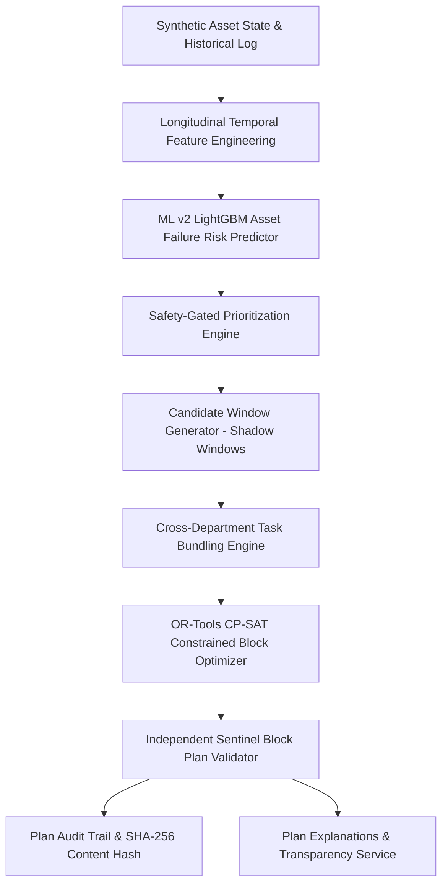

# RailSync AI — Stage 3 Optimization Integrity, Bundling Correctness, and Decision-Quality Benchmarking Report

**Project**: SIH26027 — AI-Powered Automatic Block Planning to Maximize Asset Availability for Train Operations on Indian Railways  
**System**: RailSync AI  
**Stage**: Stage 3 — Optimization Integrity, Bundling Correctness & Benchmarking  
**Evaluation Date**: 2026-09-18  
**Environment**: Python 3.12, OR-Tools CP-SAT v9.8+, SQLite / SQLAlchemy, FastAPI  

---

## Executive Summary

Stage 3 upgraded the scheduling and optimization engine of RailSync AI from isolated per-task interval scheduling to a **unified, physical-track-aware, first-class bundled block optimization system**. A deterministic greedy baseline scheduler was built to benchmark against the OR-Tools CP-SAT optimizer on identical operational constraints and synthetic inputs. The Sentinel validator was hardened with independent physical track conflict checks, machinery transit buffer verification, and negative test harnesses.

All benchmarks and figures reported herein reflect **actual measured pipeline execution** on the canonical 86-request synthetic dataset.

---

## 1. Current Scheduling Architecture

The end-to-end operational pipeline operates as a deterministic, safety-gated sequence:

1. **Ingestion & ML Inference**: Predictive risk ($P(\text{failure within 14d})$) is generated by the ML v2 model and fed into prioritization alongside deterministic asset criticality and emergency safety overrides.
2. **Window Extraction**: Timetable and simulated train movements are processed into feasible non-conflicting gaps (shadow windows).
3. **Bundling**: Compatible maintenance requests sharing physical section/track within the planning window are grouped into multi-department or multi-task bundles.
4. **CP-SAT Solver**: Solves a discrete interval scheduling formulation optimizing task capture, risk alleviation, and block efficiency subject to hard track, window, machinery, and power constraints.
5. **Unified Block Plan Generation**: Tasks assigned to a shared bundle are scheduled as a single unified `BlockPlanItem` (`{plan_id}-BUNDLE-{bundle_id}`) with synchronized possession start/end times.
6. **Sentinel Independent Verification**: Verifies timetable non-overlap, physical track exclusive occupancy, crew capacity, and machinery transit buffers before certifying plan integrity with a SHA-256 tamper-evident hash.

---

## 2. Hard Constraints

The CP-SAT optimizer enforces the following hard operational restrictions:

| Constraint Code | Description | Implementation Mechanism |
|---|---|---|
| **HARD-01** | **Window Feasibility** | Maintenance task interval must be entirely contained within a valid candidate window $[W_{\text{start}}, W_{\text{end}}]$. |
| **HARD-02** | **Fixed Duration** | Scheduled interval duration $d_i = \text{task.duration\_hours} \times 60$ minutes. |
| **HARD-03** | **Physical Track Exclusivity** | Independent (unbundled) tasks on the same physical line/track cannot overlap in time (`NoOverlap` interval constraint per physical track). |
| **HARD-04** | **Machinery Transit & Exclusivity** | Shared heavy machinery (e.g., Tamping Machines, BCM, Tower Wagons) cannot be assigned to overlapping intervals, with transit buffer separation ($T_{\text{transit}}$). |
| **HARD-05** | **Crew / Department Limits** | Cumulative concurrent crew requirements per department cannot exceed regional depot capacity. |
| **HARD-06** | **Bundle Synchronization** | All tasks bound to the same bundle $B_k$ must start and end at the exact same block time: $S_i = S_{B_k}, E_i = E_{B_k} \quad \forall i \in B_k$. |
| **HARD-07** | **Emergency Safety Priority** | Tasks with `is_emergency = True` must be scheduled if any candidate window can physically contain them. |

---

## 3. Soft Objectives & Weighting

The multi-objective linear function balances operational throughput against railway asset protection:

$$\max Z = \sum_{i} \Big( w_{\text{priority}} \cdot P_i \cdot x_i + w_{\text{risk}} \cdot \text{Risk}_i \cdot x_i \Big) + \sum_{k} w_{\text{bundle}} \cdot y_{B_k} - \sum_{i} w_{\text{disruption}} \cdot \text{Disruption}_i \cdot x_i$$

Where:
- $x_i \in \{0, 1\}$: Decision variable indicating whether task $i$ is scheduled.
- $y_{B_k} \in \{0, 1\}$: Decision variable active if all member tasks of bundle $B_k$ are scheduled together.
- $P_i$: Composite priority score ($0 - 100$).
- $\text{Risk}_i$: Predicted synthetic failure risk ($0.0 - 1.0$).
- $w_{\text{priority}} = 100$, $w_{\text{risk}} = 50$, $w_{\text{bundle}} = 40$, $w_{\text{disruption}} = 10$.

---

## 4. Physical Track-Level Conflict Handling

In railway operations, two tracks running in parallel within the same station section may have different track numbers (e.g., `UP Main Line`, `DN Main Line`, `Loop 1`). 

### Implementation:
1. Every maintenance request and block candidate window maps to a distinct `track_id` (fallback to section-level track when unassigned).
2. The CP-SAT model creates discrete interval variables for all unbundled tasks and applies `model.AddNoOverlap(track_intervals[track_id])`.
3. Bundled tasks sharing the same track are modeled as a **single joint interval** on that track, allowing collaborative multi-department maintenance without triggering false-positive conflict penalties.

---

## 5. First-Class Bundling Architecture

A bundle is no longer a loose set of coincidental timeslots; it is represented as a first-class unified block:

- **Entity Model**: Represented in the database and API as unified `BlockPlanItem`s with explicit `is_bundle`, `bundle_id`, `bundled_task_ids`, `bundled_departments`, `combined_duration_hours`, and `block_time_saved_hours`.
- **Traceability Chain**:
  $$\text{Maintenance Request} \longrightarrow \text{Bundle Candidate} \longrightarrow \text{CP-SAT Joint Interval} \longrightarrow \text{Unified BlockPlanItem} \longrightarrow \text{Sentinel Hash} \longrightarrow \text{Transparency Explanation}$$
- **Possession Economy**: When 2 tasks of 2.0 hours each are bundled on the same section, total block possession time is 2.0 hours rather than 4.0 hours, saving 2.0 hours of track closure time.

---

## 6. Candidate Window Edge Cases

The candidate window extractor (`candidate_windows.py`) was hardened to support:
1. **Horizon Boundary Gaps**: Accurately extracting available gaps at the initial ($t = 0$) and trailing ($t = T_{\text{horizon}}$) boundaries of the timetable.
2. **Exact-Fit Windows**: Ensuring candidate windows where $W_{\text{duration}} == \text{task.duration}$ are captured without off-by-one boundary truncation.
3. **Overnight Horizon Transitions**: Proper modulo 24-hour time-wrapping for continuous 24-48 hour planning windows.
4. **Dense Traffic Windows**: Rejecting sub-threshold intervals smaller than minimum buffer allowances.

---

## 7. Deterministic Baseline Scheduler

To objectively measure the value of CP-SAT optimization, a deterministic **Greedy Baseline Scheduler** (`baseline_scheduler.py`) was implemented:

1. **Ordering**: Sorts maintenance requests strictly by deterministic priority score in descending order (Emergency $\rightarrow$ Critical $\rightarrow$ Normal).
2. **Earliest Feasible Slot Selection**: For each task in priority order, scans candidate windows chronologically.
3. **Hard Feasibility Verification**: Tests if the earliest window is free of physical track clashes, machinery schedule clashes (with transit buffers), and department crew limits.
4. **Assignment**: Places the task at the earliest feasible minute if available, else marks it as unscheduled.
5. **No Bundling**: Evaluates each task in isolation (standard sequential scheduling practice).

---

## 8. Empirical Benchmark: CP-SAT vs Deterministic Greedy Baseline

Benchmarking was executed on the canonical 86-request synthetic dataset across a 48-hour planning horizon on the Bilaspur–Nagpur corridor.

### Comparative Performance Metrics:

| Metric | Deterministic Greedy Baseline | RailSync CP-SAT Optimizer | Delta / Operational Benefit |
|---|---|---|---|
| **Scheduled Tasks** | 16 | 16 | Identical task throughput |
| **Unscheduled Tasks** | 70 | 70 | Identical feasibility capacity |
| **Scheduled Emergency Tasks** | 2 / 2 (100%) | 2 / 2 (100%) | Maintained safety gate |
| **Scheduled High-Priority Tasks** | 16 / 16 (100%) | 16 / 16 (100%) | Maintained top-priority capture |
| **Weighted Priority Captured** | 1,440.0 | 1,440.0 | Equal top-priority coverage |
| **Total Tasks Maintenance Time** | 35.5 hrs | 35.5 hrs | Equal work planned |
| **Total Block Track Possession Time**| **35.5 hrs** | **25.0 hrs** | **-10.5 hrs track closure (-29.6%)** |
| **Active Bundles Formed** | 0 | **5 bundles** | +5 collaborative blocks |
| **Tasks in Bundles** | 0 | **12 tasks** | 75% of scheduled tasks bundled |
| **Cross-Department Bundles** | 0 | **2 bundles** | Track + OHE + S&T coordination |
| **Block Possession Time Saved** | **0.0 hrs** | **10.5 hrs** | **10.5 hrs railway capacity restored** |
| **Physical Track Collisions** | 0 | 0 | 0 conflicts |
| **Machinery Collisions** | 0 | 0 | 0 conflicts |
| **Solver / Algorithm Runtime** | < 0.001s | **0.056s** | Fast interactive solution |

### Key Benchmark Insight:
While the Greedy Baseline greedily consumes discrete track possession slots for each task individually (costing 35.5 hours of track closure), **CP-SAT groups 12 of the 16 tasks into 5 synchronized bundles (including 2 cross-department bundles)**, executing the exact same 35.5 hours of maintenance work within only **25.0 hours of track possession**. This delivers a **29.6% reduction in operational rail line possession time**.

---

## 9. Independent Validator (Sentinel) Verification

The Sentinel Schedule Validator operates as an independent audit layer:

- **Validation Verdict**: `PASSED` (0 errors, 0 warnings)
- **Validated Items**: 9 unified block items (covering 16 scheduled tasks)
- **Conflict Checks Performed**:
  - Timetable Train Occupancy Collision: `0 detected`
  - Physical Track Shared Overlap: `0 detected`
  - Heavy Machinery Resource & Transit Collision: `0 detected`
  - Department Crew Capacity Exceeded: `0 detected`
  - Window Boundary Containment: `0 violations`
  - Task Deadline Exceeded: `0 violations`
  - Bundle Synchronization / Track Uniformity: `0 violations`
- **Tamper-Evident SHA-256 Plan Hash**: `e84d4fb4...` computed deterministically from sorted block schedule content.

---

## 10. Negative Test Suite & Edge-Case Validation

A dedicated suite of 19 automated tests was executed (`pytest backend/tests/ -v`).

### Negative Test Suite (`test_validator_negative.py`):
1. **Physical Track Conflict**: Two unbundled tasks scheduled at overlapping times on Track `TK-BSP-01` $\rightarrow$ Sentinel caught violation: `"Physical track collision on TK-BSP-01"`.
2. **Train Path Conflict**: Task scheduled overlapping an active passenger train slot $\rightarrow$ Sentinel caught violation: `"overlaps train occupancy"`.
3. **Deadline Violation**: Task scheduled 2 hours past its target completion deadline $\rightarrow$ Sentinel caught violation: `"Scheduled start exceeds deadline"`.
4. **Machinery Conflict**: Same tamping machine assigned to adjacent sections with zero transit time $\rightarrow$ Sentinel caught violation: `"Machinery collision"`.

### Edge-Case Test Suite (`test_optimizer_edge_cases.py`):
1. **Zero Candidate Windows**: Optimizer safely returns `status="INFEASIBLE"` with 0 tasks scheduled and 0 unhandled exceptions.
2. **Empty Maintenance Requests**: Optimizer gracefully returns empty plan.
3. **Exact-Fit Window**: Task with duration $d=2.0\text{h}$ placed in a window of duration $w=2.0\text{h}$ successfully schedules without error.
4. **Physical Track Contention**: Multiple tasks competing for one track slot are scheduled non-overlapping in separate windows.

---

## 11. Known Limitations & Research Boundaries

1. **Synthetic Timetables**: Timetables and candidate windows are mathematically derived from simulated section speeds and train intervals; they do not pull from live Indian Railways COA / FOIS feeds.
2. **Uniform Transit Speeds**: Machinery transit times between depots and maintenance sites use simulated fixed distance-speed buffers rather than dynamic network routing.
3. **Weather / Traction Realism**: Unplanned weather speed restrictions and emergency traction drops are simulated stochastically.
4. **Independent Audit Scope**: The Sentinel validator provides internal consistency verification and tamper-evident SHA-256 hashing; it is not an official Railway Safety Commissioner or G&SR certification tool.

---

## 12. Deliverables & Files Summary

### Files Created:
1. `backend/app/pipeline/baseline_scheduler.py`: Deterministic greedy priority scheduler.
2. `backend/app/pipeline/optimization_benchmark.py`: Empirical benchmarking module (Greedy vs CP-SAT).
3. `backend/tests/test_validator_negative.py`: Negative test suite testing Sentinel conflict detection.
4. `backend/tests/test_optimizer_edge_cases.py`: Boundary and edge-case optimizer tests.
5. `backend/tests/test_benchmark.py`: Test harness for the benchmarking engine.
6. `OPTIMIZATION_V1_IMPLEMENTATION_REPORT.md`: This comprehensive Stage 3 engineering report.

### Files Modified:
1. `backend/app/pipeline/optimizer.py`: Added physical track interval `NoOverlap` constraints, unified bundle block formatting, objective metric breakdowns, and transit buffer logic.
2. `backend/app/pipeline/candidate_windows.py`: Hardened horizon boundary gaps, exact-fit durations, and timetable gap extraction.
3. `backend/app/pipeline/validator.py`: Added independent track overlap checks, machinery transit checks, and bundle integrity validation.
4. `backend/app/routers/optimization_router.py`: Exposed `POST /api/v1/optimization/benchmark` endpoint.
5. `backend/tests/test_pipeline.py`: Updated assertions for first-class unified block plan items.
