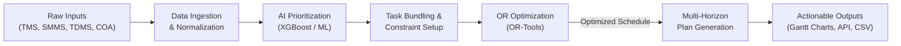

# RailSync AI
# Block Demand Management System

## SIH26027: AI-Powered Automatic Block Planning to Maximize Asset Availability

## 1. Problem Statement
**Background:** Maintenance for fixed infrastructure on Indian Railways (Engineering, Traction Distribution, and Signal & Telecommunication) is currently planned in decentralized silos. Each department requests maintenance downtime (blocks) manually via the Block Demand Management System (BDMS).

**The Challenge:** The Control Office attempts to fit these uncoordinated BDMS requests into the live train traffic managed by the Control Office Application (COA). This manual, disjointed process leads to inefficient block utilization, overlapping repair requests, and unnecessary asset downtime that severely impacts train operations.

## 2. Proposed Solution
This project builds an intelligent master scheduling system that effectively replaces the manual BDMS workflow. It automatically ingests defect and maintenance data from the departmental databases (TMS, SMMS, TDMS). An AI/ML engine ranks these tasks by urgency and criticality. Then, a constraint-programming optimizer cross-references the prioritized tasks with train timetables and corridor availability from the COA. 

Instead of processing uncoordinated requests, the system automatically bundles multi-departmental repairs into natural timetable gaps ("shadow blocks"), maximizing asset uptime and ensuring reliable, uninterrupted train operations.

## 3. Integrated Data Sources
The system operates on localized, simulated data representing the following core Indian Railways systems:
*   **TMS (Track Management System):** Pulls track geometry defects, rail wear, weld failures, and overdue machine tamping constraints.
*   **SMMS (Signalling Maintenance & Management System):** Pulls signal failures, point machine malfunctions, track circuit defects, and telecom cable maintenance.
*   **TDMS (Traction Distribution Management System):** Pulls overhead equipment (OHE) defects, insulator faults, substation faults, and power supply issues.
*   **COA (Control Office Application):** Provides the "free time" windows via active passenger Train Time Tables and goods train forecasts.

## 4. Key Features
*   **AI Task Prioritization:** Uses Machine Learning algorithms to dynamically score and rank maintenance requests based on defect severity, safety risk, and age.
*   **Optimized Block Scheduling:** Uses constraint-programming to bundle geographically adjacent tasks from different departments into a single time window, eliminating repeated track closures.
*   **Multi-Horizon Planning:** Generates actionable, high-granularity short-term (weekly) schedules and strategic long-term (monthly) forecasts.
*   **Interactive UI Dashboard:** Provides control officers with visual Gantt charts of scheduled blocks, asset availability metrics, and a manual override feature for emergencies.

## 5. System Architecture

```
[ EXTERNAL DATA SIMULATION ]
   ├── TMS (Track Data)       ─────┐
   ├── SMMS (Signal Data)     ─────┼──► [ Data Ingestion Pipeline ]
   ├── TDMS (Electrical Data) ─────┤
   └── COA (Timetables)       ─────┘
                                              │
                                              ▼
[ LOCAL UNIFIED STORAGE ]          [( Local Relational DB )]
                                     ▲                 ▲
                                     │                 │
[ AI & OPTIMIZATION ENGINE ]         ▼                 ▼
                          [ AI Prioritization ]   [ Scheduling Optimizer ]
                          (Scores & Ranks)        (Bundles & Allocates)
                                                       │
                                                       ▼
[ APPLICATION LAYER ]                        [ Local Backend API ]
                                                       │
                                                       ▼
                                          [ Interactive UI Dashboard ]
                                          (Gantt Charts & Overrides)
```

## 6. Technology Stack
*   **Frontend:** React.js, Tailwind CSS, Gantt Chart Libraries
*   **Backend:** Python, FastAPI 
*   **Database:** PostgreSQL (or local SQLite for development)
*   **AI & Optimization:** Scikit-Learn/XGBoost (Prioritization), Google OR-Tools (Scheduling constraints), Pandas/NumPy (Data Processing)

## 8. Usage Instructions
1. Navigate to https://localhost:3000 to access the control dashboard.
2. Click "Sync External Data" to fetch the latest synthetic defects from the local TMS, SMMS, and TDMS mock repositories.
3. Click "Run Optimization Engine" to trigger the AI prioritization and schedule generation against the current COA timetable.
4. View the unified multi-department maintenance blocks on the interactive visual timeline.

**AI-Powered Automatic Block Planning to Maximize Asset Availability for Train Operations**

[](https://www.sih.gov.in/)
[](https://www.sih.gov.in/)
[](#)
[](#)
[](#)
[](#3-offline-first-architecture)

---

## Project Information

| Parameter | Details |
| :--- | :--- |
| **Hackathon** | Smart India Hackathon 2026 |
| **Problem Statement ID** | SIH26027 |
| **Problem Statement** | AI-Powered Automatic Block Planning to Maximize Asset Availability for Train Operations on Indian Railways |
| **Theme** | Smart Automation / Transportation & Logistics |
| **Category** | Software |
| **Team Name** | Commit & Crack |

---

## Overview

**RailSync AI** is a data-driven, intelligent master scheduling system designed to automatically integrate, prioritize, and optimize maintenance blocks across Indian Railways' engineering, signaling, and electrical departments.

> [!IMPORTANT]
> **Authoritative Single Source of Truth Documentation**: For complete architectural specifications, dataset schemas, constraint programming mathematical models, API definitions, and implementation roadmaps, consult [`00_DOCUMENTATION_INDEX.md`](00_DOCUMENTATION_INDEX.md) and the accompanying 28 root architecture documents (`00_` through `27_`).

Currently, railway maintenance for fixed infrastructure is planned independently by different departments using the manual Block Demand Management System (BDMS). This disjointed process leads to overlapping requests, poor coordination, and suboptimal track utilization. RailSync AI addresses this by replacing the manual workflow with an AI optimization engine that fuses departmental data with train traffic control parameters:

* **TMS (Track Management System):** Engineering defects, rail wear, and track maintenance constraints.
* **SMMS (Signalling Maintenance & Management System):** Signal failures and telecom cable upkeep.
* **TDMS (Traction Distribution Management System):** Overhead equipment (OHE) and power supply issues.
* **COA (Control Office Application):** Passenger train timetables and freight forecasts.
* **AI Prioritization:** Machine learning models to assess task criticality and safety risk.
* **Constraint Optimization:** Operations Research algorithms to bundle cross-departmental tasks into optimal "shadow blocks."
* **Multi-Horizon Planning:** Generation of actionable weekly and monthly maintenance schedules.

---

## Key Features

### 1. Dynamic Task Prioritization
RailSync AI evaluates every incoming maintenance request and assigns a dynamic criticality score based on defect severity, safety impact, and overdue status. As a task ages, its priority automatically increases to ensure it is not permanently deferred.

### 2. Multi-Source Input & Normalization
The system features a robust ingestion pipeline that standardizes data from completely isolated silos (TMS, SMMS, TDMS) and aligns it temporally with the active traffic corridors managed by the COA.

### 3. Local-First Architecture
Designed to operate securely on local railway network nodes, the application does not rely on external cloud computation, ensuring that sensitive infrastructure data remains air-gapped and secure.

### 4. Smart Block Optimization
The core constraint programming engine solves the scheduling puzzle by bundling tasks. If electrical (TDMS) and track (TMS) repairs are needed in the same 5-kilometer sector, the engine schedules them concurrently within a single block, minimizing overall asset downtime.

### 5. AI + Mathematical Verification
To ensure schedules do not disrupt train operations, the system mathematically verifies block feasibility against the COA timetable. The optimization minimizes downtime $D$:
$$D = \sum_{i=1}^{n} (B_i \times \text{Impact}_i)$$
where $B_i$ is the duration of the maintenance block and $\text{Impact}_i$ is the disruption factor derived from the COA traffic density.

### 6. Interactive Geotagged Dashboard
Schedules are mapped to physical geographic zones and presented via an interactive Gantt chart dashboard, complete with manual override capabilities for control officers during sudden emergencies.

#### Example Output Format
```json
{
  "block_id": "BLK-2026-09A",
  "corridor": "Delhi-Mumbai Sector 4",
  "scheduled_window": "02:00 - 05:30",
  "bundled_tasks": ["TMS-902", "SMMS-411", "TDMS-88"],
  "cumulative_priority": 94.5,
  "asset_uptime_saved": "2.5 hours"
}

```

---

## System Workflow



### Pipeline Stages

1. **Data Ingestion:** Fetches synthetic defects and timetables from simulated departmental APIs.
2. **Data Normalization:** Converts distinct departmental data formats into a unified database schema.
3. **AI Prioritization:** Scores each task based on severity, overdue age, and safety constraints.
4. **Task Bundling:** Geographically groups adjacent tasks across different departments.
5. **OR Optimization:** Fits bundled tasks into natural timetable gaps (shadow blocks) utilizing constraint programming.
6. **Plan Generation:** Outputs granular weekly action plans and broader monthly strategic schedules.
7. **Actionable Outputs:** Feeds the React dashboard for visualization and final officer approval.

---

## System Architecture

```
[ EXTERNAL DATA SIMULATION ]
   ├── TMS (Track Data)       ─────┐
   ├── SMMS (Signal Data)     ─────┼──► [ Data Ingestion Pipeline ]
   ├── TDMS (Electrical Data) ─────┤
   └── COA (Timetables)       ─────┘
                                              │
                                              ▼
[ LOCAL UNIFIED STORAGE ]          [( Local Relational DB )]
                                     ▲                 ▲
                                     │                 │
[ AI & OPTIMIZATION ENGINE ]         ▼                 ▼
                          [ AI Prioritization ]   [ Scheduling Optimizer ]
                          (Scores & Ranks)        (Bundles & Allocates)
                                                       │
                                                       ▼
[ APPLICATION LAYER ]                        [ Local Backend API ]
                                                       │
                                                       ▼
                                          [ Interactive UI Dashboard ]
                                          (Gantt Charts & Overrides)
```

---

## Technical Approach

The proposed technical approach is organized into modular components:

* **Data Simulation & Ingestion:** Local mock repositories mimic live BDMS/COA networks.
* **Unified Database:** A centralized relational schema storing defects and timetables.
* **Prioritization Model:** An ML regression/classification model assigning priority scores.
* **Constraint Programming:** Operations Research math solvers (e.g., Google OR-Tools) to allocate resources without violating traffic bounds.
* **Multi-Horizon Engine:** Temporal filtering for short-term and long-term planning.
* **UI/UX Visualization:** Interactive timelines for dispatchers to review, edit, and approve block plans.

---

## System Outputs

* **Unified Block Schedules:** Coordinated maintenance windows containing cross-departmental tasks.
* **Task Prioritization Scores:** Ranked lists of all pending railway infrastructure repairs.
* **Asset Availability Metrics:** Real-time calculation of uptime percentages across network sectors.
* **Multi-Horizon Plans:** Specific Weekly plans and aggregated Monthly forecasts.
* **JSON / CSV Export:** Structured records for integration with actual COA systems.

---

## Feasibility and Viability

### Technical Feasibility

* **Established Algorithms:** Constraint programming is a mature, proven technology for logistics and scheduling.
* **Modular Architecture:** Prioritization ML and Scheduling OR can be developed and tuned independently.
* **Offline Execution:** Completely local computing removes dependencies on external internet access.

### Operational Viability

* **Seamless Transition:** Replaces the inefficient manual BDMS while seamlessly reading from existing systems (TMS/SMMS/TDMS/COA).
* **Cost & Time Savings:** Bundling tasks reduces the number of times tracks must be shut down, heavily optimizing operational budgets.
* **Enhanced Safety:** AI ensures critical safety defects are never left unaddressed due to manual scheduling oversights.

---

## Challenges and Mitigation Strategies

| Challenge | Operational Risk | Proposed Mitigation |
| --- | --- | --- |
| **Conflicting Department Constraints** | Track machinery might block electrical repair vehicles. | Hard constraints in the OR solver to sequence incompatible tasks within the same block. |
| **Sudden Train Delays** | Live traffic changes invalidate the AI's scheduled shadow block. | Manual override features in the UI and rapid re-optimization trigger in the backend. |
| **Data Silo Discrepancies** | Missing kilometer markers or varied formatting across TMS/SMMS. | Robust data normalization pipeline that flags incomplete records for manual review. |
| **Algorithm Compute Time** | Scheduling thousands of tasks across a whole month can hang the system. | Segmenting the network into independent geographic zones for parallel optimization processing. |

---

## Implementation Roadmap

| Phase | Phase Name | Planned Deliverables |
| --- | --- | --- |
| **1** | **Data Simulation** | Mock APIs and synthetic data generation for TMS, SMMS, TDMS, and COA. |
| **2** | **Unified Database** | ETL pipeline and standardized relational schema design. |
| **3** | **AI Prioritization** | Machine learning model for task criticality scoring. |
| **4** | **Constraint Engine** | OR-Tools implementation for task bundling and shadow block matching. |
| **5** | **Dashboard Dev** | Interactive React Gantt chart UI with override capabilities. |
| **6** | **Integration & Test** | End-to-end local testing and multi-horizon plan generation. |

---

## Impact Analysis

### Impact Pathway

$$\text{Data Ingestion} \longrightarrow \text{Task Prioritization} \longrightarrow \text{Constraint Bundling} \longrightarrow \text{Block Allocation} \longrightarrow \text{Maximized Uptime}$$

* **Operational Impact:** Drastically cuts manual negotiation time between departments and the control office.
* **Economic Benefits:** Maximizing track availability directly increases the capacity for freight and passenger revenue.
* **Safety Benefits:** Ensures high-risk defects are automatically pushed to the top of the queue and resolved during the very next available shadow block.

---

## Comparison

| Capability | Current Manual System (BDMS) | RailSync AI |
| --- | --- | --- |
| **Planning Process** | Decentralized, manual requests | Unified, automated master schedule |
| **Coordination** | High risk of overlapping disruptions | Intelligent cross-department bundling |
| **Prioritization** | Subjective, localized urgency | Data-driven, network-wide ML scoring |
| **Asset Uptime** | Suboptimal due to repeated blocks | Maximized through shadow block utilization |
| **Horizons** | Day-to-day reactive | Multi-horizon (Weekly/Monthly) proactive |

---

## Example Use Case

*(Proposed operational scenario)*

1. **Defect Generation:** TMS reports a misaligned track; SMMS reports a faulty signal 2 km away.
2. **Data Sync:** RailSync AI automatically ingests both tasks and flags them as highly critical.
3. **Timetable Analysis:** The system reads the COA and identifies a 3-hour gap between train movements tonight.
4. **Optimization:** The engine bundles both the engineering and signaling repairs into that single 3-hour window.
5. **Approval:** The control officer reviews the unified block on the dashboard and approves it.
6. **Execution:** Both departments execute maintenance simultaneously, preventing two separate track closures.

---

## Tech Stack

* **AI & Optimization:** Python, Scikit-Learn/XGBoost, Google OR-Tools, Pandas
* **Backend:** FastAPI, Uvicorn
* **Frontend:** React + Vite + Tailwind CSS + Gantt/Timeline Libraries
* **Database:** PostgreSQL / SQLite (for local development)
* **Deployment:** 100% Local Network Execution

---

## Project Structure

```text
railsync-ai/
├── backend/
│   ├── main.py                     # FastAPI application & REST endpoints
│   ├── ingestion.py                # Mock API data fetchers & normalizers
│   ├── database.py                 # SQLAlchemy models and SQLite connection
│   ├── engine/
│   │   ├── priority_ml.py          # Task scoring algorithms
│   │   ├── optimizer.py            # OR-Tools constraint solver
│   │   ├── bundling.py             # Geographic sector grouping
│   │   └── horizons.py             # Weekly and Monthly plan generator
│   └── api/
│       ├── tasks.py                # Endpoints for pending maintenance
│       └── schedules.py            # Endpoints for generated blocks
│
├── ml_models/
│   ├── train_priority.py           # Training script for the priority model
│   └── mock_data_gen.py            # Script to generate synthetic TMS/SMMS/TDMS CSVs
│
├── frontend/                       # React + Vite + Tailwind dashboard
├── data/                           # Simulated dataset storage
└── README.md                       # Main project documentation

```

---

## Incremental Development Strategy

* **V0.1:** Data Simulation $\rightarrow$ Unified Database
* **V0.2:** Pending Tasks $\rightarrow$ AI Priority Scoring
* **V0.3:** Priority Tasks + COA Timetables $\rightarrow$ OR-Tools Scheduling
* **V0.4:** Scheduling Engine $\rightarrow$ Cross-Department Task Bundling
* **V0.5:** Complete Backend API $\rightarrow$ Weekly/Monthly Generation
* **V1.0:** Full end-to-end system (Dashboard + API + Core Engine)

---

## Installation & Running Guidelines

### 1. Prerequisites

* **Python:** 3.10+
* **Node.js:** v18+ and npm
* **Hardware:** Standard local development machine (No GPU required for constraint programming)

---

### 2. Quick Start: Local Implementation

#### Step 1: Clone Repository & Set Up Virtual Environment

```bash
# Clone the repository
git clone [https://github.com/Aapiier/SIH26027.git](https://github.com/Aapiier/SIH26027.git)
cd Aapiier

# Create and activate Python virtual environment
python -m venv venv

# Windows (PowerShell):
.\venv\Scripts\Activate.ps1
# Linux / macOS:
# source venv/bin/activate

# Install backend dependencies
pip install -r backend/requirements.txt

```

#### Step 2: Initialize Database and Generate Synthetic Data

```bash
# Generate the mock TMS, SMMS, TDMS, and COA data
python ml_models/mock_data_gen.py

# Run database migrations
cd backend
alembic upgrade head

```

#### Step 3: Launch FastAPI Backend Server

```bash
uvicorn main:app --reload --host 127.0.0.1 --port 8000

```

* Backend API runs at: `http://localhost:8000`
* API Documentation: `http://localhost:8000/docs`

#### Step 4: Launch React Planning Dashboard

```bash
cd frontend
npm install
npm run dev

```

* Operations Dashboard runs at: `http://localhost:5173`

---

## Future Scope

* **Real-Time Integration:** Connecting directly to live BDMS/COA network APIs for real-time synchronization.
* **Predictive Maintenance:** Moving beyond overdue tasks to predict component failure *before* it occurs using historical defect data.
* **Resource Optimization:** Incorporating staff availability, machinery locations, and inventory constraints into the scheduling engine.
* **Mobile Field App:** A lightweight companion app for ground crews to instantly report block completion back to the central system.

```
