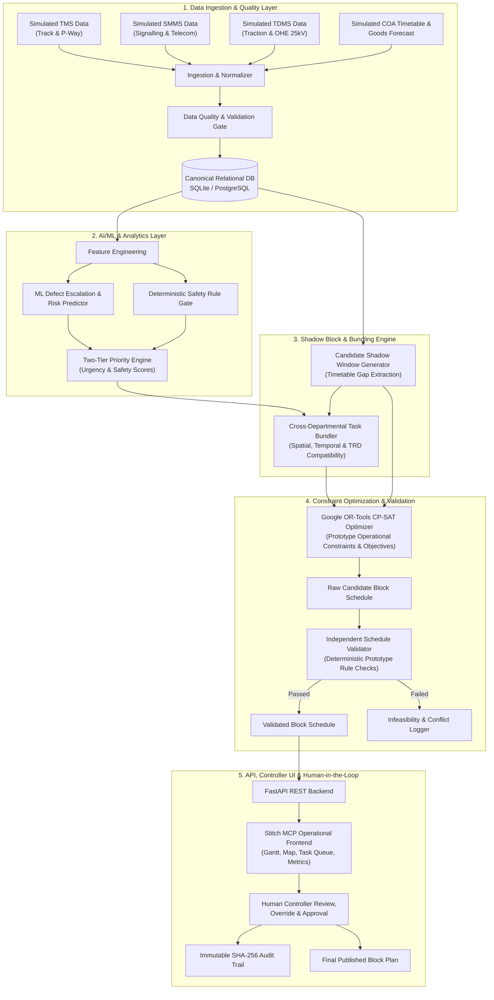

# REFERENCE_ANALYSIS.md — Comprehensive Three-Reference Comparison & Architectural Evaluation

**Project**: SIH26027 — AI-Powered Automatic Block Planning to Maximize Asset Availability for Train Operations on Indian Railways  
**System Name**: RailSync AI  
**Author**: Antigravity Engineering Pair  
**Status**: Authoritative Reference Evaluation & Synthesis (Engineering Decision-Support Prototype)  

---

## 1. Executive Summary & Boundary Notice

> [!NOTE]
> **Prototype Boundary & Domain Stance**: RailSync AI is a **decision-support prototype** operating on **synthetic datasets** and **simulated railway data sources** (simulated TMS, SMMS, TDMS, COA timetables, and simulated goods forecasts). It does not claim official Indian Railways certification, direct FOIS production integration, or safety-critical interlocking control. All rule validations and constraints are **prototype operational constraints** designed to demonstrate automated block planning feasibility. Numerical metrics, entity counts, constraint counts, and scenario quantities discussed below are **provisional targets** derived from domain requirements and will be refined during implementation.

To build an original, robust, and verified prototype for SIH26027, we performed an in-depth source code and architectural audit of three reference solutions alongside our existing specification in `md/`:

1. **Reference 1 (`TRIKAAL-RAKSHA-BLOCK-main`)**:
   - *Nature*: Standalone React/Vite frontend + Lightweight Python CP-SAT HTTP server (`server/cp_sat_server.py`).
   - *Key Focus*: Pairwise time-window overlapping and multi-departmental bundling to maximize saved possession minutes.
   - *Key Strength*: Clean, visual UI presentation of bundled savings and clear departmental roles.
   - *Key Weakness*: No real train timetable / dynamic gap search; assumes maintenance requests already have fixed start/end times and only bundles intersecting requests. No relational DB or formal ingestion/validation pipeline.

2. **Reference 2 (`rail-bloc-main`)**:
   - *Nature*: Monorepo (`packages/core`, `packages/optima`, `packages/sentinel`, `packages/ml`, `packages/chronicle`, `apps/web`, `apps/api`) with rigorous engineering.
   - *Key Focus*: Mathematical CP-SAT interval scheduling with exogenous train paths, machine disjunctive transit times, and an independent validator with prototype operational checks.
   - *Key Strength*: CP-SAT interval formulation (`OptionalIntervalVar`, disjunctive machine constraints, soft freight delay pricing, `NoOverlap` against train headway corridors) and strict deterministic post-solve validator with cryptographic content hashing.
   - *Key Weakness*: High architectural complexity, heavy domain abstraction layers, sparse interactive UI for live operational controllers compared to dedicated dashboards, limited synthetic dataset generator scenarios.

3. **Reference 3 (`sih26027-prototype-main`)**:
   - *Nature*: Full-stack FastAPI + React/Vite + Tailwind CSS application backed by SQLite (`railway_blocks.db`) with a 12-module pipeline architecture.
   - *Key Focus*: End-to-end railway workflow covering network topology (stations with 2D map coordinates), train timetable, maintenance requests across TMS/SMMS/TDMS, candidate window generation, track rerouting, emergency injections, and interactive Gantt/Map visualization.
   - *Key Strength*: Rich operational workflows (network map with Bezier track curves, live monitoring, manual override modal, emergency injection, explainability modal) and full relational data schema.
   - *Key Weakness*: Optimizer logic is simplified/heuristic in parts compared to mathematical CP-SAT interval models; ML model is tightly coupled to synthetic labels without clear leakage isolation; dataset generation script is large and monolithic.

4. **Our Strategy (The 4th System — RailSync AI)**:
   - Combine the **mathematical CP-SAT formulation and independent schedule validation** of Reference 2 (Interval CP-SAT, disjunctive machine routing, prototype operational rule validator, cryptographic audit hashing).
   - Integrate the **rich domain workflows, interactive network topology, and sequential pipeline architecture** of Reference 3 (simulated TMS/SMMS/TDMS ingestion, candidate timetable gap extraction, emergency disruption handling, explainable UI).
   - Leverage the **clean multi-department bundle visualization and clear operator justification** of Reference 1.
   - Design a **brand new, modular, seeded synthetic dataset generator** in `dataset_generation/` that produces realistic relational datasets with guaranteed edge scenarios (happy paths, conflicts, overdue tasks, resource bottlenecks, emergency reoptimizations).
   - Deliver an interactive, modern frontend built using our **Stitch MCP integration** and powered by real FastAPI backend endpoints.

---

## 2. Comprehensive 28-Dimension Comparison Matrix

| # | Dimension | Reference 1 (`TRIKAAL-RAKSHA-BLOCK`) | Reference 2 (`rail-bloc`) | Reference 3 (`sih26027-prototype`) | Current MD Spec (`md/`) | RailSync AI Decision | Rationale & Action Plan |
|---|---|---|---|---|---|---|---|
| 1 | **System Architecture** | Client-Server: React frontend + simple Python script HTTP server | Monorepo modular Python packages (`optima`, `sentinel`, `ml`, `core`) + Next.js/FastAPI | 12-module sequential pipeline backend + React/Vite SPA + SQLite | Modular monolith (Ingestion, Norm, Prioritization, Window Gen, Bundling, CP-SAT, Validator, API, UI) | **BUILD NEW (Hybrid Monolith)** | Modular FastAPI backend with explicit clean service boundaries (`pipeline/`, `domain/`, `solver/`, `validator/`, `api/`) and React/Vite UI. |
| 2 | **Data Model** | Flat JSON request objects without relational schema | Dataclasses (`DemandInput`, `TrainPathInput`, `MachineInfo`) + Pydantic | Relational SQLite schema (`Station`, `Section`, `Track`, `Train`, `Timetable`, `MaintenanceRequest`, `Resource`) | Canonical Relational Schema across core relational entities | **COMBINE & STANDARDIZE** | Define unified relational SQLite/PostgreSQL schema with foreign keys, compound indexes, versioning, and provenance tracking. |
| 3 | **TMS (Track) Integration** | Basic category strings in JSON | `DemandInput(department='ENGINEERING')` | Structured TMS defects (rail fracture, weld flaw, track geometry, tamping) | Formal TMS schema with defect severity, track km range, speed restriction | **REWRITE & STANDARDIZE** | Standardize TMS fields: defect type, flaw category, track geometry index, tamping overdue days, track possession type. |
| 4 | **SMMS (Signal) Integration** | Basic category strings in JSON | `DemandInput(department='SIGNAL_TELECOM')` | Structured SMMS defects (point machine, track circuit, axle counter, signal lamp) | Formal SMMS schema with interlocking dependencies, signal failure risk | **REWRITE & STANDARDIZE** | Include signal gear ID, prototype interlocking checks, point disconnection requirements, S&T team availability. |
| 5 | **TDMS (Electrical) Integration** | Basic category strings in JSON | `DemandInput(department='TRD')` with feeding section mapping | Structured TDMS defects (OHE insulator, cantilever, contact wire wear, TSS neutral section) | Formal TDMS schema with 25kV power isolation, elementary section IDs | **REWRITE & STANDARDIZE** | Support TRD power isolation boundaries (elementary section + power feeding post) and earthing requirements. |
| 6 | **Simulated COA & Timetable** | Fixed synthetic time slots | Exogenous train paths with fixed start/end intervals and headway expansions | Full train timetable with intermediate station departure/arrival times | Train schedules with passenger priority ranking (Rajdhani to Freight) and sectional occupancies | **COMBINE & ADAPT** | Model timetables with station-to-station sectional occupancies, priority rankings (1 to 4), and realistic operational buffers. |
| 7 | **Simulated Goods Forecast** | None | Probabilistic freight paths with confidence thresholding (<0.60 priced as soft penalty) | Fixed timetable freight entries | Simulated freight forecast with arrival confidence and corridor impact | **ADAPT from Ref 2** | Treat high-confidence freight (>0.75) as hard blocks and uncertain freight as soft objective penalty terms in CP-SAT. |
| 8 | **Canonical Synthetic Dataset** | Handcrafted JSON payload | Synthetic CSV/fixture files in `packages/core` | Pre-seeded SQLite database (~1000 trains, 150 requests) | Canonical CSV/DB tables in `data/synthetic/` | **BUILD NEW** | Generate clean, relational CSV datasets in `data/synthetic/` accompanied by JSON schemas and data validation manifests. |
| 9 | **Dataset Generator** | Single procedural script `generate_dataset.py` (8 KB) | Procedural fixtures + benchmark scripts | Monolithic 45 KB generator script (`create_full_seed_script.py`) | Modular generator specification in `md/09_SYNTHETIC_DATASET_DESIGN.md` | **BUILD NEW (Modular Generator)** | Build clean modular generator in `dataset_generation/` with isolated generators for topology, assets, defects, timetables, and edge scenarios. |
| 10 | **Data Quality & Validation** | Minimal field presence checks | Pydantic schema validation at ingestion | Basic database constraints | Formal Data Quality Gates (missingness, schema, referential integrity, range checks) | **BUILD NEW** | Implement a deterministic data validator that validates schema, FK integrity, chronological consistency, and creates quarantine logs. |
| 11 | **Data Analysis & EDA** | Basic summary statistics in frontend | None built-in | Basic count aggregates in SQLite | Automated EDA profiling in `dataset_generation/` | **BUILD NEW** | Implement automated data quality profiling reporting density, defect distributions, gap histograms, and corridor backlog. |
| 12 | **Feature Engineering** | Basic score mapping | Urgency calculation (`time_weighted_urgency`) | Feature vectorization inside pipeline module 2 | Multi-dimensional feature pipeline (asset risk, operational impact, age, geometry) | **COMBINE & REFINE** | Engineer features: `days_overdue`, `speed_restriction_impact`, `traffic_density_index`, `asset_criticality_weight`, `seasonal_risk_factor`. |
| 13 | **Priority Scoring** | Static heuristic rules | Dynamic time-weighted urgency formulation | Blended ML score + deterministic rule overrides | Two-tier prioritization: Deterministic Safety Rule Gate + ML Risk Ranking | **COMBINE & FORMALIZE** | Two-tier priority engine: Hard Safety Gates (Emergency / Safety Critical = 95-100) + ML Risk Score (0-90) with full feature attribution. |
| 14 | **AI / ML Model** | None | Simple degradation exponential decay model | XGBoost classifier / regressor for defect escalation risk | Calibrated Gradient Boosting / Random Forest with feature explanations and fallback | **REWRITE & HARDEN** | Train Scikit-Learn / XGBoost model on synthetic features with strict train/val split, zero data leakage, and a fallback to deterministic scoring. |
| 15 | **Candidate Window Engine** | Pairwise request intersection only | Full time horizon with headway expansion | Timetable gap subtraction engine (`module5_candidate_windows.py`) | Multi-criteria shadow block finder with headway, buffer, and length filtering | **COMBINE & BUILD NEW** | Timetable gap subtraction engine that computes available corridor time windows, applies setup/clearance buffers, and indexes eligible windows. |
| 16 | **Task Bundling Engine** | Greedy pairwise combination check | CP-SAT window containment formulation (`built.shadow`) | Geometric and corridor proximity grouping (`module4_work_grouping.py`) | Multi-departmental compatibility matrix (geography, temporal, machinery, TRD power) | **COMBINE & ENHANCE** | Pre-solver spatial/temporal compatibility check + CP-SAT multi-possession containment with explicit machine safety exclusion. |
| 17 | **Optimization Engine** | Basic CP-SAT maximizing saved duration (5s limit) | Advanced Interval CP-SAT with `OptionalIntervalVar`, machine disjunction, and soft penalties | Greedy/Integer Linear heuristic with constraint relaxation | Google OR-Tools CP-SAT with prototype operational constraints & soft objectives | **ADAPT from Ref 2 + Ref 3** | Formulate CP-SAT model using `OptionalIntervalVar`, disjunctive machine routing with transit time, TRD isolation bounds, and Pareto multi-objective. |
| 18 | **Constraints Formulation** | Overlap & machinery clash only | Train `NoOverlap`, machine transit disjunctive, deadline bounds, TRD feeding | Headway buffers, station capacity, crew shift bounds | Comprehensive prototype operational constraints & soft penalty terms | **COMBINE & HARDEN** | Implement prototype operational constraints: train headway separation, machine transit speed, crew availability, power isolation, and maximum duration. |
| 19 | **Independent Schedule Validator** | None | Independent validator checking prototype operational rules, machine clashes, and content hashes | Basic database check | Independent Post-Solve Validator checking prototype operational constraints | **ADAPT from Ref 2** | Implement dedicated `ScheduleValidator` that independently verifies all schedule intervals, train headways, and machinery conflicts without OR-Tools. |
| 20 | **Weekly Planning** | Fixed 1-day batch | Horizon-based execution | Daily/Weekly views | High-granularity operational block planning | **BUILD NEW** | High-resolution 7-day operational block plan with minute-level precision and crew assignment. |
| 21 | **Monthly Planning** | None | None | Long-term forecast simulation | Strategic corridor maintenance possession forecasting | **BUILD NEW** | Strategic 30-day macro-block planning allocating major track renewal/mega blocks to corridor slots. |
| 22 | **Reoptimization / Disruption** | None | Re-solve with hints (`AddHint`) | Emergency block injection and track rerouting simulation | Disruption event pipeline: train delay, emergency defect, machine breakdown | **COMBINE & EXPAND** | Event-driven reoptimization preserving unaffected approved blocks, invalidating collided windows, and re-solving affected horizon with warm start. |
| 23 | **API Design** | Simple custom HTTP server (`BaseHTTPRequestHandler`) | FastAPI app in `apps/api` | FastAPI routers (`/blocks`, `/trains`, `/optimize`, `/emergency`) | Complete RESTful API with Pydantic schemas in `md/14_API_SPECIFICATION.md` | **BUILD NEW (FastAPI)** | Clean FastAPI REST API with endpoints for ingestion, tasks, candidate windows, optimization runs, validation, overrides, and exports. |
| 24 | **Frontend Architecture** | React + Vite + Tailwind CSS (Single Page) | Next.js / React with Tailwind | React + Vite + Tailwind + Lucide Icons + Custom Gantt & Map | React + Vite + Tailwind + Interactive Gantt, Network Map, Command Dashboard | **BUILD NEW with Stitch MCP** | Stitch MCP designed operational dashboard: Command Overview, Live Timetable/Gantt Board, Topology Map, Task Queue, and Override Modal. |
| 25 | **Metrics & Benchmarks** | Saved block hours & conflict reduction % | Unaddressed defect penalty & shadow reward score | Delay minutes, block efficiency, asset health index | Operational KPIs (Availability %, Block Possession Hours, Bundle Factor, Delay Index) | **BUILD NEW** | Calculate prototype operational metrics: Asset Availability %, Total Possessions Saved, Cross-Dept Bundle Ratio, Controller Workload Reduction. |
| 26 | **Security & Offline-First** | No auth, pure local | Local tokens, cryptographic content hashing | Local SQLite | Air-gapped offline operation, role-based override permissions, immutable audit log | **COMBINE & HARDEN** | Fully offline-first (zero external cloud dependencies), SQLite/PostgreSQL storage, role-based override authorization, and SHA-256 audit log. |
| 27 | **Testing & Quality Assurance** | None | Pytest suite for `sentinel`, `optima`, `core` | Basic unit test suite | Comprehensive test strategy (Unit, Integration, Scenario verification) | **BUILD NEW** | Full Pytest suite covering ingestion, data validation, ML training, window extraction, CP-SAT solver, validator, and API endpoints. |
| 28 | **Deterministic Demo Scenarios** | 1 canned demo case | Benchmark scenarios | 4 scenarios (Normal, Emergency, Overload, Reroute) | Scripted Scenarios in `md/22_DEMO_SCENARIOS.md` | **BUILD NEW** | Deterministic reproducible scenarios: Multi-Dept Mega Block, Safety-Critical Escalation, Freight Gap Squeeze, Machine Conflict, and Disruption Reoptimization. |

---

## 3. Detailed Component Classification & Decision Rationale

### A. Components to REUSE & ADAPT
- **Interval CP-SAT Formulation (from Reference 2)**:
  - *Why*: Reference 2's formulation of maintenance blocks as `OptionalIntervalVar` against exogenous train intervals with headway expansion is mathematically sound and prevents schedule flicker.
  - *Adaptation*: Extend it to handle multi-departmental bundled tasks, explicit station/corridor boundaries, and machine setup/clearance buffers.
- **Independent Schedule Validator (from Reference 2)**:
  - *Why*: An independent verification layer that validates schedules against prototype operational rules with SHA-256 cryptographic hashing guarantees safety and audit integrity.
  - *Adaptation*: Adapt into our internal prototype `ScheduleValidator` module.
- **Operational UI Workflows & Topology Map (from Reference 3)**:
  - *Why*: Reference 3 provides intuitive railway topology representation (stations with coordinates, track segments, train timetables, and emergency injection controls).
  - *Adaptation*: Redesign and elevate UI components using Stitch MCP for high information density, crisp typography, and real-time backend API synchronization.
- **Multi-Departmental Savings & Justification (from Reference 1)**:
  - *Why*: Reference 1 clearly articulates why Engineering, S&T, and TRD tasks should be bundled (e.g., joint power isolation, track packing) and calculates saved block hours.
  - *Adaptation*: Incorporate human-readable and machine-readable bundle justifications into the API and UI response models.

### B. Components to REJECT & AVOID
- **Naive Pairwise Intersection without Timetable Gaps (Reference 1)**:
  - *Why*: In realistic railway operations, maintenance cannot simply happen whenever two departments ask for overlapping times; it must fit into actual train timetable gaps ("shadow blocks") where tracks are clear.
- **Heuristic-Only Solvers (Parts of Reference 3)**:
  - *Why*: Heuristic slot matching can generate suboptimal or invalid schedules on dense corridors. We must use CP-SAT for constraint guarantees.
- **Monolithic 45 KB Unstructured Seed Scripts (Reference 3)**:
  - *Why*: Monolithic seed scripts with hardcoded strings make automated testing, schema migration, and scenario tuning unmaintainable.
- **Overcomplicated Build Pipelines & Unnecessary Microservices (Parts of Reference 2)**:
  - *Why*: Complex microservice boundaries and heavy build tooling hinder local offline deployment on railway station workstations.

### C. Components to BUILD NEW
1. **Modular Seeded Synthetic Dataset Generator (`dataset_generation/`)**:
   - Clean, modular Python package generating consistent relational CSVs and SQLite databases with deterministic seeds.
2. **Automated Data Quality & Validation Engine (`backend/app/pipeline/data_quality.py`)**:
   - Schema enforcement, foreign key verification, chronological sanity checks, and quarantine logging.
3. **Dedicated Candidate Shadow-Block Generator (`backend/app/pipeline/candidate_windows.py`)**:
   - Exact timetable gap extraction engine with headway buffers, station clearance, and goods forecast uncertainty.
4. **Hybrid Two-Tier Prioritization & ML Engine (`backend/app/pipeline/prioritization.py`)**:
   - Deterministic rule gate (Emergency / Critical defects) + trained Scikit-Learn/XGBoost risk model with feature attribution.
5. **Interactive Operational Dashboard via Stitch MCP (`frontend/`)**:
   - Modern, high-density decision-support UI with interactive Gantt, track corridor map, task queue, conflict visualizer, and override approvals.
6. **Immutable Audit & Tamper-Proof Log (`backend/app/services/audit_service.py`)**:
   - SHA-256 hash chaining of all solver outputs, manual overrides, and approval actions.

---

## 4. Synthesis & Architectural Blueprints for RailSync AI

---
*Reference Analysis completed and verified. Next step: Implementation Plan and living documentation synchronization.*
