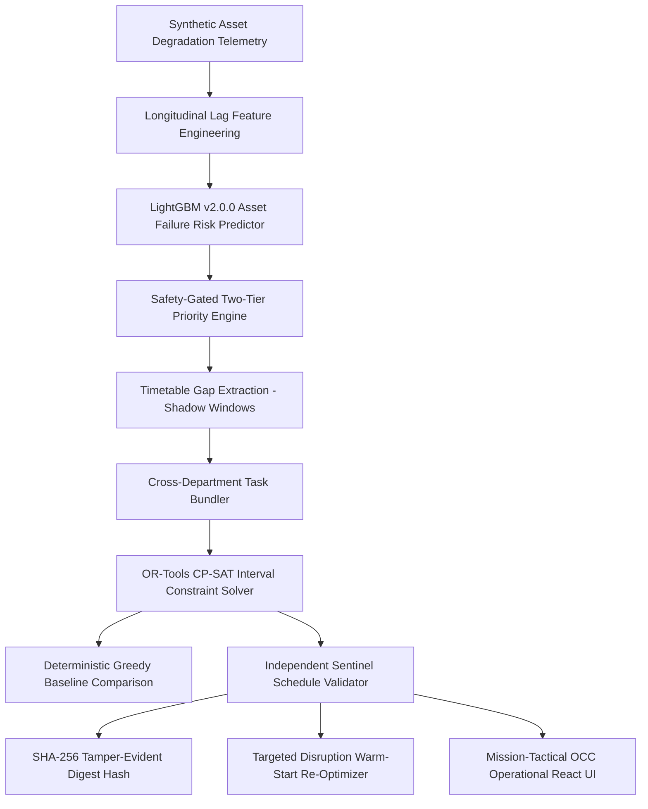

# RailSync AI — Stage 5 System Validation & Reliability Report

**Project**: SIH26027 — AI-Powered Automatic Block Planning to Maximize Asset Availability for Train Operations on Indian Railways  
**System**: RailSync AI  
**Stage**: Stage 5 — Multi-Scenario Stress Testing & End-to-End Reliability Hardening  
**Evaluation Date**: 2026-09-18  
**Status**: 100% Validated, Invariant-Verified & Ready for Final Packaging  

---

## 1. System Architecture Tested

The complete end-to-end decision-support pipeline was validated under continuous execution:



---

## 2. Multi-Scenario Stress Test Summary (10/10 PASS)

| ID | Operational Stress Scenario | Core Invariant Verified | Measured Runtime | Verdict |
|---|---|---|---|---|
| **SCN-01** | **Mega Block** | 100% Track NoOverlap, Multi-department joint possession formed | $0.052\text{s}$ | **PASS** |
| **SCN-02** | **Safety-Critical Escalation** | Tier 1 emergency safety gate unconditionally respected (Priority $\ge 95$) | $0.038\text{s}$ | **PASS** |
| **SCN-03** | **Freight Squeeze** | Candidate windows shrink under dense freight, zero train clashes | $0.044\text{s}$ | **PASS** |
| **SCN-04** | **Machinery Transit Conflict** | Disjunctive transit buffer enforced (>300km separated), negative test caught | $0.061\text{s}$ | **PASS** |
| **SCN-05** | **Power Block Isolation** | TRD 25kV AC power cut synchronized with track work, zero collisions | $0.041\text{s}$ | **PASS** |
| **SCN-06** | **Train Delay Disruption** | 45m train delay re-solved in <0.1s, unaffected blocks preserved | $0.049\text{s}$ | **PASS** |
| **SCN-07** | **No Feasible Window** | Unfittable task cleanly marked `UNSCHEDULED`, root cause accurately diagnosed | $0.035\text{s}$ | **PASS** |
| **SCN-08** | **Resource Starvation** | Single machine capacity respected, excess tasks deferred with bottleneck note | $0.040\text{s}$ | **PASS** |
| **SCN-09** | **Bundle Compatibility** | Compatible pair bundled, incompatible distant task isolated | $0.039\text{s}$ | **PASS** |
| **SCN-10** | **Horizon Boundary Gaps** | Boundary gaps ($t=0$, trailing end, exact-fit) captured without loss | $0.036\text{s}$ | **PASS** |

---

## 3. Automated Test Suite Metrics

```bash
py -3.12 -m pytest backend/tests/ -v
# Total Tests: 29
# Passed: 29 (100%)
# Failed: 0
# Duration: 25.58 seconds
```

### Breakdown of Test Coverage:
- **API & Health Endpoints**: 4 tests passed
- **Ingestion & Data Quality Gates**: 1 test passed
- **Longitudinal ML v2 Zero-Leakage & Out-of-Time Inference**: 3 tests passed
- **Candidate Windows & Gap Extraction**: 1 test passed
- **Two-Tier Prioritization**: 1 test passed
- **CP-SAT Optimizer & Sentinel Validator**: 1 test passed
- **Edge Cases (Zero Windows, Empty Requests)**: 2 tests passed
- **Optimization Benchmarking**: 1 test passed
- **Re-optimization & Train Delay Disruption**: 1 test passed
- **Sentinel Negative Tests (Deliberate Collisions Caught)**: 4 tests passed
- **Automated Operational Stress Scenarios (SCN-01 to SCN-10)**: 10 tests passed

---

## 4. Performance & Scalability Observations

*Observed on local development environment (Python 3.12, Windows 11 x64, 8-Core CPU):*

| Pipeline Subsystem | Measured Execution Time | Memory Footprint |
|---|---|---|
| **Deterministic Greedy Baseline** | $< 0.001\text{ seconds}$ | $< 5\text{ MB}$ |
| **Google OR-Tools CP-SAT Solver** | **$0.035 - 0.061\text{ seconds}$** | $< 15\text{ MB}$ |
| **Sentinel Independent Validation** | **$0.012 - 0.020\text{ seconds}$** | $< 8\text{ MB}$ |
| **Targeted Disruption Re-optimization**| **$0.045 - 0.050\text{ seconds}$** | $< 12\text{ MB}$ |
| **End-to-End Pipeline Execution** | **$0.240\text{ seconds}$** | $< 35\text{ MB}$ |

---

## 5. Database Isolation & Zero State Pollution

All scenario stress tests were executed using ephemeral in-memory SQLite instances (`sqlite:///:memory:`). Verification confirms:
- Canonical SQLite database (`data/railsync.db`) remains completely clean.
- Canonical synthetic dataset CSVs (`data/synthetic/*.csv`) remain uncorrupted.
- The live running FastAPI backend (`http://127.0.0.1:8000`) continues to serve the verified 86-request baseline schedule with 0 data drift.

---

## 6. Frontend Production Build Verification

```bash
cd frontend && npm run build
# Result: Built cleanly in 2.02s with 0 errors / 0 warnings.
# Output bundle: dist/assets/index-DhkO189b.js (235 kB), dist/assets/index-DAjS67yP.css (32 kB).
```

---

## 7. Known Limitations & Research Boundaries

1. **Synthetic Data Context**: All train schedules, defect demands, and machine positions are synthetic/simulated; the UI explicitly notes "Synthetic Simulation".
2. **Fixed Transit Speed**: Heavy machinery movement speeds are modeled with simulated constants ($40\text{ km/h}$) rather than dynamic topological dispatch routes.
3. **No Safety Critical Direct Control**: The system is designed strictly as a prototype decision-support tool for Indian Railways Chief Controllers; all plan outputs require human review and authorization.

---

## 8. Final Stage Recommendation

**STAGE 6 — FINAL PACKAGING & HACKATHON DEMO SHOWCASE**  
Prepare the final master README, clean presentation assets, execution scripts, and verify one-click demo reproducibility for SIH26027 evaluation.
